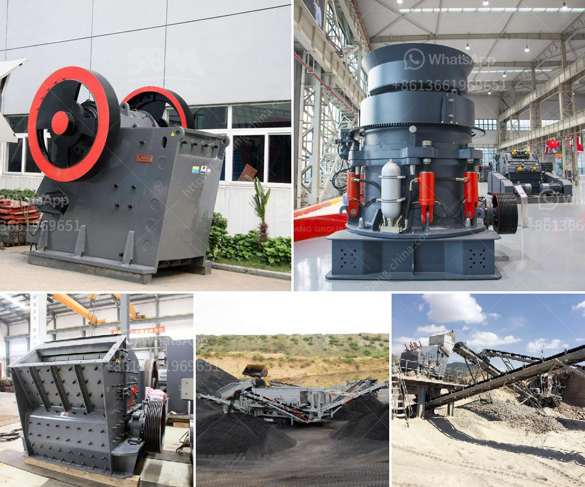

<h3>مطحنة عمودية للكالسيوم</h3>
تعتبر مطحنة عمودية للكالسيوم واحدة من أهم الآلات التي تستخدم في صناعة تكسير وطحن مسحوق الكالسيوم. تعمل هذه الآلة على تحويل الحجر الجيري أو الدولوميت إلى مسحوق كالسيوم فائق النعومة، والذي يتم استخدامه في العديد من المجالات مثل البلاستيك ومواد البناء والدهانات وصناعة الورق وتصنيع الأدوية.

تتكون المطحنة العمودية من العديد من الأجزاء المهمة التي تعمل بتناسق لتحقيق النتائج المطلوبة. تحتوي المطحنة على برج عمودي يحتوي على قرص مركزي يدور بسرعة عالية، وحوله مجموعة من الأسطوانات الطحن. يمكن ضبط سرعة دوران الأسطوانات وكذلك القرص المركزي لتحقيق الحجم المطلوب من المسحوق المطحون.

يتم إدخال الحجر الجيري أو الدولوميت إلى منطقة التغذية، حيث يتم تجهيزها ووضعها على الأسطوانات الطحن. يتم تكسير الحجر تحت تأثير القرص المركزي وحركة الأسطوانات الدورانية، وذلك بسبب القوة المركزية التي تعمل على تحطيم الجزيئات. ثم يتم نقل الحجر الناتج إلى الناقل الهوائي الموجود في جزء سفلي من المطحنة.

يمر الحجر الناتج من خلال فتحة الناقل الهوائي إلى جهاز جمع الغبار، فيتم فصل الغبار عن الهواء ويتم جمع الغبار المنفصل حتى يمكن استخدامه فيما بعد. يتم نقل الهواء المنقى إلى الجهاز الرئيسي للتصنيف، حيث يتم فصل الجسيمات الدقيقة من الجسيمات الأكبر، وتجمع الجسيمات الدقيقة في وحدة جمع الغبار.

خلال عملية الطحن، توفر المطحنة العمودية قدرًا كبيرًا من القوة الطحن، وبالتالي تحسين كفاءة تكسير الحجر وطحنه. كما أنه بفضل التصميم العمودي، تستغل المطحنة مساحة أقل في المصنع وتوفر إمكانية التعامل مع كمية كبيرة من الحجر في وقت قصير.

باختصار، تلعب المطحنة العمودية للكالسيوم دورًا حاسمًا في صناعة تكسير الكالسيوم، حيث توفر عملية طحن عالية الكفاءة للمسحوق. يمكن أن تكون هذه الآلة حلاً مثاليًا للمصانع التي تحتاج إلى إنتاج مسحوق كالسيوم عالي الجودة وفائق النعومة.
<h3>Contact us</h3><ul><li><strong>Whatsapp:&nbsp;<a href="https://wa.me/8613661969651">+8613661969651</a></strong></li><li><a href="https://swt.shibang-china.com/?git&amp;zhl&amp;مطحنة عمودية للكالسيوم"><strong>Online Service(chat now)</strong></a></li></ul><h3>Related</h3><ul><li><a href='شركات تعدين الذهب في ألمانيا.md'>شركات تعدين الذهب في ألمانيا</a></li><li><a href='وظائف كسارة مخروطية.md'>وظائف كسارة مخروطية</a></li><li><a href='معدات كسارة الفك للبيع في الفلبين.md'>معدات كسارة الفك للبيع في الفلبين</a></li><li><a href='سعر محطم محمول.md'>سعر محطم محمول</a></li><li><a href='معدات مطحنة الكرة.md'>معدات مطحنة الكرة</a></li></ul>