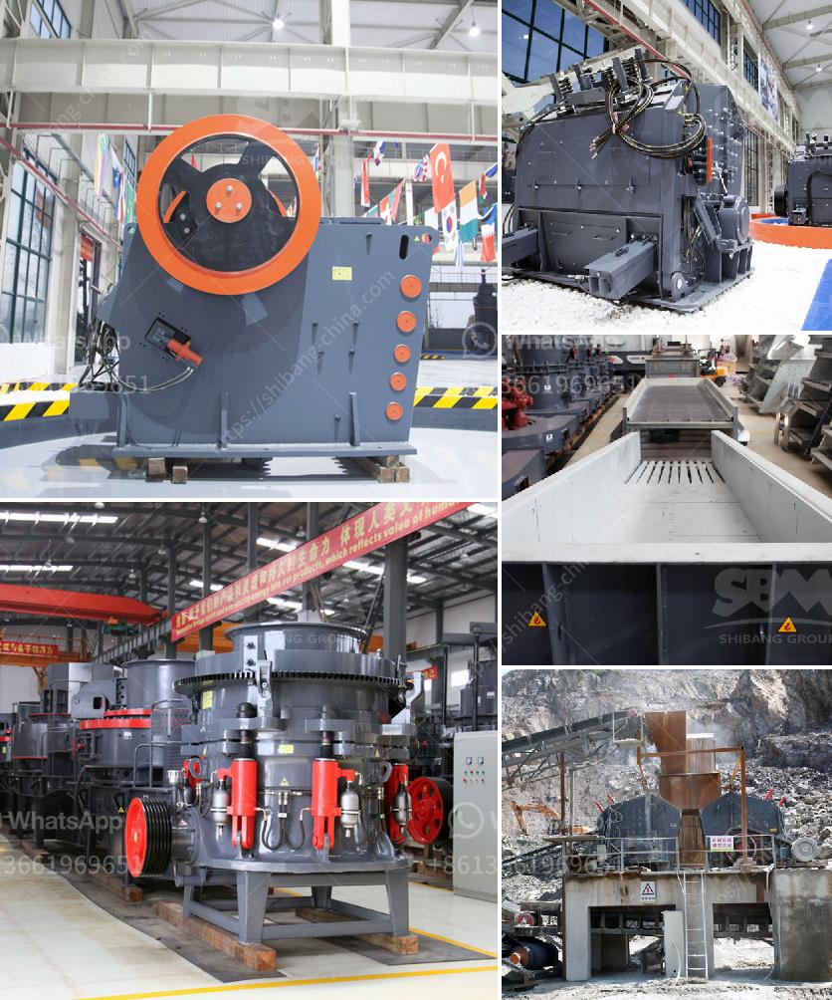

<h3>مطحنة عمودية معلومات أيرلندا</h3>
موقع أيرلندا يضم العديد من المعالم الجميلة والمثيرة لاهتمام السياح. ومن بين تلك المعالم، تتميز مطحنة عمودية بوجودها في الريف الأيرلندي. تعتبر المطاحن العمودية إحدى الأيقونات الثقافية في أيرلندا، حيث تعد بمثابة تجسيد لتاريخ البلاد الغني والثقافة الزراعية.

تُعد المطاحن العمودية مبان خشبية تقليدية تستخدم لطحن القمح والحبوب الأخرى. تتميز بتصميمها الفريد الذي يشمل هيكلًا عموديًا يحمل الكثير من الأجنحة الخشبية. يتم تركيب هذه الأجنحة بشكل متوازي على الهيكل العمودي، وتدور بفعل الرياح الساعدة. وقد تم استخدامها لسنوات طويلة كجهاز يعمل بالطاقة الحيوية لطحن الحبوب.

تعد المطاحن العمودية من أشهر المعالم السياحية في أيرلندا. فهي تعكس التراث الزراعي التقليدي والنسيج الاجتماعي الذي كان يهيمن على البلاد منذ فترة طويلة. في الواقع، كانت المطاحن العمودية تشكل جزءًا لا يتجزأ من الحياة اليومية للمزارعين في أيرلندا قديمًا، حيث كانوا يستخدمونها لطحن الحبوب التي تزرع في حقولهم.

علاوة على ذلك، تتمتع المطاحن العمودية بمظهر جميل يضفي رونقًا خاصًا على المشهد الريفي في أيرلندا. ففي كثير من الأحيان، يتم بناء المطاحن العمودية في المناطق الريفية الخلابة والمطلة على المناظر الطبيعية الخلابة مثل الأنهار أو المرتفعات الجبلية. وبالتالي، تشكل واحدة من المعالم السياحية التي يمكن زيارتها واستكشافها في رحلات السياحة في الطبيعة.

في الوقت الحاضر، يتم الحفاظ على المطاحن العمودية التقليدية كتراث ثقافي في أيرلندا. تُستخدم بعضها حتى الآن كمحل للزيارة وللتعرف على هذه الصناعة التقليدية وتاريخ البلاد. وتُقدم الجولات التوجيهية في بعض المطاحن العمودية للزوار، حيث يمكنهم الاطلاع على كيفية عمل المطحنة ودورها في حياة الناس القديمة.

بإختصار، تعد المطاحن العمودية أحد الرموز البارزة في أيرلندا، حيث تمثل التراث الزراعي والثقافي للبلاد. وتضفي هذه المعالم الجميلة رونقًا على المشهد الريفي، وتعد وجهة سياحية شهيرة تستحق الزيارة للمسافرين الراغبين في استكشاف التاريخ والثقافة الأيرلندية.
<h3>Contact us</h3><ul><li><strong>Whatsapp:&nbsp;<a href="https://wa.me/8613661969651">+8613661969651</a></strong></li><li><a href="https://swt.shibang-china.com/?git&amp;zhl&amp;مطحنة عمودية معلومات أيرلندا"><strong>Online Service(chat now)</strong></a></li></ul><h3>Related</h3><ul><li><a href='معدات زراعية للبيع بأسعار مناسبة.md'>معدات زراعية للبيع بأسعار مناسبة</a></li><li><a href='مواصفات كسارة الفك.md'>مواصفات كسارة الفك</a></li><li><a href='شركات تصنيع أحزمة الناقل في بنغلاديش.md'>شركات تصنيع أحزمة الناقل في بنغلاديش</a></li><li><a href='اقتباس لكسارة vsi.md'>اقتباس لكسارة vsi</a></li><li><a href='عملية كولمان للطحن.md'>عملية كولمان للطحن</a></li></ul>