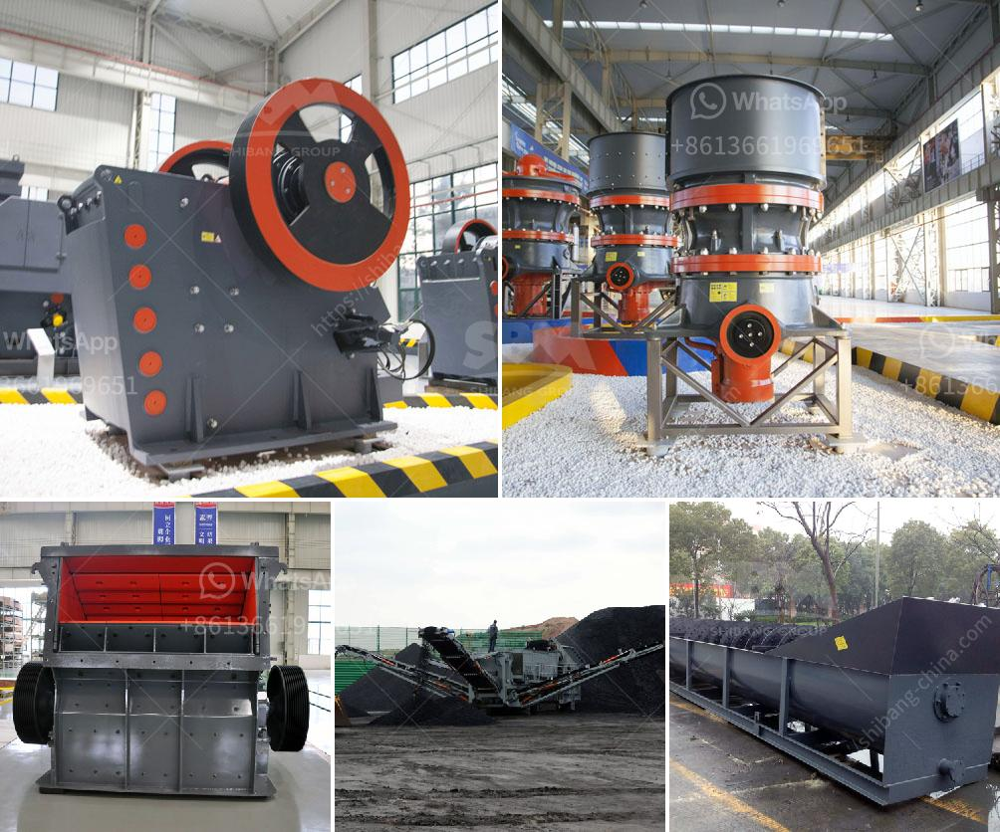

<h3>مطحنة فحم رولر</h3>
تعتبر مطحنة فحم رولر واحدة من أهم الأجهزة المستخدمة في صناعة الفحم المسحوق. تستخدم هذه المطاحن لطحن الفحم الخام إلى جسيمات صغيرة ، وذلك لتحقيق الاحتراق الفعال وزيادة كفاءة الأفران والمراجل العاملة بالفحم.

تتكون مطاحن الفحم رولر من عدة أجزاء رئيسية ، بما في ذلك الجهاز الطحني ونظام النقل ونظام التحكم. تتكون الجهاز الطحني من عدة أسطوانات مثبتة بشكل أفقي وموازياً للأرض ، وتوجد مجموعة من الأسطوانات الثابتة ومجموعة أخرى من الأسطوانات المتحركة. يتم طحن الفحم بين الأسطوانات الثابتة والمتحركة ، وذلك عن طريق ضغطه وتكسيره باستخدام قوة مطحنة الرول. يتم تكوين ضغط الطحن اللازم للفحم بواسطة نظام التعويم الهوائي وسحق الأسطوانات المتحركة. تعد هذه الآلية فعالة عندما يرغب المشغلون في ضبط حجم الجسيمات المطحونة.

تتمتع مطاحن الفحم رولر بالعديد من المزايا الهامة. أولاً ، فإنها تعمل بكفاءة عالية وتنتج جسيمات فحم مسحوقة ذات حجم متجانس. هذا يتيح مزيدًا من استخدام الفحم في الأفران والمراجل بفاعلية أعلى وتقليل استهلاك الوقود. ثانياً ، فإن مطاحن الفحم رولر تقلل من تشكيل الغبار أثناء عملية الطحن ، مما يحسن بيئة العمل ويحد من التلوث البيئي الناتج عنها. ثالثاً ، يتم التحكم في مطاحن الفحم رولر بسهولة باستخدام نظام التحكم المناسب ، مما يسهل تعديل تدفق الفحم وتشغيل الجهاز بسلاسة.

بالإضافة إلى ذلك ، فإن مطاحن الفحم رولر قابلة للتطبيق في عدة صناعات أخرى بجانب صناعة الفحم المسحوق. فعلى سبيل المثال ، يمكن استخدامها في معالجة المواد الخام الأخرى مثل الأسمنت والكيماويات. توفر مطاحن الفحم رولر طحنًا فعالًا وسريعًا لهذه المواد ، مما يسهم في تحسين جودة المنتجات النهائية.

لخلاصة كلامنا ، فإن مطاحن الفحم رولر تعتبر جزءًا أساسيًا في صناعة الفحم المسحوق. تساعد على زيادة كفاءة الاحتراق وتحسين جودة المنتجات النهائية. تتمتع بالعديد من المزايا مثل الكفاءة العالية والقدرة على التحكم والتطبيقات المتعددة. ومن المهم الاهتمام بصيانة وتشغيل هذه المطاحن بشكل صحيح لضمان عملها بشكل فعال وسلس.
<h3>Contact us</h3><ul><li><strong>Whatsapp:&nbsp;<a href="https://wa.me/8613661969651">+8613661969651</a></strong></li><li><a href="https://swt.shibang-china.com/?git&amp;zhl&amp;مطحنة فحم رولر"><strong>Online Service(chat now)</strong></a></li></ul><h3>Related</h3><ul><li><a href='فرق بين مطحنة ريموند وضغط عالي.md'>فرق بين مطحنة ريموند وضغط عالي</a></li><li><a href='مصنع دوامة للبيع لخام الكروم.md'>مصنع دوامة للبيع لخام الكروم</a></li><li><a href='آلة طحن الحجر الصخري في فوجيان.md'>آلة طحن الحجر الصخري في فوجيان</a></li><li><a href='مصنع تكسير المحاجر الكامل في جنوب أفريقيا.md'>مصنع تكسير المحاجر الكامل في جنوب أفريقيا</a></li><li><a href='كسارات رئيسية للبيع على Alibaba.md'>كسارات رئيسية للبيع على Alibaba</a></li></ul>