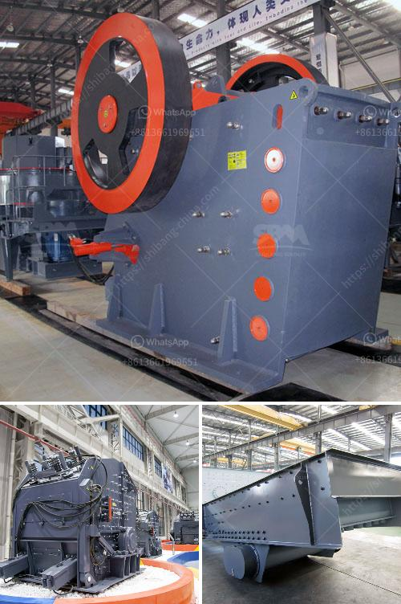

<h3>مطحنة قضيب الطحن الجاف</h3>
تعد مطحنة قضيب الطحن الجاف واحدة من أنواع المطاحن المستخدمة في صناعة الطحن. تستخدم هذه المطاحن لطحن المواد الجافة بدقة وفعالية عالية.

تعمل مطاحن قضيب الطحن الجاف عن طريق إدخال المواد في الجزء العلوي من المطحنة حيث يتم وضع قضبان الطحن الدوارة الموجودة داخلها. تدور هذه القضبان بسرعة عالية مما يؤدي إلى تكسير وطحن المواد الجافة بفعالية.

تتميز مطاحن قضيب الطحن الجاف بعدة مزايا. أولاً وقبل كل شيء، فإن هذه المطاحن تتميز بفعالية عالية في طحن المواد الجافة. يعود ذلك إلى سرعة الدوران العالية لقضبان الطحن التي تنشأ من تشكيلها الهندسي الخاص. هذا يسمح للمطحنة بطحن المواد بسرعة كبيرة وبأداء ممتاز.

ثانيًا، تعد مطاحن قضيب الطحن الجاف مثالية للعمليات التي تستدعي دقة عالية. فهذه الطريقة من الطحن تنتج نتائج دقيقة ومتسقة. بفضل تصميم القضبان الدوارة وسرعتها العالية، يتم ضمان طحن المواد الجافة بشكل موحد وبنتائج موحدة.

علاوة على ذلك، فإن مطاحن قضيب الطحن الجاف تحتوي على نظام فحص لافتات العدوى المثبتة في الجهة العلوية من المطحنة. يحسب هذا النظام بشكل آلي عدد لافتات العدوى المطحونة وتتم إزالتها من داخل المطحنة. يعزز ذلك الاستفادة القصوى من المطحنة ويسهم في الحفاظ على نوعية المنتجات النهائية.

وفي الختام، تأتي مطاحن قضيب الطحن الجاف بأحجام مختلفة، مما يسمح للشركات بالاختيار من بين مجموعة واسعة من القدرات والإنتاجية. بالإضافة إلى ذلك، يمكن تعديل سرعة دوران قضبان الطحن والضغط الذي يتم تطبيقه على المواد داخل المطحنة، وهو ما يسمح بالتحكم الكامل في عملية الطحن.

باختصار، تعد مطاحن قضيب الطحن الجاف أدوات مهمة في صناعة الطحن. تتميز بفعالية عالية ودقة متميزة في طحن المواد الجافة. بفضل قدرتها على تحقيق نتائج متجانسة وموثوقة، تعتبر هذه المطاحن اختيارًا مثاليًا للشركات التي تهدف إلى تحسين إنتاجيتها وتوفير منتجات عالية الجودة.
<h3>Contact us</h3><ul><li><strong>Whatsapp:&nbsp;<a href="https://wa.me/8613661969651">+8613661969651</a></strong></li><li><a href="https://swt.shibang-china.com/?git&amp;zhl&amp;مطحنة قضيب الطحن الجاف"><strong>Online Service(chat now)</strong></a></li></ul><h3>Related</h3><ul><li><a href='مصنع معالجة الباريت.md'>مصنع معالجة الباريت</a></li><li><a href='سعة مطحنة الكرة بالأطنان.md'>سعة مطحنة الكرة بالأطنان</a></li><li><a href='شاشة تصنيف اهتزازية.md'>شاشة تصنيف اهتزازية</a></li><li><a href='مصانع التعدين.md'>مصانع التعدين</a></li><li><a href='معدات تنظيف الرمال في الصغيرة.md'>معدات تنظيف الرمال في الصغيرة</a></li></ul>