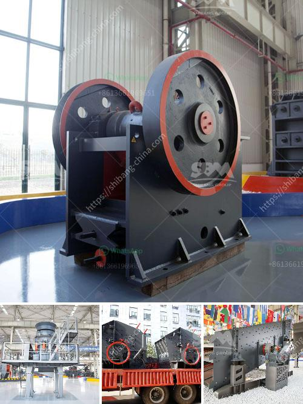

<h3>مطحنة قضيب الكرة الحجر الجيري</h3>
تُعد مطحنة قضيب الكرة الحجر الجيري أحد الوسائل المهمة لطحن وتكسير المواد الصلبة، وتستخدم عادة في صناعة الأسمنت والصناعات الكيميائية والتعدينية وغيرها. تتميز هذه المطاحن بتصميمها الفريد الذي يوفر قدرًا كبيرًا من الكفاءة والإنتاجية.

تعتمد مطاحن قضيب الكرة الحجر الجيري على التأثير والاحتكاك بين كرات الطحن الثقيلة والمواد الصلبة وقضبان الحديد (القضبان الحجرية) التي تملأ الجزء الأسفل من الدائرة. عند تشغيل المطحنة، تدور الطاحونة مسببةً اندفاعًا للكرات الصلبة والمواد الأخرى داخل الداخل في اتجاهات معاكسة. يتم تكسير المواد الصلبة وسحقها تحت تأثير الكرات الثقيلة التي تصطدم بها، ويتم طحن المواد إلى حجم أصغر بفضل قضبان الحديد الموجودة في أعلى المطحنة، ويتم تفريغ المواد المطحونة عبر فتحة التفريغ في الجزء السفلي من المطحنة.

تتميز مطحنة قضيب الكرة الحجر الجيري بعدة مزايا مهمة. لا سيما فيما يتعلق بالقدرة على المعالجة العالية والكفاءة العالية. يمكن تعديل حجم الجسيمات المطلوب طحنها عن طريق تغيير قطر كرات الطحن أو مقدار الكرات الصلبة المستخدمة، مما يجعل هذا النوع من المطاحن متعدد الاستخدامات. علاوة على ذلك، تتميز هذه المطاحن بقدرتها على التعامل مع مجموعة واسعة من المواد الصلبة بما في ذلك الحجر الجيري.

بفضل هذه الميزات، أصبحت مطاحن قضيب الكرة الحجر الجيري أداة أساسية في صناعة الأسمنت وصناعات أخرى. فهي تحسن من كفاءة عمليات التصنيع وتقلل من تكلفة التشغيل. بالإضافة إلى ذلك، فإن تقنية هذه المطاحن لا تتطلب كمية كبيرة من الطاقة، مما يساهم في تقليل انبعاثات الكربون وتحقيق التوازن البيئي.

باختصار، تعتبر مطاحن قضيب الكرة الحجر الجيري وسيلة فعالة لطحن وتكسير المواد الصلبة. تساهم هذه المطاحن في تعزيز الإنتاجية وتقليل التكلفة في صناعة الأسمنت وغيرها من الصناعات المرتبطة، مع الأخذ في الاعتبار الاستدامة البيئية.
<h3>Contact us</h3><ul><li><strong>Whatsapp:&nbsp;<a href="https://wa.me/8613661969651">+8613661969651</a></strong></li><li><a href="https://swt.shibang-china.com/?git&amp;zhl&amp;مطحنة قضيب الكرة الحجر الجيري"><strong>Online Service(chat now)</strong></a></li></ul><h3>Related</h3><ul><li><a href='آلة مسحوق الدولوميت.md'>آلة مسحوق الدولوميت</a></li><li><a href='كل مصانع التكسير المحاجر.md'>كل مصانع التكسير المحاجر</a></li><li><a href='وكيل وارد ريموند مطحنة إندونيسيا.md'>وكيل وارد ريموند مطحنة إندونيسيا</a></li><li><a href='آلة فحص في سنغافورة.md'>آلة فحص في سنغافورة</a></li><li><a href='شركة تبيع كسارة الحجر في كينيا.md'>شركة تبيع كسارة الحجر في كينيا</a></li></ul>