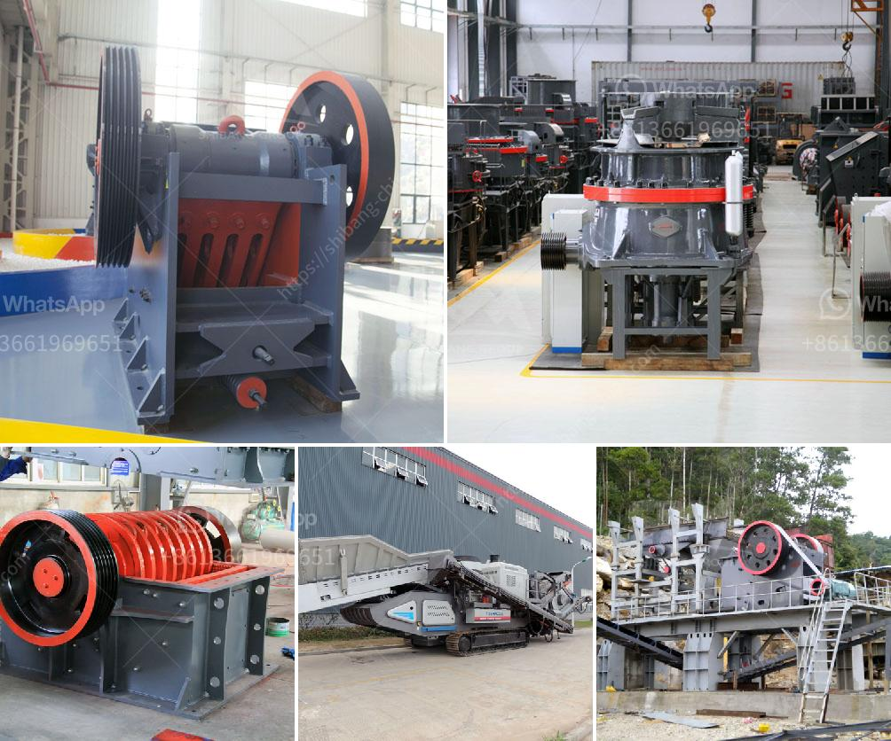

<h3>مطحنة كبيرة القدرة في ماليزيا</h3>
تُعد المطحنة الكبيرة القدرة في ماليزيا واحدة من أبرز المشاريع الصناعية في البلاد. تم إنشاء هذه المطحنة بهدف تلبية الطلب المتزايد على الطحين وتحسين قدرة الإنتاج في الصناعة الزراعية. بالإضافة إلى ذلك، فإن مشروع المطحنة الكبيرة القدرة يسهم في تعزيز الاقتصاد الماليزي وتوفير فرص عمل جديدة للمجتمع المحلي.

تتميز المطحنة الكبيرة القدرة بمعداتها وتقنياتها المتطورة، فهي مجهزة بأحدث التقنيات في صناعة الطحين. تضم مصانع المطحنة معدات تنقية القمح وطحنه وفحصه وتخزينه. كما تحتوي على نظام حديث للتحكم في العمليات الإنتاجية ومراقبة الجودة، مما يضمن إنتاج طحين عالي الجودة بكفاءة عالية.

بالإضافة إلى ذلك، تعتمد المطحنة الكبيرة القدرة على مصادر الطاقة المتجددة والصديقة للبيئة. تستخدم الطاقة الشمسية والرياح لتوليد الكهرباء التي تشغل المعدات والآلات المستخدمة في صناعة الطحين. هذا النهج البيئي يساهم في المحافظة على البيئة وتقليل الانبعاثات الضارة.

تعد المطحنة الكبيرة القدرة أحد أهم المصادر المحلية لإنتاج الطحين. وبفضل استخدام التكنولوجيا الحديثة، يمكن للمطحنة إنتاج طحين بكميات كبيرة دون التأثير على الجودة. توفر هذه الإمكانية استدامة إنتاج الطحين وضمان توفره للسكان المحليين والمناطق المجاورة.

مشروع المطحنة الكبيرة القدرة له تأثير كبير على الاقتصاد المحلي والمجتمع المحيط. يسهم في خلق فرص عمل جديدة للسكان المحليين ويعزز استقرار الاقتصاد المحلي. كما يسهم في تحسين البنية التحتية وتطوير المناطق المحيطة بالمطحنة.

بصفة عامة، تعتبر المطحنة الكبيرة القدرة في ماليزيا مثالاً ناجحاً للاستثمار الصناعي في البلاد. يعزز القدرة الإنتاجية للصناعة ويدعم الاقتصاد المحلي، بالإضافة إلى توفير فرص عمل وتحسين الظروف المعيشية للمجتمع المحلي. تُعتبر هذه المشاريع الكبيرة أحد الطروق الرئيسية لتحقيق النمو الاقتصادي وتعزيز التنمية في ماليزيا.
<h3>Contact us</h3><ul><li><strong>Whatsapp:&nbsp;<a href="https://wa.me/8613661969651">+8613661969651</a></strong></li><li><a href="https://swt.shibang-china.com/?git&amp;zhl&amp;مطحنة كبيرة القدرة في ماليزيا"><strong>Online Service(chat now)</strong></a></li></ul><h3>Related</h3><ul><li><a href='مصنع أسمنت للبيع في ألمانيا.md'>مصنع أسمنت للبيع في ألمانيا</a></li><li><a href='أفضل علامات تجارية للآلات في المحجر.md'>أفضل علامات تجارية للآلات في المحجر</a></li><li><a href='مصنع كسارة في كينيا.md'>مصنع كسارة في كينيا</a></li><li><a href='سعر مطحنة ريموند الفائقة الدقة.md'>سعر مطحنة ريموند الفائقة الدقة</a></li><li><a href='كم يكلف كسارة الحجر.md'>كم يكلف كسارة الحجر</a></li></ul>