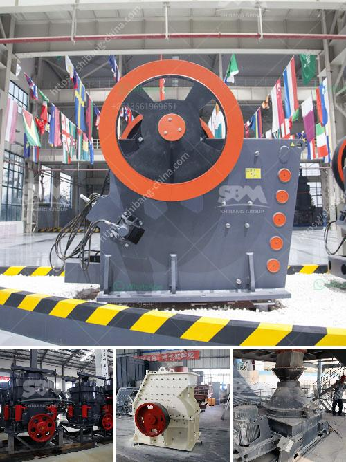

<h3>مطحنة كرات صغيرة للبيع</h3>
تعتبر مطحنة الكرات الصغيرة واحدة من أهم وأكثر الأدوات استخدامًا في عملية طحن المواد الصلبة. تُستخدم هذه المطاحن في صناعات عديدة مثل صناعة الاسمنت والصناعات الكيماوية ومعالجة المعادن والصناعات الأخرى التي تتطلب عملية طحن دقيقة وتفجير المواد الخام.

تتكون مطاحن الكرات الصغيرة من جسم هندسي معدني صلب، وفي داخله توجد كرات صغيرة وأسطوانة دوارة. عند تشغيل المطحنة، تتحرك الأسطوانة والكرات داخل الجسم الهندسي لسحق وطحن المواد الصلبة.

من أهم المميزات التي تجعل مطاحن الكرات الصغيرة مرغوبة هي قدرتها على تحقيق طحن دقيق وفعال للمواد الصلبة. فبسبب حجم الكرات الموجودة داخل المطحنة، فإنها تكون قادرة على تفتيت المواد إلى حجم صغير جدًا وبذلك تحقق طحنًا دقيقًا وفعالًا. كما أنها تتميز بالقدرة على تفجير وطحن المواد الهشة والرطبة والجافة على حد سواء.

تُستخدم مطاحن الكرات الصغيرة في صناعة الاسمنت بشكل خاص، حيث تستخدم لطحن الكلنكر والمواد الإضافية معًا لتشكيل الإسمنت النهائي. كما تستخدم أيضًا في صناعة الأسمدة وطحن المعادن مثل الفلسبار والكوارتز. بالإضافة إلى ذلك، فإنها تستخدم في صناعة الدهانات والأصباغ والبلاستيك والكيماويات والمواد الغذائية وغيرها من الصناعات التي تتطلب عملية طحن دقيقة.

في نهاية المطاف، إذا كنت تبحث عن مطحنة كرات صغيرة للبيع، فإنك ستجد العديد من الخيارات المتاحة في السوق. تتفاوت أحجام المطاحن وقدرتها على الطحن وأسعارها. ينصح دائمًا بشراء مطحنة من مصدر موثوق به والتأكد من أنها تتوافق مع احتياجاتك ومتطلباتك المحددة.

قبل الشراء، يجب أن تأخذ في الاعتبار بعض العوامل الرئيسية مثل سعة المطحنة وسرعة الدوران ومستوى الضوضاء وتكلفة الصيانة. يجب أن تكون المطاحن مصنوعة من مواد ذات جودة عالية لتحمل الاستخدام الشاق وتشتت المواد بشكل فعال.

باختصار، مطاحن الكرات الصغيرة للبيع هي أدوات أساسية في العديد من الصناعات. تساعد في عملية طحن دقيقة للمواد الصلبة وتفجيرها بشكل فعال. وبفضل تقنيات التحكم الحديثة، أصبحت هذه المطاحن تعمل بكفاءة أعلى وبدقة أكبر، مما يسهم في زيادة الإنتاجية وتحسين جودة المنتج النهائي.
<h3>Contact us</h3><ul><li><strong>Whatsapp:&nbsp;<a href="https://wa.me/8613661969651">+8613661969651</a></strong></li><li><a href="https://swt.shibang-china.com/?git&amp;zhl&amp;مطحنة كرات صغيرة للبيع"><strong>Online Service(chat now)</strong></a></li></ul><h3>Related</h3><ul><li><a href='آلة طحن الرخام.md'>آلة طحن الرخام</a></li><li><a href='سير الناقل في زامبيا.md'>سير الناقل في زامبيا</a></li><li><a href='المعدات المطلوبة لإنشاء محجر الجرانيت.md'>المعدات المطلوبة لإنشاء محجر الجرانيت</a></li><li><a href='البحث عن مطحنة الهامر.md'>البحث عن مطحنة الهامر</a></li><li><a href='خط إنتاج مسحوق الجبس الرسم التخطيطي.md'>خط إنتاج مسحوق الجبس الرسم التخطيطي</a></li></ul>