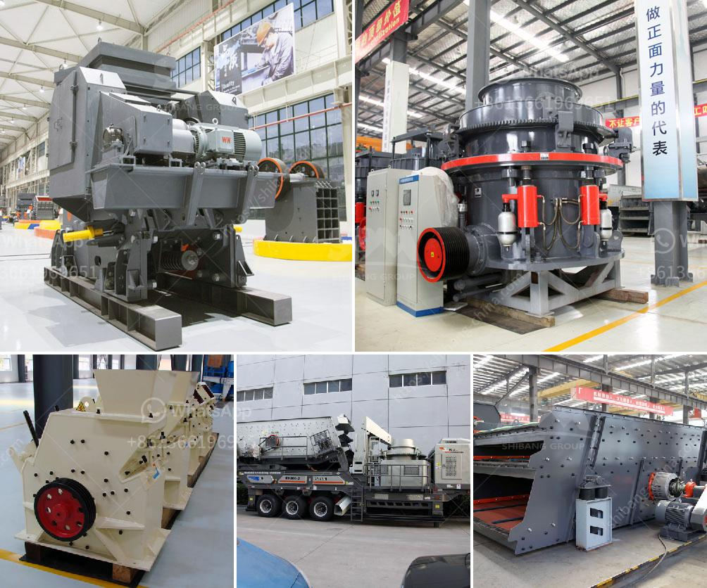

<h3>مطحنة كرات صغيرة لهنان الصين</h3>
تعد صناعة التعدين أحد القطاعات الهامة في الصين، وتعتبر محافظة هنان واحدة من أكبر المناطق المنتجة في هذا القطاع. بدأت مطاحن الكرات الصغيرة في هنان تلعب دورًا أساسيًا في تجهيز الخامات وطحنها لصناعة المواد الأولية المستخدمة في الصناعات المعدنية والتعدينية.

تساهم مطاحن الكرات الصغيرة في زيادة كفاءة طحن الخامات، وتحسين جودتها قبل استخدامها في العمليات الصناعية اللاحقة. فعن طريق تطوير هذه المطاحن، يتمكن المُشغِّلون من تحقيق إنتاجية أعلى بفضل عملية الطحن السريعة والمتسقة. لذلك، تعد مطاحن الكرات الصغيرة في هنان حلاً مثلى للمنتجين والمُشغِّلين الذين يسعون لتحسين أداء إنتاجهم.

يتم استخدام مطاحن الكرات الصغيرة في هنان في مجموعة متنوعة من الصناعات مثل التعدين والصناعات المعدنية والمواد الكيميائية. تعتبر مطاحن الكرات الصغيرة عنصرًا أساسيًا في معالجة الخامات وإنتاج المواد الأولية المستخدمة في هذه الصناعات.

تتكون مطاحن الكرات الصغيرة في هنان من جسم أسطواني يحتوي على كرات فولاذية صغيرة تستخدم لطحن المواد الخام. تتحرك الكرات حسب اتجاه دوران الأسطوانة، وبفضل قوة الاحتكاك بين الكرات والمواد الخام، يتم تفتيت وطحن الخام بشكل فعال. وتختلف حجم الكرات الصلبة المستخدمة في المطاحن حسب الاحتياجات المحددة لكل صناعة ونوع الخام المعالج.

يتميز تصميم مطاحن الكرات الصغيرة في هنان بالكفاءة والمتانة والقدرة على المعالجة العالية. حيث تعتمد معدات الطحن الأخرى على نظام الاحتكاك الهوائي، يعتمد تصميم هذه المطاحن على دوران الكرات الفولاذية لتحقيق ثبات وسرعة أعلى. توفر هذه المطاحن أيضًا نقاط تفتيت مختلفة تحسبًا لاحتياجات العملاء المحددة.

في النهاية، تُعَد مطاحن الكرات الصغيرة في هنان، الصين، أداة مهمة في صناعة التعدين والصناعات المعدنية. تعزز هذه المطاحن كفاءة العمليات وتحسن جودة المواد الخام المستخدمة. بالتالي، تلعب مطاحن الكرات الصغيرة دورًا حيويًا في صناعة التعدين وتسهم في تحسين إنتاجية الشركات وتلبية احتياجات السوق بشكل أفضل.
<h3>Contact us</h3><ul><li><strong>Whatsapp:&nbsp;<a href="https://wa.me/8613661969651">+8613661969651</a></strong></li><li><a href="https://swt.shibang-china.com/?git&amp;zhl&amp;مطحنة كرات صغيرة لهنان الصين"><strong>Online Service(chat now)</strong></a></li></ul><h3>Related</h3><ul><li><a href='كسارة حجرية بسعة 100 طن في الساعة استهلاك الديزل.md'>كسارة حجرية بسعة 100 طن في الساعة استهلاك الديزل</a></li><li><a href='سيور ناقلة للبيع في الصين.md'>سيور ناقلة للبيع في الصين</a></li><li><a href='مصنع غسيل رمال الكروم بأسعار مناسبة.md'>مصنع غسيل رمال الكروم بأسعار مناسبة</a></li><li><a href='مصنع مطحنة ريموند في الهند.md'>مصنع مطحنة ريموند في الهند</a></li><li><a href='تبيع شاشات الاهتزاز للحصى والرمل.md'>تبيع شاشات الاهتزاز للحصى والرمل</a></li></ul>