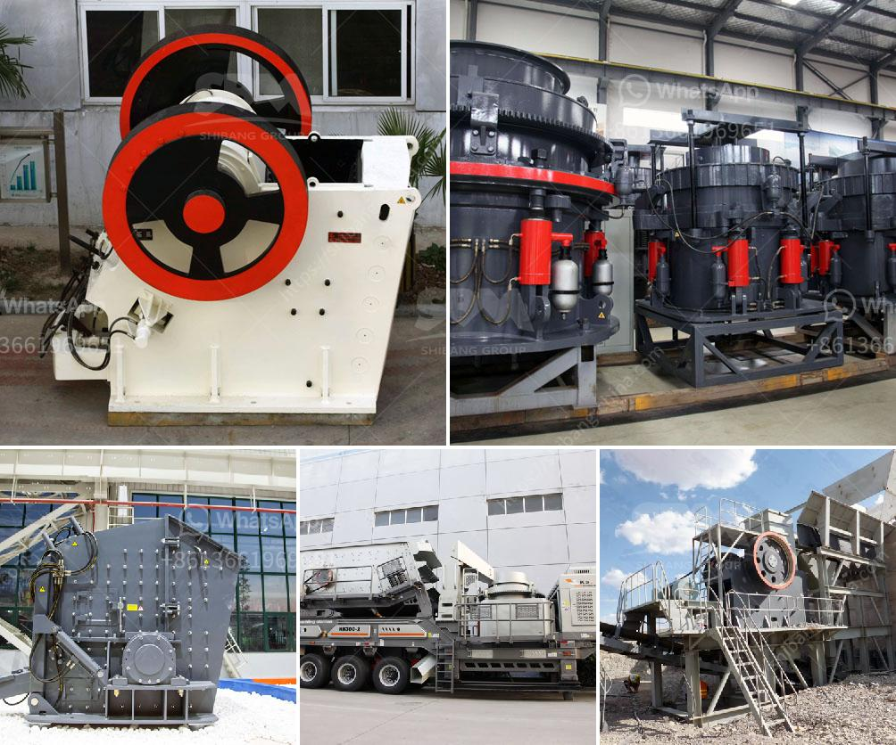

<h3>مطحنة كرات عمودية في كينيا</h3>
تعتبر مطاحن الكرات العمودية من أهم التقنيات المستخدمة في صناعة التعدين والبناء والكيمياء. وفي كينيا، يشهد قطاع التعدين نموًا ملحوظًا خلال العقود الأخيرة بفضل الاكتشافات المستمرة للموارد الطبيعية مثل الذهب والفضة والفوسفات والصخور الصلبة الأخرى. ومع زيادة الطلب على استخراج وتجهيز هذه الموارد، أصبح استخدام مطاحن الكرات العمودية في كينيا أمرًا حيويًا للغاية.

تعمل مطاحن الكرات العمودية عن طريق تدوير أسطوانة تحوي كرات صلبة داخلها. تستخدم هذه الكرات لسحق المواد الخام إلى حجم معين، وتؤدي هذه العملية إلى تحرير المعادن القيمة المخبأة في الصخور. تتمتع مطاحن الكرات العمودية بالعديد من المزايا مثل سهولة الاستخدام والصيانة وكفاءة التحطيم المرتفعة. كما تتميز أيضًا بالقدرة على معالجة مجموعة واسعة من المواد الصلبة المختلفة، بما في ذلك الصخور الصلبة ذات القساوة العالية.

واحدة من المعدات المعروفة بأداءها الممتاز في مجال تعدين الذهب في كينيا هي مطحنة الكرات العمودية. وقد تم استخدامها بنجاح في إنتاج الذهب وتحسين عمليات استخلاص المعدن في العديد من المناجم. تعتمد مطاحن الكرات العمودية في عملية تكسير وطحن الصخور الخام، وتنتج مسحوقًا ناعمًا يحتوي على جسيمات الذهب المستهدفة. ثم يتم تركيز هذه المساحيق باستخدام تقنيات تخصيب مختلفة لاستخلاص الذهب بفاعلية أكبر.

إلى جانب تعدين الذهب، تجد أن مطاحن الكرات العمودية تستخدم أيضًا في أنشطة استخراج المعادن الأخرى في كينيا. فعلى سبيل المثال، في صناعة الفوسفات، يتم استخدامها لطحن المعادن الخام وتنقيتها لإنتاج الأسمدة. كما تستخدم أيضًا في تجهيز الصخور الصلبة الأخرى مثل الجرانيت والبازلت في صناعة البناء والركام.

باختصار، يمثل استخدام مطاحن الكرات العمودية في كينيا خطوة هامة نحو تحسين كفاءة صناعة التعدين وتحقيق الأرباح. تساهم هذه التقنية في تحرير قيمة الموارد الطبيعية واستخلاصها بشكل أكثر كفاءة واقتصادية. كما تساهم أيضًا في دعم التنمية المستدامة للقطاع التعديني وتعزيز الاستدامة البيئية في كينيا.
<h3>Contact us</h3><ul><li><strong>Whatsapp:&nbsp;<a href="https://wa.me/8613661969651">+8613661969651</a></strong></li><li><a href="https://swt.shibang-china.com/?git&amp;zhl&amp;مطحنة كرات عمودية في كينيا"><strong>Online Service(chat now)</strong></a></li></ul><h3>Related</h3><ul><li><a href='مطاحن الكرة المستخدمة في بيرو.md'>مطاحن الكرة المستخدمة في بيرو</a></li><li><a href='آلة قطع الحجر المستخدمة من اليابان.md'>آلة قطع الحجر المستخدمة من اليابان</a></li><li><a href='مورد آلة طحن الكرة في إندونيسيا.md'>مورد آلة طحن الكرة في إندونيسيا</a></li><li><a href='صنع مسحوق الكالسيوم.md'>صنع مسحوق الكالسيوم</a></li><li><a href='آلة تكسير الفك.md'>آلة تكسير الفك</a></li></ul>