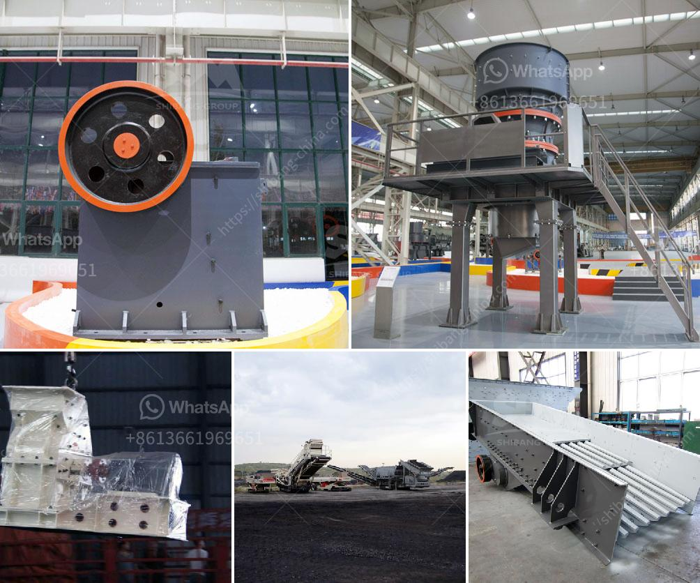

<h3>مطحنة كرات لتعدين الذهب للبيع</h3>
تُعد مطحنة الكرات أحد الأجهزة الهامة في صناعة تعدين الذهب، حيث تستخدم لطحن الخامات الصلبة إلى حجم صغير قبل استخلاص الذهب منها. تعتبر مطاحن الكرات جزءًا أساسيًا من تجهيز المصانع التعدينية وتشتهر بكفاءتها وقدرتها على معالجة كميات كبيرة من المواد بشكل فعّال.

تتكون مطحنة الكرات من أسطوانة طويلة تحتوي على كرات فولاذية أو معدنية متناسقة الحجم يتراوح طولها ما بين عدة سنتيمترات إلى عدة بوصات. يتم تعبئة الخامات داخل الأسطوانة المدورة وعندما تدور الأسطوانة، ترتفع الكرات لتصطدم بالخامات ويتم طحنها بفعل قوة الاصطدام بينهما. يتم إضافة الماء إلى الأسطوانة لزيادة الفاعلية الطحن وتقليل توليد الغبار.

يتم استخدام مطاحن الكرات في عمليات تعدين الذهب، حيث يتم طحن الخامات الصلبة لتجهيزها للاستخلاص اللاحق. يتم طحن الخامات لزيادة نسبة السطح النشطة وتعزيز الاستخلاص، حيث يتعرض الخام للشد والضغط بين الكرات ويتم تحطيمه إلى حجم أصغر. يتم تحريك الكرات بسرعة داخل الأسطوانة مما يعزز الطحن ويحسّن أداء المطحنة.

تتوفر مطاحن الكرات للبيع في السوق بمختلف الأحجام والقدرات وتكاليف التشغيل. يتأثر سعر المطحنة بعوامل عديدة، بما في ذلك الطاقة الإنتاجية للمطحنة، وحجم الكرات المستخدمة، وجودة التصنيع، والتكنولوجيا المستخدمة. عمومًا، يتراوح سعر مطحنة الكرات لتعدين الذهب بين 200 و 400 دولار، ولكن يجب أن يؤخذ في الاعتبار أن هذه الأرقام قد تختلف اعتمادًا على العلامة التجارية ومكان البيع.

تجدر الإشارة إلى أن استخدام مطاحن الكرات يعتبر مهمة في جميع مصانع تعدين الذهب الصناعية. يعتبر الطحن الجيد والفعّال أمرًا بالغ الأهمية لاستخلاص الذهب بكميات كبيرة وبكفاءة عالية، ومن ثم زيادة العائد المادي. بالتالي، فإن شراء مطحنة كرات لتعدين الذهب يعد استثمارًا ناجحًا للمنشآت التعدينية الراغبة في زيادة إنتاجها ورفع كفاءتها.
<h3>Contact us</h3><ul><li><strong>Whatsapp:&nbsp;<a href="https://wa.me/8613661969651">+8613661969651</a></strong></li><li><a href="https://swt.shibang-china.com/?git&amp;zhl&amp;مطحنة كرات لتعدين الذهب للبيع"><strong>Online Service(chat now)</strong></a></li></ul><h3>Related</h3><ul><li><a href='مخروط سحق 700 1000.md'>مخروط سحق 700 1000</a></li><li><a href='معدات مصنع الإسمنت اللازمة.md'>معدات مصنع الإسمنت اللازمة</a></li><li><a href='مصنع كسارة السخام في الهند.md'>مصنع كسارة السخام في الهند</a></li><li><a href='سعر مطرقة مطحنة سعة صنع في الصين.md'>سعر مطرقة مطحنة سعة صنع في الصين</a></li><li><a href='مورد آلة كسارة الأسطوانة.md'>مورد آلة كسارة الأسطوانة</a></li></ul>