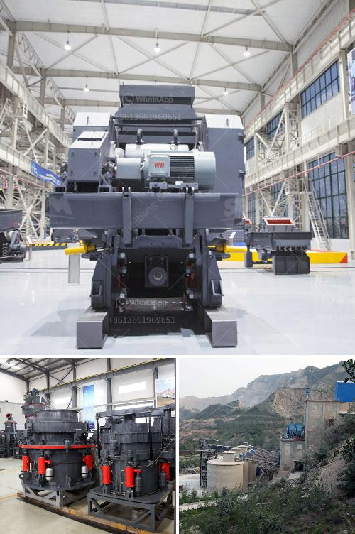

<h3>مطحنة كرات محمولة لتعدين الحجم الصغير</h3>
تلعب معدات التعدين دورًا حاسمًا في استخراج المعادن من الأرض وفصلها عن الصخور والرواسب الأخرى. ومن بين هذه المعدات هناك ما يعرف بمطحنة الكرات المحمولة أو المتنقلة. وتعد هذه المعدة من إحدى الأدوات الهامة لتعدين الحجم الصغير وتعتبر فعالة وسهلة الاستخدام.

تتكون مطحنة الكرات المحمولة من جهاز أسطواني طويل يحتوي على كرات صلبة تستخدم لطحن المواد الصلبة ، مما يؤدي إلى تفتيتها إلى جزيئات أصغر. وتستخدم هذه المطاحن في تعدين الحجم الصغير ، حيث يكون للكرات الصلبة أبعاد صغيرة تتراوح بين بضعة سنتيمترات إلى بضعة أمتار ويتم تحميلها في المطحنة مع عينة المادة التي يتم معالجتها.

يمكن استخدام مطحنة الكرات المحمولة في عدة نواحي بطرق مختلفة في عمليات التعدين ، تشمل ذلك سحق الخامات الصلبة وطحنها وفصل المعادن النفيسة من الصخور المعدنية الأخرى. وتعتبر هذه المعدة مفيدة جدًا في التعامل مع الحجارة الغنية بالمعادن الثمينة مثل الذهب والفضة والنحاس والرصاص وغيرها.

بالإضافة إلى ذلك ، مطحنة الكرات المحمولة تعتبر مناسبة للاستخدام في المناطق التي يصعب الوصول إليها. فمن خلال نقلها بسهولة وتركيبها في أماكن مختلفة ، يمكن للمطحنة تلبية احتياجات العمل في الأماكن النائية والمعزولة.

علاوة على ذلك ، فإن هذه المعدة توفر أداءً مستقرًا وفعالًا. وبفضل قدرتها على طحن المواد إلى حجم أصغر ، يتسنى استخلاص المعادن الثمينة بكفاءة أكبر. كما أنها تعمل بواسطة محرك قوي يدعم عمليات الطحن المستمرة حتى تتم الحصول على المنتج النهائي.

إن استخدام مطحنة الكرات المحمولة في تعدين الحجم الصغير يعتبر خيارًا مثاليًا للحصول على كفاءة أعلى وإنتاجية أكبر. وهي تقدم إمكانية التعامل بسهولة مع الخامات الصلبة وفصل المعادن الثمينة بدقة وعزم كبيرين.
<h3>Contact us</h3><ul><li><strong>Whatsapp:&nbsp;<a href="https://wa.me/8613661969651">+8613661969651</a></strong></li><li><a href="https://swt.shibang-china.com/?git&amp;zhl&amp;مطحنة كرات محمولة لتعدين الحجم الصغير"><strong>Online Service(chat now)</strong></a></li></ul><h3>Related</h3><ul><li><a href='موردين محمولين لكسارة الحجر.md'>موردين محمولين لكسارة الحجر</a></li><li><a href='آلة مسحوق الدولوميت في سريلانكا.md'>آلة مسحوق الدولوميت في سريلانكا</a></li><li><a href='مورد آلة كسارة النفايات الفلبين.md'>مورد آلة كسارة النفايات الفلبين</a></li><li><a href='مكونات مصنع معالجة الفحم المتنقل.md'>مكونات مصنع معالجة الفحم المتنقل</a></li><li><a href='سؤال حول عملية الطحن بالكرات.md'>سؤال حول عملية الطحن بالكرات</a></li></ul>