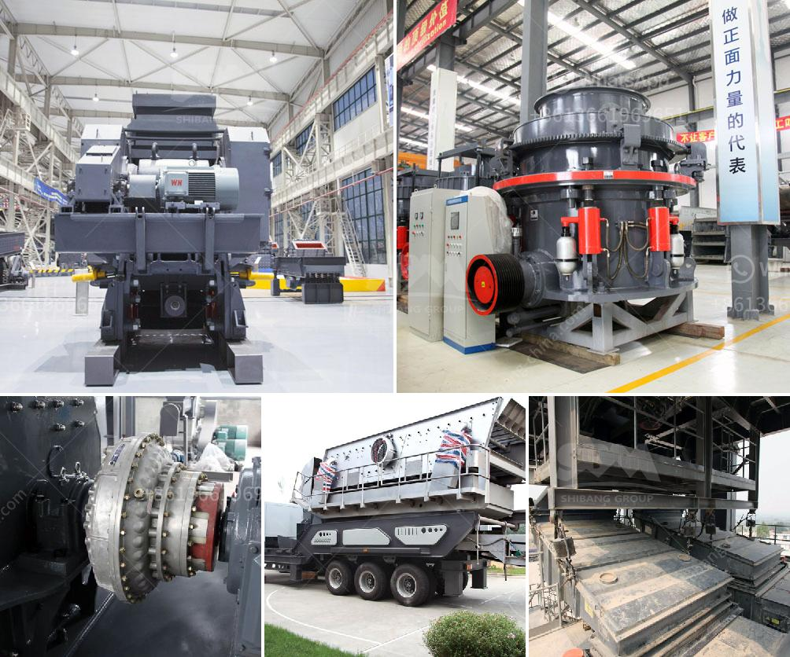

<h3>مطحنة كرات مخروطية للبيع</h3>
تعتبر مطاحن الكرات المخروطية أحد أهم الأدوات في صناعة الطحن. فهي تستخدم لطحن المواد الخام والمواد الجافة في صناعات متعددة مثل صناعة الأسمنت وصناعة السيراميك ومعالجة المواد المعدنية. في هذه المقالة سنتعرف على فوائد استخدام مطحنة الكرات المخروطية، وسنلقي نظرة على العوامل المؤثرة في سعرها ومدى توفرها في السوق.

يعود استخدام مطاحن الكرات المخروطية إلى القرن العشرين، ومنذ ذلك الحين تطورت وتحسنت بشكل كبير. تتكون هذه المطاحن من جسم أسطواني مخروطي مع أغلفة معدنية قوية، وفي داخلها توجد كرات معدنية صلبة تستخدم لطحن المواد. وتعتبر المطاحن المخروطية من أكثر أنواع المطاحن استخدامًا في الصناعة بسبب كفاءتها العالية وسهولة تشغيلها.

تتميز مطاحن الكرات المخروطية بعدة فوائد. أولاً، فإنها توفر طحنًا فعالًا ومتجانسًا للمواد الخام بفضل تصميمها المبتكر وتوزيع الكرات المعدنية في الداخل. ثانيًا، فإنها تتميز بكفاءة عالية في استخدام الطاقة، مما يساهم في تقليل تكاليف الإنتاج. كما تتميز أيضًا بالتحكم في حجم الجسيمات المطحونة، مما يتيح التحكم الدقيق في خصائص المواد النهائية التي يتم إنتاجها.

بالنسبة لسعر مطاحن الكرات المخروطية، فإنه يعتمد على عدة عوامل. أهمها الحجم والسعة المطلوبة للمطحنة، حيث تختلف الأحجام والسعات المتاحة وفقًا لاحتياجات العملاء المختلفة. علاوة على ذلك، يؤثر نوع المواد المطحونة على سعر المطحنة، إذ تتطلب المواد ذات الصلابة العالية مطاحن معدنية أكثر صلابة وبنية قوية مما يؤثر في تكلفتها.

بالنسبة لتوفر مطاحن الكرات المخروطية في السوق، فإنها تعتبر متاحة بشكل واسع نظرًا لاستخدامها الشائع في الصناعة. يمكن العثور على مطاحن الكرات المخروطية المستعملة بأسعار منخفضة، وهناك أيضًا العديد من الشركات المصنعة المعروفة التي توفرها بأحجام وسعات مختلفة وبأسعار تنافسية.

في الختام، تعد مطاحن الكرات المخروطية أداة لا غنى عنها في صناعة الطحن. فهي توفر طحنًا فعالًا ومتجانسًا، وتتميز بكفاءة عالية في استخدام الطاقة والتحكم الدقيق في حجم الجسيمات. وعلى الرغم من اختلاف الأسعار وتوفرها في السوق، إلا أنه من الممكن العثور على مطاحن كرات مخروطية بسعر وجودة تلبي احتياجات ومتطلبات العملاء المختلفة.
<h3>Contact us</h3><ul><li><strong>Whatsapp:&nbsp;<a href="https://wa.me/8613661969651">+8613661969651</a></strong></li><li><a href="https://swt.shibang-china.com/?git&amp;zhl&amp;مطحنة كرات مخروطية للبيع"><strong>Online Service(chat now)</strong></a></li></ul><h3>Related</h3><ul><li><a href='وزن آلة كسارة الصخور.md'>وزن آلة كسارة الصخور</a></li><li><a href='مكونات مصنع معالجة الفحم المتنقل.md'>مكونات مصنع معالجة الفحم المتنقل</a></li><li><a href='كسارة للإيجار في نيو جيرسي.md'>كسارة للإيجار في نيو جيرسي</a></li><li><a href='مطحنة فحم رولر.md'>مطحنة فحم رولر</a></li><li><a href='كسارة تعدين الحجر الجيري في فيتنام.md'>كسارة تعدين الحجر الجيري في فيتنام</a></li></ul>