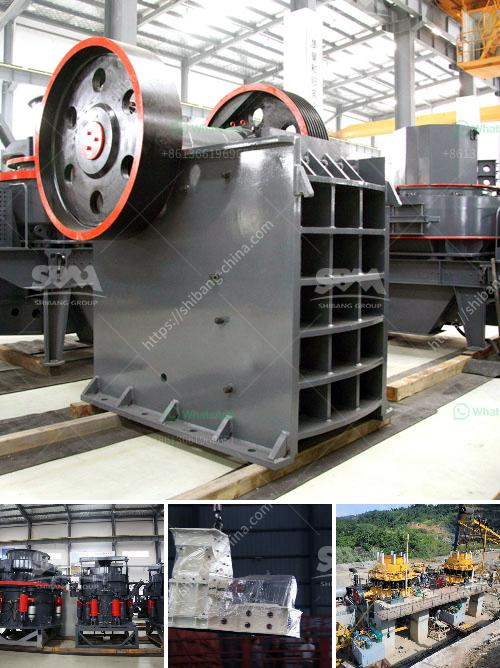

<h3>مطحنة كرة مطحنة مطرقة</h3>
مطحنة الكرة ومطحنة المطرقة هما نوعان من المطاحن التي تستخدم لطحن المواد الخام والمواد الأخرى في الصناعة. في هذه المقالة ، سنقوم بمقارنة بين المطحنة الكروية ومطحنة المطرقة لفهم الاختلافات بينهما.

تستخدم مطحنة الكرة لطحن المعادن والمواد الأخرى بواسطة إعطائها شكل كروي. تتحرك الكرات داخل الأسطوانة وتطحن المواد لأحجام مختلفة. تعتمد قدرة الطحن على حجم الكرات وحجم المواد الداخلة. إذا كانت المواد ذات قطر أكبر ، فسوف تستغرق عملية الطحن وقتًا أطول. يعتبر استخدام مطحنة الكرة في العديد من الصناعات مثل صناعة الإسمنت والتعدين والكيمياء وغيرها أمرًا شائعًا.

من ناحية أخرى ، تتميز مطحنة المطرقة بسرعة عملية الطحن وفعاليتها في تحطيم المواد إلى جسيمات صغيرة. تعتمد هذه المطحنة على استخدام رؤوس مطرقة ثقيلة تدور بسرعة عالية لتحطيم المواد. يمكن استخدام مطاحن المطارق لطحن الأعلاف والحبوب والأعشاب والخضروات والتوابل والمواد الأخرى في صناعة الأغذية.

أحد الاختلافات الرئيسية بين المطحنة الكروية ومطحنة المطرقة هو طريقة الطحن المستخدمة. في حين يستخدم المطحنة الكروية الاحتكاك والضغط لطحن المواد ، تعتمد مطحنة المطرقة على قوة الصدمة لتكسير المواد. كما أنه يتطلب اختلاف في التصميم والهيكل بين المطحنتين.

بالإضافة إلى ذلك ، يتطلب استخدام المطحنة الكروية تدوير الأسطوانة بسرعة منخفضة ، في حين يتم تشغيل مطحنة المطرقة بسرعة أعلى. هذا يعني أن مطاحن الكرة غالباً ما تكون أكبر حجماً وأثقل وتحتاج إلى قدرة كهربائية أعلى من مطاحن المطارق.

للاختيار بين استخدام مطحنة الكرة أو مطحنة المطرقة ، يجب أخذ العديد من العوامل في الاعتبار مثل نوع المواد المطحونة وحجمها والقدرة المطلوبة والتكاليف المتوقعة. ينبغي أيضا مراعاة احتياجات الصيانة والتشغيل والاستثمار في المعدات.

في النهاية ، تعتبر مطحنة الكرة ومطحنة المطرقة أدوات مهمة في صناعة الطحن وتستخدم في مجموعة متنوعة من التطبيقات. تحقق كلا المطحنتين من الكفاءة والاقتصاد في عملية الطحن وتلبية احتياجات الصناعة المستخدمة فيها.
<h3>Contact us</h3><ul><li><strong>Whatsapp:&nbsp;<a href="https://wa.me/8613661969651">+8613661969651</a></strong></li><li><a href="https://swt.shibang-china.com/?git&amp;zhl&amp;مطحنة كرة مطحنة مطرقة"><strong>Online Service(chat now)</strong></a></li></ul><h3>Related</h3><ul><li><a href='شركات سيور النقل في المكسيك.md'>شركات سيور النقل في المكسيك</a></li><li><a href='صيانة محطة توليد الفحم بصيغة PDF.md'>صيانة محطة توليد الفحم بصيغة PDF</a></li><li><a href='مصنع كسارة الحجر 100 tph.md'>مصنع كسارة الحجر 100 tph</a></li><li><a href='سعر كسارة مخروطية 250 طن.md'>سعر كسارة مخروطية 250 طن</a></li><li><a href='آلات كسارة الرقائق.md'>آلات كسارة الرقائق</a></li></ul>