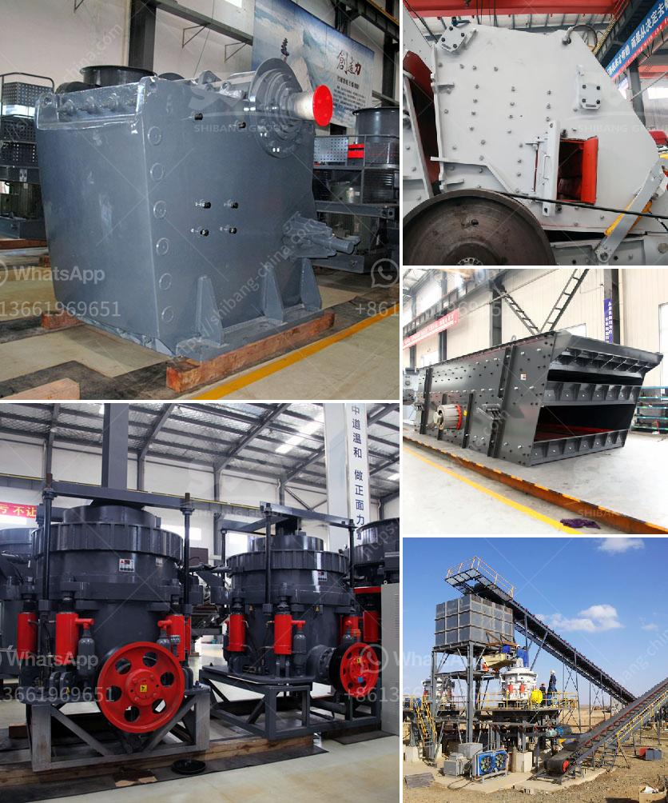

<h3>مطحنة للحجر الجيري في إيطاليا في بيرجامو</h3>
تقع مطحنة الحجر الجيري في إيطاليا في مدينة بيرجامو في منطقة لومبارديا. تعتبر هذه المطحنة من أبرز المعالم الصناعية في المدينة وتحظى بشهرة عالمية بفضل عملية صناعة الحجر الجيري.

تأسست مطحنة الحجر الجيري في بيرجامو في القرن التاسع عشر وكانت تستخدم في الأصل لطحن الحجر الجيري لإنتاج مواد البناء. يعود تاريخ بناء المطحنة إلى العصور الوسطى وقد تم تجديدها وتحديثها على مر السنين لتلبية الاحتياجات الحديثة للصناعة.

تتمتع المطحنة بموقع استراتيجي قرب محاجر الحجر الجيري، مما يوفر توفرًا كبيرًا للموارد الطبيعية اللازمة لعملية الإنتاج. يتم تكسير الحجر الجيري وطحنه في المطحنة للحصول على مسحوق الحجر الجيري النقي، الذي يستخدم في العديد من الصناعات مثل البناء والتعدين والصناعات الكيماوية.

تتميز عملية طحن الحجر الجيري في المطحنة بقدرتها العالية على إنتاج مسحوق حجر جيري نقي ذو جودة عالية ومقاييس دقيقة. يتم استخدام تكنولوجيا حديثة ومعدات عالية الجودة في المطحنة، مما يضمن الحصول على منتج نهائي متميز وصحيح الحجم والمواصفات.

تلعب مطحنة الحجر الجيري في بيرجامو دورًا حيويًا في صناعة البناء في إيطاليا وحول العالم. يتم تصدير منتجات المطحنة إلى العديد من الدول وتستخدم في مشاريع البناء والتشييد الكبرى.

بفضل جودة منتجاتها وسمعتها الطيبة، أصبحت مطحنة الحجر الجيري في بيرجامو وجهة مشهورة للمهندسين المعماريين ومقاولي البناء الذين يبحثون عن مواد ذات جودة عالية لمشاريعهم.

بالإضافة إلى ذلك، تشتهر بيرجامو أيضًا بمناظرها الطبيعية الخلابة وتاريخها الغني بالآثار الثقافية والتاريخية. فمن الممكن دمج زيارة مطحنة الحجر الجيري مع رحلة استكشافية لاستكشاف جمال المدينة ومعالمها.

في الختام، تعتبر مطحنة الحجر الجيري في بيرجامو في إيطاليا واحدة من أبرز المعالم الصناعية في المدينة وتحظى بشهرة عالمية بفضل منتجاتها ذات الجودة العالية. تعد هذه المطحنة مكانًا قيمًا للزوار الذين يرغبون في معرفة المزيد عن عملية صناعة الحجر الجيري والاستمتاع بجمال بيرجامو.
<h3>Contact us</h3><ul><li><strong>Whatsapp:&nbsp;<a href="https://wa.me/8613661969651">+8613661969651</a></strong></li><li><a href="https://swt.shibang-china.com/?git&amp;zhl&amp;مطحنة للحجر الجيري في إيطاليا في بيرجامو"><strong>Online Service(chat now)</strong></a></li></ul><h3>Related</h3><ul><li><a href='مصنع مسحوق لوح الجبس في إثيوبيا.md'>مصنع مسحوق لوح الجبس في إثيوبيا</a></li><li><a href='تكلفة آلات الحديد الاسفنجي 300 طن في اليوم.md'>تكلفة آلات الحديد الاسفنجي 300 طن في اليوم</a></li><li><a href='كسارة مخروطية قياسية دليل الإصلاح.md'>كسارة مخروطية قياسية دليل الإصلاح</a></li><li><a href='كسارة الخرسانة للبيع في نيو جيرسي.md'>كسارة الخرسانة للبيع في نيو جيرسي</a></li><li><a href='مصانع محمولة للبيع في جنوب أفريقيا.md'>مصانع محمولة للبيع في جنوب أفريقيا</a></li></ul>