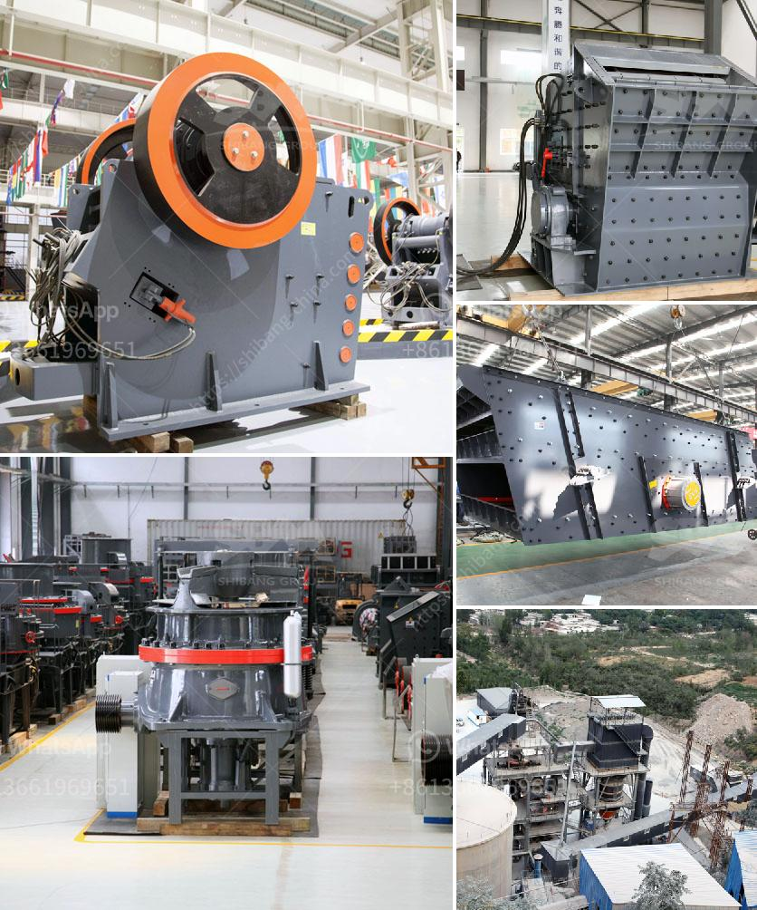

<h3>مطحنة للحجر الجيري في إيطاليا</h3>
تعتبر إيطاليا واحدة من الدول الأوروبية الجميلة والثقافية ، وتشتهر بالعديد من المعالم السياحية الشهيرة في جميع أنحاء البلاد. واحدة من هذه المعالم هي مطحنة الحجر الجيري في إيطاليا.

تقع مطحنة الحجر الجيري في منطقة توسكانا الخلابة في وسط إيطاليا. وتعتبر هذه المطحنة من أقدم المزارع في المنطقة ، حيث يعود تاريخها إلى العصور الوسطى. تم استخدام المطحنة في السابق لطحن الحجر الجيري المستخدم في صناعة البناء والتشييد.

تم بناء مطحنة الحجر الجيري على جانب نهر جميل ، وهي مبنية من الحجارة الطبيعية لتنسجم مع الطبيعة المحيطة. يتميز المبنى بمعماره الفريدة ، حيث يستخدم الحجر الجيري المحلي في بنائه. يتكون المبنى من عدة طوابق ، ويحتوي على آلات ومعدات تستخدم لطحن الحجر الجيري.

تم استخدام الحجر الجيري المطحون في صناعة البناء ، والطلاء ، والتماثيل ، والأعمال الفنية الأخرى. كان هناك طلب كبير على الحجر الجيري في تلك الفترة ، والذي تم استخراجه من المناجم المجاورة ، ثم يتم طحنه في المطحنة لصنع منتجات عالية الجودة.

تعتبر مطحنة الحجر الجيري اليوم واحدة من المعالم الثقافية التي يمكن للسياح زيارتها في إيطاليا. يمكن للزوار الاستمتاع بالمشاهد الخلابة للمبنى والتعرف على التاريخ الغني لهذه المنطقة. بالإضافة إلى ذلك ، يمكن للسياح مشاهدة عملية طحن الحجر الجيري المستخدم في مطحنة الحجر الجيري وشراء المنتجات المصنوعة منه.

بالمجمل ، تعتبر مطحنة الحجر الجيري في إيطاليا معلمًا ثقافيًا فريدًا يعكس تاريخ البلاد وتراثها الثقافي. إن زيارة هذا الموقع ستكون رحلة ممتعة وتعليمية لمحبي التاريخ والثقافة. يجب أن تكون إيطاليا على رأس قائمة الوجهات المفضلة لدى محبي السفر
<h3>Contact us</h3><ul><li><strong>Whatsapp:&nbsp;<a href="https://wa.me/8613661969651">+8613661969651</a></strong></li><li><a href="https://swt.shibang-china.com/?git&amp;zhl&amp;مطحنة للحجر الجيري في إيطاليا"><strong>Online Service(chat now)</strong></a></li></ul><h3>Related</h3><ul><li><a href='كسارة للحجر الجيري.md'>كسارة للحجر الجيري</a></li><li><a href='معالجة الحجر الجيري على نطاق صغير.md'>معالجة الحجر الجيري على نطاق صغير</a></li><li><a href='آلة كسارة الحجر.md'>آلة كسارة الحجر</a></li><li><a href='آلة تكسير الحجر في الصين.md'>آلة تكسير الحجر في الصين</a></li><li><a href='كيف يتم استخدام مسحوق الدولوميت في البناء.md'>كيف يتم استخدام مسحوق الدولوميت في البناء</a></li></ul>