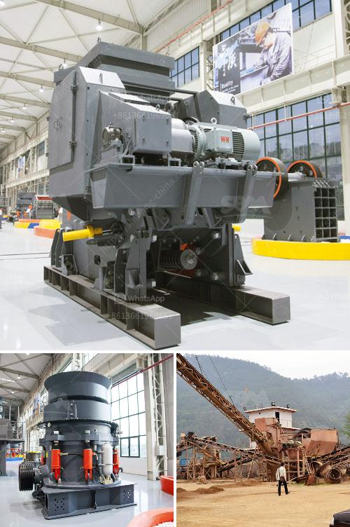

<h3>مطحنة ليستر في كينيا</h3>
تعد مطحنة ليستر واحدة من أبرز المعالم السياحية في كينيا. تقع هذه المطحنة في منطقة ريفية جميلة تعرف بإنتاجها للقهوة، وتعود تاريخ هذه المطحنة إلى أكثر من قرن من الزمان.

تأسست مطحنة ليستر في القرن التاسع عشر، وتحديدًا في عام 1888، لتكون أحد أوائل المطاحن في المنطقة. ومنذ ذلك الحين، ارتبطت مطحنة ليستر بتاريخ صناعة القهوة في كينيا.

تعتبر مطحنة ليستر اليوم واحدة من أكبر مطاحن القهوة في البلاد، حيث تقوم بمعالجة وطحن حبوب البن المحلية. وتتمتع المطحنة بسمعة عالية بفضل جودة منتجاتها واهتمامها بالتفاصيل وروح المبادرة.

واحدة من أبرز الخصائص التي تميز مطحنة ليستر هي التزامها بالممارسات الزراعية المستدامة والعدالة الاجتماعية. حيث تعاون المطحنة مع المزارعين المحليين لتوفير التدريب والدعم اللازم لتحسين جودة المحاصيل وزيادة الإنتاجية. كما تلتزم المطحنة بدفع أسعار معقولة للمزارعين، مما يساهم في تحسين مستوى المعيشة ودفع الاقتصاد في المنطقة.

بالإضافة إلى عملية طحن القهوة، يوفر مصنع ليستر أيضًا جولات سياحية تعرض عملية صنع القهوة من بدايتها حتى نهايتها. يتمكن الزوار من مشاهدة عملية تحميص حبوب البن، وتجربة الطحن اليدوي وتذوق أنواع مختلفة من القهوة المحمصة.

تعتبر مطحنة ليستر وجهة شهيرة لعشاق القهوة والمسافرين الذين يبحثون عن تجربة ثقافية فريدة من نوعها. تعد هذه المطحنة فرصة للاستمتاع بتجربة لا تنسى في عالم القهوة، وتكرس نفسها لتعزيز الوعي بأهمية صناعة القهوة وأثرها على المجتمعات المحلية.

المطحنة ليستر تعبر عن ثقافة وتراث كينيا، وتوفر للسياح فرصة للاستمتاع بأجواء نقية وجمال طبيعي بديع. إن الجمع بين إعداد القهوة بمهارة وتاريخ الزراعة المتجذر في المنطقة يجعل من مطحنة ليستر وجهة يجب زيارتها لأي مسافر مهتم بأصالة وثقافة الأماكن التي يزورها.

باختصار، تشكل مطحنة ليستر رمزًا لصناعة القهوة في كينيا وتتميز بتقديم منتجات ذات جودة عالية ومساهمتها الفعّالة في تعزيز الاستدامة والعدالة الاجتماعية. تجسد هذه المطحنة تراث وتطور البلاد في صناعة القهوة، وتعد وجهة تجذب العديد من السياح وعشاق القهوة لاستكشاف عالم القهوة الكيني وجمال الطبيعة المحيطة بها.
<h3>Contact us</h3><ul><li><strong>Whatsapp:&nbsp;<a href="https://wa.me/8613661969651">+8613661969651</a></strong></li><li><a href="https://swt.shibang-china.com/?git&amp;zhl&amp;مطحنة ليستر في كينيا"><strong>Online Service(chat now)</strong></a></li></ul><h3>Related</h3><ul><li><a href='آلة معالجة الجبس بسعة طن واحد.md'>آلة معالجة الجبس بسعة طن واحد</a></li><li><a href='أسعار كسارة الحجر في إندونيسيا.md'>أسعار كسارة الحجر في إندونيسيا</a></li><li><a href='كسارات حجر مستعملة للبيع.md'>كسارات حجر مستعملة للبيع</a></li><li><a href='مطحنة أسطوانية صينية.md'>مطحنة أسطوانية صينية</a></li><li><a href='كسارات الصخور للبيع.md'>كسارات الصخور للبيع</a></li></ul>