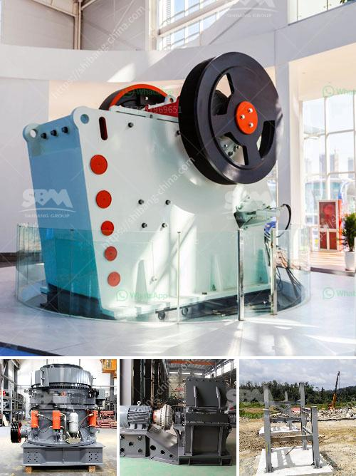

<h3>مطحنة محمولة في أستراليا بيرث</h3>
تعتبر مطحنة المحمولة في أستراليا بيرث واحدة من التكنولوجيات المتقدمة التي تساعد في تسهيل عملية طحن الحبوب والحصول على الطحين بسهولة وفعالية. يُعتبر الطحين منتجًا أساسيًا في صناعة الغذاء والخبز، والقدرة على طحن الحبوب في الموقع بما في ذلك خلال الرحلات الصغيرة تعد خيارًا مرغوبًا ومفيدًا للكثيرين.

تستخدم المطحنة المحمولة أحدث التقنيات في مجال الطحن المحمول، حيث يمكن للمستخدم أن يقوم بطحن الحبوب بنفسه دون الحاجة إلى الاعتماد على مطاحن التجارية الكبيرة. يتميز الجهاز بحجمه الصغير والعملي، بحيث يمكن حمله ونقله بسهولة إلى أي مكان. يمكن للأشخاص الذين تعتمد أنشطتهم على الحبوب، مثل الطهاة في المطاعم والفنادق والمزارعين والمخبوزين، استخدام هذه المطحنة المحمولة للحصول على طحين طازج بجودة عالية في أي وقت وفي أي مكان.

باستخدام المطحنة المحمولة، يمكن للمستخدم ضبط درجة الطحن بدقة وفقًا لاحتياجاته الخاصة. يعد هذا أمرًا هامًا للغاية في صناعة الطعام، حيث أن درجة الطحن تؤثر على نكهة الطعام وعلى نسبة الامتصاص والخصائص الحسية للمنتج النهائي. يمكن للمستخدم ضبط المطحنة المحمولة واختيار الدرجة المطلوبة للطحن، سواء كان ذلك طحنًا ناعمًا أو خشنًا.

توفر المطحنة المحمولة العديد من الفوائد العملية والاقتصادية. فمن المعروف أن الحبوب الطازجة تحتوي على قيمة غذائية أعلى ونكهة أكثر طعمًا من الحبوب المطحونة مسبقًا. وبالطبع، يمكن توفير الوقت والمال من خلال طحن الحبوب في الموقع بدلاً من شراء الطحين الجاهز. ليس هذا فحسب، بل يمكن أيضًا تقليل الهدر والفاقد من خلال طحن الحبوب حسب الحاجة فقط.

بالإضافة إلى ذلك، تعتبر المطحنة المحمولة في أستراليا بيرث خيارًا صديقًا للبيئة، حيث يمكن إعادة استخدام الحبوب المتبقية أو إضافتها إلى التغذية الحيوانية بدلاً من التخلص منها. يُعَد استثمار في هذا الجهاز فرصة ذكية للأفراد والمتاجر والمؤسسات الصغيرة لتحقيق توفير في التكاليف وتقديم منتجات طحين ذات جودة عالية للزبائن.

في الختام، تُعد مطحنة المحمولة في أستراليا بيرث خيارًا ممتازًا للأفراد والمؤسسات الصغيرة لطحن الحبوب بكفاءة وجودة عالية في أي مكان وفي أي وقت. تلبي هذه التقنية الحديثة احتياجات المستخدمين بطريقة عملية واقتصادية وتوفر منتجات طحين طازجة ولذيذة للمستهلكين.
<h3>Contact us</h3><ul><li><strong>Whatsapp:&nbsp;<a href="https://wa.me/8613661969651">+8613661969651</a></strong></li><li><a href="https://swt.shibang-china.com/?git&amp;zhl&amp;مطحنة محمولة في أستراليا بيرث"><strong>Online Service(chat now)</strong></a></li></ul><h3>Related</h3><ul><li><a href='تكلفة فتح مصنع للأسمنت الصغير.md'>تكلفة فتح مصنع للأسمنت الصغير</a></li><li><a href='كسارة السيليكون الوافر.md'>كسارة السيليكون الوافر</a></li><li><a href='كسارة الحجر ساياجي.md'>كسارة الحجر ساياجي</a></li><li><a href='سعر كسارة الحجر المحمول في باكستان.md'>سعر كسارة الحجر المحمول في باكستان</a></li><li><a href='مشروع تركي لإنتاج مسحوق الجبس.md'>مشروع تركي لإنتاج مسحوق الجبس</a></li></ul>