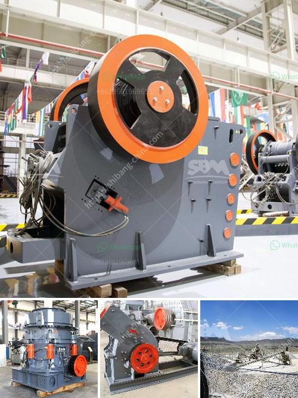

<h3>مطحنة مسحوق الحجر الجيري</h3>
تُعد مطحنة مسحوق الحجر الجيري عبارة عن آلة تُستخدم في طحن الحجر الجيري إلى مسحوق ناعم. يُستخدم الحجر الجيري على نطاق واسع في مجال البناء وصناعة المعادن، حيث أنه يعتبر أحد الخامات الرئيسية التي تُستخدم في إنتاج الأسمنت والطلاء والمواد الكيميائية والمعادن وغيرها من المنتجات.

تتكون مطحنة مسحوق الحجر الجيري من جهاز التغذية، الجزء الرئيسي للمطحنة، وحدة التوجيه، وحدة الختم، وحدة الضغط، وحدة التفريغ، ووحدة السيارة، ووحدة التحكم الكهربائية. تتميز هذه الآلة بقدرتها على طحن الحجر الجيري إلى مسحوق ناعم بحيث يكون قطر جسيماته صغيرًا جدًا، وبالتالي يكون له استخدامات واسعة.

من بين التطبيقات الأكثر شيوعًا لمسحوق الحجر الجيري هو استخدامه في إنتاج الأسمنت. فالحجر الجيري يعتبر أحد المكونات الأساسية لإنتاج الأسمنت، حيث يُطحن ليتحول إلى مسحوق ثم يخلط مع الألومينا والسيليكا والحديد لمنتجة الأسمنت. يتم طحن الحجر الجيري في مطحنة مسحوق الحجر الجيري بحجم حبيبات صغير جدًا، مما يزيد من كفاءة العمليات التالية.

بالإضافة إلى ذلك، فإن مسحوق الحجر الجيري يُستخدم أيضًا في صناعة المعدن والزجاج والورق والطلاء والمواد الكيميائية. فهو يستخدم كعامل ملين في صناعة الزجاج والورق، كما أنه يُضاف إلى الدهانات والطلاء لمنحها مقاومة للتآكل والتلوث. كما يستخدم أيضًا في صناعة الأدوية وفي إزالة الملوثات من المياه.

تؤثر مطحنة مسحوق الحجر الجيري بشكل كبير في جودة المسحوق المنتج. فالجودة المثلى تتطلب قطر جسيمات متجانس وناعم، وهذا ما يمكن تحقيقه عن طريق استخدام مطحنة مسحوق الحجر الجيري المتقدمة. تعتبر هذه الآلة عملية وفعالة من حيث الاستخدام وتُستخدم على نطاق واسع في عمليات الطحن الصناعية.

في الختام، تُعتبر مطحنة مسحوق الحجر الجيري أداة لا غنى عنها في صناعة البناء والصناعات التحويلية. حيث أنها تعمل على طحن الحجر الجيري إلى مسحوق ناعم يستخدم في العديد من التطبيقات المختلفة. تجعل الآلة هذا العمل أسهل وتحسن كفاءة العمليات التالية، وتضمن جودة المسحوق المنتج. لذا، يوصى بشدة باستخدام مطحنة مسحوق الحجر الجيري في الصناعات ذات الصلة للحصول على منتج ذو جودة عالية وأداء ممتاز.
<h3>Contact us</h3><ul><li><strong>Whatsapp:&nbsp;<a href="https://wa.me/8613661969651">+8613661969651</a></strong></li><li><a href="https://swt.shibang-china.com/?git&amp;zhl&amp;مطحنة مسحوق الحجر الجيري"><strong>Online Service(chat now)</strong></a></li></ul><h3>Related</h3><ul><li><a href='آلة طحن المطرقة بمعدل طن في الساعة.md'>آلة طحن المطرقة بمعدل طن في الساعة</a></li><li><a href='قائمة أسعار كسارات الفك.md'>قائمة أسعار كسارات الفك</a></li><li><a href='آلة صنع مسحوق الحجر الجيري في باكستان.md'>آلة صنع مسحوق الحجر الجيري في باكستان</a></li><li><a href='مطاحن ريموند في الصين.md'>مطاحن ريموند في الصين</a></li><li><a href='آلة حزمة مطحنة الكرة.md'>آلة حزمة مطحنة الكرة</a></li></ul>