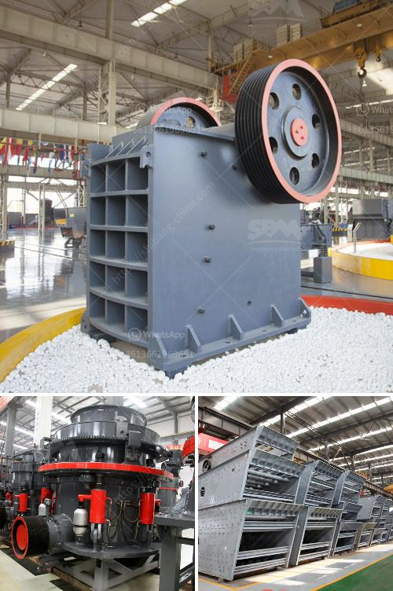

<h3>مطحنة مسحوق عالي الضغط في الهند</h3>
تعد مطحنة مسحوق عالي الضغط واحدة من أنواع المطاحن الشهيرة في الهند. تستخدم هذه المطاحن لطحن المواد الخام إلى مسحوق ناعم. يمكن استخدامها لمجموعة متنوعة من المواد مثل الباريت والكاولين والدولوميت والمرمر والجبس والفحم المسحوق والمواد الكيميائية والمعادن غير الحديدية وغيرها.

تتميز هذه المطاحن بخصائصها الفريدة. تتألف المطحنة العالية الضغط من العديد من الأجزاء مثل الغرفة الرئيسية ، ووحدة التحكم ، ونظام الدفع ، والمروحة ، والمنفاخ ، والمصعد. تعمل المروحة على التحكم في تدفق الهواء داخل المطحنة ، في حين أن المنفاخ يساعد على تنظيم درجة الحرارة. يمكن ضبط الحجم النهائي للمسحوق عن طريق ضبط الحجم الخشن للشبكة التي يتم استخدامها.

تعتبر هذه المطاحن فعالة في طحن المواد إلى مسحوق دقيق للغاية. بفضل الضغط العالي الذي يتم تسليمه إلى المطحنة ، يتم تحقيق تأثير طحن قوي وسريع. يتم طحن المواد بشكل متكامل داخل الغرفة الرئيسية للمطحنة ، مما يؤدي إلى تصنيع مسحوق ناعم ومتجانس.

تعد المطاحن عالية الضغط مثالية للاستخدام في صناعات متنوعة. تستخدم على نطاق واسع في تصنيع المواد الكيميائية والصناعات الكهربائية والطاقة والصناعات الثقيلة والمعادن وصناعة البناء والتعدين وغيرها. تعطي هذه المطاحن الأولوية لتحسين الكفاءة العامة للعملية ، وتقليل التلوث ، وتحسين جودة المنتج النهائي.

في الهند ، تعد المطاحن عالية الضغط سمة بارزة في قطاع التعدين وصناعة المعادن. تتوفر هذه المطاحن بأحجام وسعات متنوعة لتناسب احتياجات العملاء المختلفة. وتستخدم عادة كحلول مثالية للتحبيب والطحن في طرازات المصانع الكبيرة.

لخلاصة القول ، تعد مطحنة مسحوق عالي الضغط تكنولوجيا متطورة توفر عملية طحن فعالة وموثوقة في الهند وجميع أنحاء العالم. تستخدم في مجموعة واسعة من الصناعات وتساهم في تحسين جودة المنتج وزيادة الإنتاجية.
<h3>Contact us</h3><ul><li><strong>Whatsapp:&nbsp;<a href="https://wa.me/8613661969651">+8613661969651</a></strong></li><li><a href="https://swt.shibang-china.com/?git&amp;zhl&amp;مطحنة مسحوق عالي الضغط في الهند"><strong>Online Service(chat now)</strong></a></li></ul><h3>Related</h3><ul><li><a href='صيغة حساب قدرة كسارة الفك.md'>صيغة حساب قدرة كسارة الفك</a></li><li><a href='اليابان لمصنع تكسير متنقل.md'>اليابان لمصنع تكسير متنقل</a></li><li><a href='تكلفة أنظمة حزام النقل للتعدين.md'>تكلفة أنظمة حزام النقل للتعدين</a></li><li><a href='مصانع تكسير الفك في المملكة العربية السعودية.md'>مصانع تكسير الفك في المملكة العربية السعودية</a></li><li><a href='شركة تبيع كسارة الحجر في كينيا.md'>شركة تبيع كسارة الحجر في كينيا</a></li></ul>