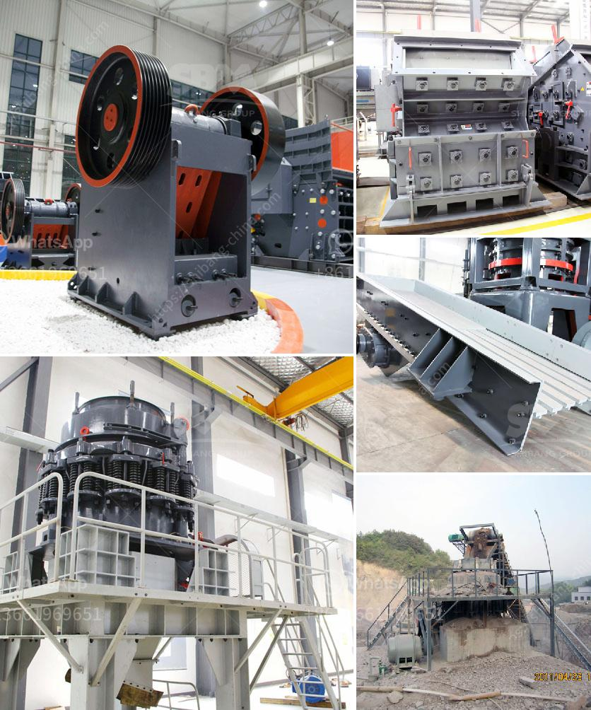

<h3>مطحنة معدنية إلى 300 ميكرون</h3>
تعتبر المطاحن المعدنية التي تعمل على طحن المواد إلى حجم يصل إلى 300 ميكرون من أهم الأدوات المستخدمة في صناعات متنوعة، مثل صناعة الأغذية والأدوية والكيماويات والمعادن. تهدف هذه المطاحن إلى تفتيت المواد إلى حجم صغير جدًا لتطبيقات محددة.

تتكون المطاحن المعدنية عادةً من جزئين رئيسيين: الجسم الخارجي والجسم الداخلي. الجسم الخارجي يعمل على حماية الماكينة من العوامل الخارجية ويحتوي على منفذ لتحميل المواد. بينما الجسم الداخلي يتكون من دورق دوار يحتوي على قطع الطحن التي تعمل على تفتيت المواد. تتوفر المطاحن المعدنية بتصاميم مختلفة حسب المتطلبات الخاصة بكل صناعة وتطبيق.

توفر المطاحن المعدنية القدرة على طحن مجموعة واسعة من المواد مثل المواد الغذائية، والمعادن، والبلاستيك، والأعشاب الطبية، والبذور، وغيرها الكثير. إن المرونة في الاستخدام تعكس أهمية هذه المطاحن في صناعات متعددة.

واحدة من الميزات الهامة للمطاحن المعدنية هي القدرة على ضبط حجم الجسيمات المطحونة. فمن خلال تغيير المسامية في الفتحة الخارجية للمطحنة أو تبديل الشبكة المستخدمة، يمكن للمشغلين تحقيق درجات مختلفة من الدقة في الطحن والحصول على حجم جسيمات معين.

بالإضافة إلى ذلك، تتمتع المطاحن المعدنية بقدرة عالية على التحمل والصمود لفترات طويلة من الاستخدام. فهي عادة ما تصنع من مواد متينة مثل الفولاذ المقاوم للصدأ أو الكاربايد، وهذا يضمن استدامة عملية الطحن لفترة طويلة دون الحاجة إلى صيانة مستمرة.

وفي الختام، تلعب المطاحن المعدنية دورًا حاسمًا في العديد من الصناعات حيث تعد القدرة على طحن المواد إلى حجم يصل إلى 300 ميكرون أمرًا بالغ الأهمية. إن هذه المطاحن تسمح بإنتاج منتجات عالية الجودة ودقيقة التوزيع الحبيبي، مما يعزز كفاءة العملية التصنيعية ويسهم في تحسين جودة المنتج النهائي.
<h3>Contact us</h3><ul><li><strong>Whatsapp:&nbsp;<a href="https://wa.me/8613661969651">+8613661969651</a></strong></li><li><a href="https://swt.shibang-china.com/?git&amp;zhl&amp;مطحنة معدنية إلى 300 ميكرون"><strong>Online Service(chat now)</strong></a></li></ul><h3>Related</h3><ul><li><a href='عملية إنتاج الجبس.md'>عملية إنتاج الجبس</a></li><li><a href='مطاحن الكرة الفلسبار.md'>مطاحن الكرة الفلسبار</a></li><li><a href='كسارة الفك bb 50 من ريتش.md'>كسارة الفك bb 50 من ريتش</a></li><li><a href='المعدات المطلوبة لعمل محجر الجرانيت.md'>المعدات المطلوبة لعمل محجر الجرانيت</a></li><li><a href='أرض الجرانيت الأسود للبيع في تاميل نادو.md'>أرض الجرانيت الأسود للبيع في تاميل نادو</a></li></ul>