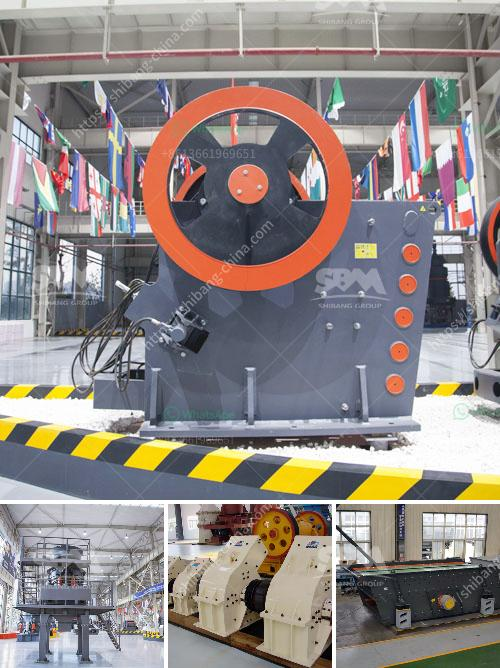

<h3>مطحنة نيجيريا</h3>
تعتبر مطحنة نيجيريا أحد أبرز المنشآت الصناعية في نيجيريا وهي من الموردين الرئيسيين للطحين في البلاد. تقع المطحنة في مدينة لاجوس، وهي معروفة بجودة منتجاتها وتقنياتها المتقدمة في عملية الطحن.

تأسست مطحنة نيجيريا في عام 1962، ومنذ ذلك الحين أصبحت مكملة للاقتصاد الزراعي في البلاد. تعمل المطحنة على طحن الحبوب مثل القمح والأرز والذرة والشعير وتحويلها إلى طحين عالي الجودة يستخدم في صناعة الخبز والمعجنات والمنتجات البذرية الأخرى.

تعتمد عملية الطحن في مطحنة نيجيريا على معدات حديثة وتقنيات متطورة، مما يسمح لها بتحقيق طحن دقيق وفعال للحبوب. كما تعتني المطحنة بمعايير الجودة العالية، حيث يتم اختبار الطحين الناتج بصورة منتظمة لضمان خلوه من الشوائب والمواد الملوثة.

تقوم مطحنة نيجيريا أيضًا بتوفير فرص عمل للعديد من السكان المحليين، حيث يعمل العديد من العمال في مختلف مراحل عملية الطحن. كما تلتزم المطحنة أيضًا بالمسؤولية الاجتماعية، حيث تسعى لدعم المشاريع الاجتماعية والتعليمية في المنطقة المحيطة بها.

بفضل أداءها الممتاز وجودة منتجاتها، حققت مطحنة نيجيريا سمعة طيبة في السوق المحلية. ومع ذلك، فإنها تواجه أيضًا تحديات، مثل تنافسية الأسعار مع المنافسين الأجانب وتداعيات الظروف الاقتصادية غير المستقرة.

عمل مطحنة نيجيريا كجهة رئيسية لتوفير الطحين يعزز الاستدامة الغذائية في البلاد، حيث يتم استخدام الطحين في إعداد الأغذية الأساسية للسكان. كما يلعب دورًا هامًا في تطوير القطاع الزراعي في نيجيريا، حيث يتم توفير طلب ثابت للمنتجات الزراعية.

في الختام، تعد مطحنة نيجيريا منشأة صناعية رائدة في نيجيريا تلبي احتياجات السكان فيما يتعلق بالطحين. رغم التحديات القائمة، فإن المطحنة تستمر في تحسين عملياتها وتعزيز أدائها من أجل تقديم منتجات عالية الجودة ومساهمة إيجابية في تنمية الاقتصاد المحلي.
<h3>Contact us</h3><ul><li><strong>Whatsapp:&nbsp;<a href="https://wa.me/8613661969651">+8613661969651</a></strong></li><li><a href="https://swt.shibang-china.com/?git&amp;zhl&amp;مطحنة نيجيريا"><strong>Online Service(chat now)</strong></a></li></ul><h3>Related</h3><ul><li><a href='كسارات وشاشات متنقلة مستعملة في جنوب أفريقيا.md'>كسارات وشاشات متنقلة مستعملة في جنوب أفريقيا</a></li><li><a href='مطحنة كرات للبيع في الهند.md'>مطحنة كرات للبيع في الهند</a></li><li><a href='مطحنة الكرة في معدات مصنع الألومنيوم.md'>مطحنة الكرة في معدات مصنع الألومنيوم</a></li><li><a href='تصنيع الكالسيت المسحوق في راجستان.md'>تصنيع الكالسيت المسحوق في راجستان</a></li><li><a href='مصنع معالجة التنغستن في الهند.md'>مصنع معالجة التنغستن في الهند</a></li></ul>