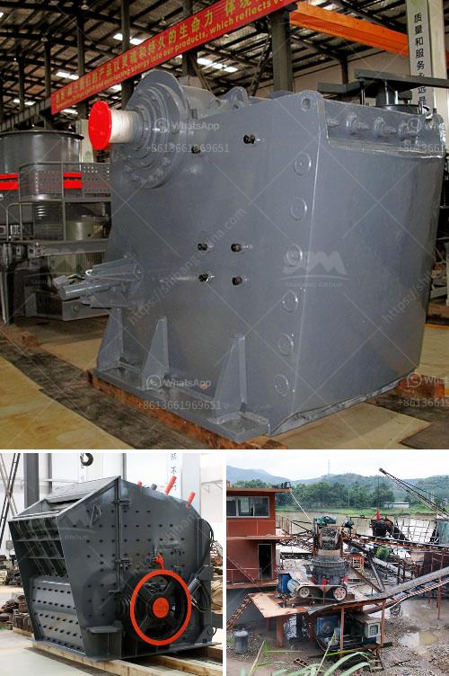

<h3>مطحنة هامر 7 في 8 للذهب والكوارتز</h3>
تعتبر مطحنة هامر 7 في 8 من أهم المعدات المستخدمة في عمليات التعدين لاستخلاص الذهب والكوارتز. تتميز هذه المطحنة بقدرتها العالية على طحن الصخور الصلبة وتفتيتها إلى حبيبات صغيرة يمكن تركيزها واستخلاص المعادن القيمة منها. ويستخدم هذا النوع من المطاحن بشكل واسع في صناعة التعدين في جميع أنحاء العالم.

تتكون مطحنة هامر 7 في 8 من محرك يعمل بقوة عالية ويتحرك بسرعة كبيرة لطحن الصخور. يتم تثبيت شاكوش صلب متين على المحرك، ويتم إرسال الطاقة الميكانيكية من المحرك إلى الشاكوش عن طريق وسيلة ميكانيكية مثل سير ملولب أو سلسلة. يقوم الشاكوش بتحطيم الصخور بالضربات المتصاعدة والهابطة المستمرة.

تستخدم مطاحن الهامر 7 في 8 أيضًا نوعًا خاصًا من المطارق الثقيلة والمعادن عالية الجودة في صناعتها، وذلك لتحمل قوة الصدمات العالية وضغط القوة المطلوبة أثناء التعدين. يتم تصميم الشاكوش بكفاءة عالية لضمان الحصول على أقصى قدر من الطاقة الواجبة تطبيقها على الصخور.

تستخدم مطاحن الهامر 7 في 8 في صناعة استخلاص الذهب والكوارتز بشكل رئيسي. حيث يتم تحطيم الصخور الصلبة وتفتيتها إلى حبيبات صغيرة، ويتم تركيز الذهب والكوارتز المتواجد في هذه الحبيبات بواسطة عمليات معالجة مثل التعويم والغسيل الجاذبية. وتعد هذه العمليات من العمليات الرئيسية في إنتاج الذهب والكوارتز وفصلها عن الصخور الأخرى.

يتم استخدام مطاحن الهامر 7 في 8 أيضًا في صناعة البناء والهندسة المدنية. حيث يتم استخدامها لطحن الحجارة والصخور الكبيرة وتحويلها إلى رمل وحصى صغيرة يمكن استخدامها في مشاريع البناء. وتعد هذه الاستخدامات الثانوية للمطحنة هامر 7 في 8 مهمة جدًا، حيث تسهم في إعادة تدوير وإعادة استخدام المواد البنائية وتقليل الحاجة إلى الحجارة الطبيعية الجديدة.

في الختام، تعتبر مطحنة هامر 7 في 8 للذهب والكوارتز جهازًا بارزًا في صناعة التعدين والبناء. تستخدم في عمليات سحق الصخور الصلبة وتفتيتها إلى حبيبات صغيرة يمكن استخلاص المعادن القيمة منها. كما تسهم في إعادة تدوير المواد البنائية وتحويل الصخور الضخمة إلى مواد قابلة للاستخدام في مشاريع البناء. وبالتالي، تعد مطحنة هامر 7 في 8 أداة حيوية في عمليات استخراج المعادن وتطوير المشاريع البنائية.
<h3>Contact us</h3><ul><li><strong>Whatsapp:&nbsp;<a href="https://wa.me/8613661969651">+8613661969651</a></strong></li><li><a href="https://swt.shibang-china.com/?git&amp;zhl&amp;مطحنة هامر 7 في 8 للذهب والكوارتز"><strong>Online Service(chat now)</strong></a></li></ul><h3>Related</h3><ul><li><a href='كسارات الفك المستعملة في إسبانيا.md'>كسارات الفك المستعملة في إسبانيا</a></li><li><a href='تخطيط مصنع الأسمنت الصغير بتنسيق PDF.md'>تخطيط مصنع الأسمنت الصغير بتنسيق PDF</a></li><li><a href='تصنيع آلات السحق في بوليفيا.md'>تصنيع آلات السحق في بوليفيا</a></li><li><a href='شركة تصنيع معدات التكسير.md'>شركة تصنيع معدات التكسير</a></li><li><a href='كسارة متنقلة قابلة للنقل بسعة 200 طن.md'>كسارة متنقلة قابلة للنقل بسعة 200 طن</a></li></ul>