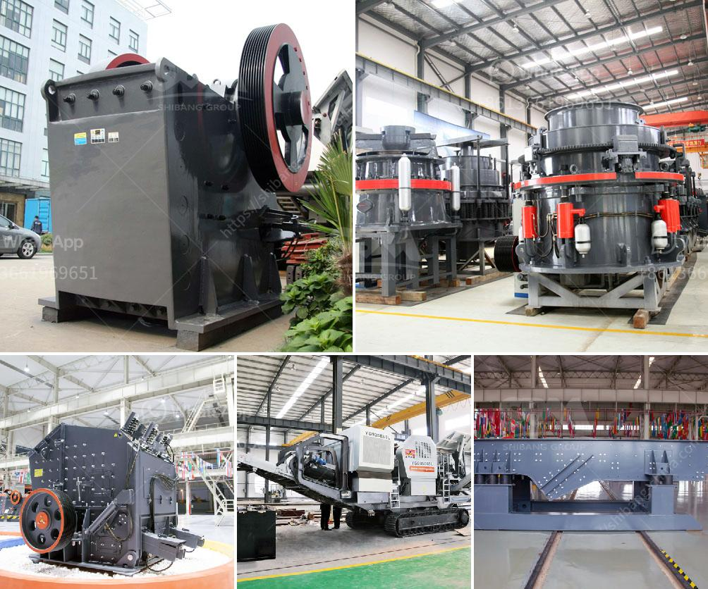

<h3>مطحنة هامر تقليدية</h3>
تعتبر مطحنة هامر التقليدية واحدة من أقدم وأكثر الأدوات استخدامًا في مجال الطحن. تعتمد هذه المطاحن على الهامر الذي يتحرك بسرعة عالية لتكسير وطحن المواد الصلبة إلى قطع صغيرة.

تاريخ مطاحن الهامر يمتد لآلاف السنين. في العصور القديمة، استخدم الناس المطروقات الحجرية لطحن الحبوب والحجارة الأخرى. ومع مرور الوقت، تطورت هذه المطاحن لتشمل آليات تشغيل أكثر فعالية، حيث استُخدم الهامر المعدني لتكسير المواد الأكثر صلابة.

تتألف مطحنة الهامر التقليدية من غرفة طحن واحدة، يوجد بها هامر مثبت على محور يدور بسرعة عالية. يُدخل المواد الصلبة إلى داخل الغرفة من خلال فتحة الإطعام، حيث يتم تكسيرها عن طريق الهامر المتحرك. تخرج المواد المطحونة من خلال فتحة أخرى في القاع.

تستخدم مطاحن الهامر التقليدية في عدة صناعات مختلفة، بما في ذلك صناعة الأعلاف والأسمدة والمواد الغذائية والمواد الكيميائية. تعتبر مطاحن الهامر فعالة في طحن المواد الصلبة ذات الصلابة المتوسطة والمرتفعة.

ومع ذلك، مع تقدم التكنولوجيا، ظهرت مطاحن هامر حديثة تستخدم تقنيات أكثر تطورًا، مثل مطاحن الهامر الهوائية والكهربائية. تتميز هذه المطاحن بسرعات عالية وقدرة أكبر على طحن المواد. تستخدم أيضًا تقنيات متقدمة في السيطرة على درجة الطحن وفصل المواد الناعمة عن المواد الخشنة.

على الرغم من استخدام المطاحن الهامر التقليدية بشكل أقل في الوقت الحالي، إلا أنها لا تزال موجودة في بعض المناطق الريفية والمزارع، حيث يُعتمد عليها لطحن الحبوب والأعلاف المنزلية. بالإضافة إلى ذلك، تعتبر المطاحن الهامر التقليدية جزءًا من التراث الثقافي في بعض المجتمعات، حيث يُحافظ الناس على هذه الأداة التقليدية لأغراض تراثية وتذكارية.

في الختام، تعد مطاحن الهامر التقليدية جزءًا من تاريخنا القديم وتمثل العملية التقليدية لطحن المواد الصلبة. على الرغم من تطور التكنولوجيا وظهور المطاحن الحديثة، إلا أن هذه المطاحن ما زالت تستخدم في بعض المناطق كما تُعتبر جزءًا من التراث الثقافي.
<h3>Contact us</h3><ul><li><strong>Whatsapp:&nbsp;<a href="https://wa.me/8613661969651">+8613661969651</a></strong></li><li><a href="https://swt.shibang-china.com/?git&amp;zhl&amp;مطحنة هامر تقليدية"><strong>Online Service(chat now)</strong></a></li></ul><h3>Related</h3><ul><li><a href='كسارة مخروط زينث.md'>كسارة مخروط زينث</a></li><li><a href='بيع كسارة حجر في ماهاراشترا.md'>بيع كسارة حجر في ماهاراشترا</a></li><li><a href='طاحونة طحن الكالسيوم.md'>طاحونة طحن الكالسيوم</a></li><li><a href='كسارة فك محمولة 30 × 42 للبيع.md'>كسارة فك محمولة 30 × 42 للبيع</a></li><li><a href='محطات تكسير للبيع.md'>محطات تكسير للبيع</a></li></ul>