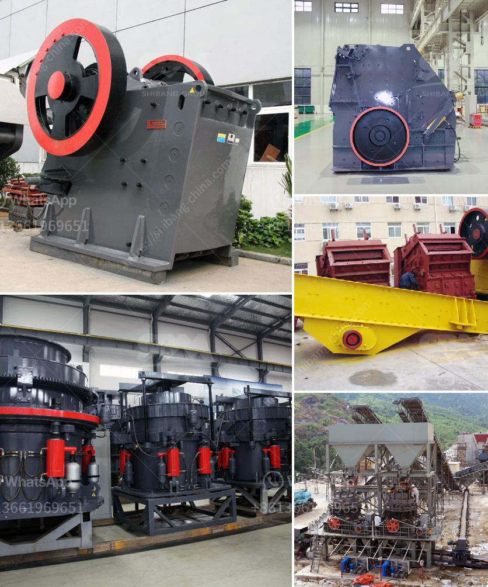

<h3>مطحنة هامر ديزل في جنوب أفريقيا</h3>
مطحنة هامر ديزل في جنوب أفريقيا: تحفة صناعية تعزز إنتاجية الزراعة

تعد مطحنة هامر ديزل في جنوب أفريقيا إحدى التحف الصناعية التي تساهم بشكل كبير في تحسين قطاع الزراعة. تعد هذه المطحنة من آلات الطحن المتقدمة التي تستخدم في إنتاج المواد الغذائية وتحجيم الحبوب وغيرها من المنتجات الزراعية الأخرى. تتميز بأنها محركة بالديزل، مما يتيح لها العمل بشكل فعال ومستقل في المناطق النائية أو التي تفتقر إلى الكهرباء.

تلعب مطاحن هامر ديزل دورًا حيويًا في تحسين اقتصاد وإنتاجية المزارعين في جنوب أفريقيا. فهي تسهم في توفير الوقت والجهد للمزارعين، حيث يمكنهم طحن الحبوب وتحضيرها للبيع أو التخزين بطريقة سهلة وسريعة. تعتبر هذه الآلة مريحة للغاية للمزارعين الذين يعتمدون على الحبوب كمصدر رئيسي للدخل، حيث توفر لهم فرصًا أكبر لتسويق منتجاتهم بطرق أمثل.

تم تصميم مطحنة هامر ديزل لتكون متينة وموثوقة، مما يجعلها مناسبة للاستخدام في البيئات القاسية والظروف الصعبة. فهي مصنوعة من مواد عالية الجودة وتتميز بقوة مذهلة في الأداء. علاوة على ذلك، فهي تعتبر صديقة للبيئة نظرًا لاستخدامها للديزل كمصدر للطاقة، حيث تقلل من انبعاثات الكربون.

من المهم أن نشير إلى أن مطحنة هامر ديزل في جنوب أفريقيا ليست مجرد آلة طحن بسيطة، بل أيضًا أداة تعزز التنمية المستدامة في المجتمعات القروية. حيث تعتبر تلك المطاحن فعالة من حيث التكلفة للمزارعين، مما يساعدهم على زيادة إنتاجيتهم وتحسين دخلهم. بالإضافة إلى ذلك، فإن توفير المطاحن الديزل يعني عدم اعتماد المزارعين على الكهرباء، وبالتالي تقليل تكاليف الطاقة والإيجار، وهو أمر مهم بالنسبة للذين يكافحون من أجل رفع مستوى معيشتهم.

في الختام، يمكن القول أن مطحنة هامر ديزل في جنوب أفريقيا هي مثال للتقنية الحديثة التي تلبي احتياجات الزراعة المعاصرة. فالجمع بين القوة والأداء المتفوق والتكاليف المنخفضة تجعل تلك المطاحن اختيارًا مثاليًا للمزارعين الذين يبحثون عن طرق فعالة وموثوقة لتحسين إنتاجيتهم والحفاظ على البيئة. يعد دعم المزارعين وتعزيز التطوير الزراعي في هذا المجال جزءًا حيويًا من بناء مستقبل مستدام ونمو اقتصاد جنوب أفريقيا.
<h3>Contact us</h3><ul><li><strong>Whatsapp:&nbsp;<a href="https://wa.me/8613661969651">+8613661969651</a></strong></li><li><a href="https://swt.shibang-china.com/?git&amp;zhl&amp;مطحنة هامر ديزل في جنوب أفريقيا"><strong>Online Service(chat now)</strong></a></li></ul><h3>Related</h3><ul><li><a href='مصنع معالجة للبيع في جنوب أفريقيا.md'>مصنع معالجة للبيع في جنوب أفريقيا</a></li><li><a href='صناعة سحق الركام في تنزانيا.md'>صناعة سحق الركام في تنزانيا</a></li><li><a href='مطحنة طحن في الولايات المتحدة الأمريكية.md'>مطحنة طحن في الولايات المتحدة الأمريكية</a></li><li><a href='معدات تنظيف الرمال في الصغيرة.md'>معدات تنظيف الرمال في الصغيرة</a></li><li><a href='آلة تصنيع الجبس.md'>آلة تصنيع الجبس</a></li></ul>