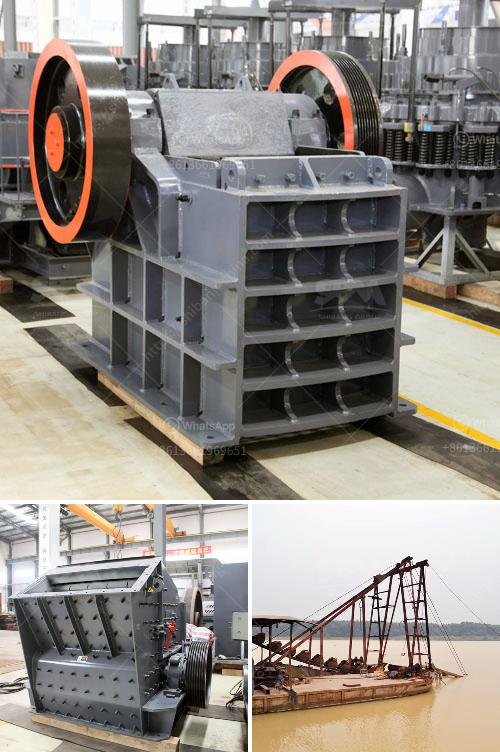

<h3>مطحنة هامر في جنوب أفريقيا</h3>
تُعتبر مطحنة هامر واحدة من أبرز المطاحن في جنوب أفريقيا، حيث تعتمد على تكنولوجيا متطورة وتقنيات حديثة لطحن المواد الصلبة والحبيبية. تُعد هذه المطحنة أحد أهم عوامل نمو الاقتصاد المحلي وتنميته، حيث توفر فرص عمل للمهندسين والفنيين والمجتمع المحلي في المنطقة.

تعد المطحنة هامر من المصانع الحديثة التي تم استيرادها من الخارج، حيث يتم استخدامها في صناعات متعددة مثل صناعة المواد الغذائية والحبوب والكيماويات. تعتبر هذه المطاحن مثالية لطحن المواد الصلبة بسرعة وكفاءة عالية، مما يتيح الحصول على نتائج ممتازة دون إهدار الموارد أو الوقت.

تتميز مطاحن هامر بتصميمها الدقيق والمبتكر، حيث يتم استخدام مجموعة من الشبكات الدقيقة والأسطوانات الدوارة لضمان الأداء الأمثل. تستخدم هذه المطاحن أيضًا شفرات حادة ومبتكرة لتمزيق المواد الصلبة إلى جزيئات صغيرة بشكل فعال وسريع.

تعتبر مطاحن هامر جنوب أفريقيا قوية وفعالة في طحن المواد الصلبة والحصول على منتج نهائي ذو جودة عالية. فهي مصممة بشكل يستهلك أقل كمية من الطاقة والوقود مقارنة بالمطاحن التقليدية. وبفضل تكنولوجيا المطاحن الحديثة، يكون لديها قدرة عالية على تجهيز الكميات الكبيرة من المواد بكفاءة عالية وبشكل مستدام.

تعتبر مطحنة هامر في جنوب أفريقيا رائدة في صناعتها وتوفر العديد من الفوائد للمجتمع المحلي. فهي تساهم في توفير فرص العمل وتشجع على التنمية الاقتصادية والصناعية في المنطقة. كما أنها توفر منتجات عالية الجودة وبأسعار تنافسية، مما يساعد في تعزيز جودة الحياة ورفاهية المجتمع المحلي.

في الختام، تعتبر مطاحن هامر في جنوب أفريقيا مهمة للغاية في تنمية الاقتصاد وتعزيز الصناعات المحلية. يمتاز هذا النوع من المطاحن بتقنياته الحديثة وكفاءته العالية في طحن المواد الصلبة والحبيبية. من المتوقع أن تستمر مطاحن هامر في النمو والتطور في جنوب أفريقيا وتلعب دورًا مهمًا في تلبية احتياجات الصناعة والمجتمع المحلي.
<h3>Contact us</h3><ul><li><strong>Whatsapp:&nbsp;<a href="https://wa.me/8613661969651">+8613661969651</a></strong></li><li><a href="https://swt.shibang-china.com/?git&amp;zhl&amp;مطحنة هامر في جنوب أفريقيا"><strong>Online Service(chat now)</strong></a></li></ul><h3>Related</h3><ul><li><a href='كم تكلف تراخيص التعدين على الذهب في نيجيريا.md'>كم تكلف تراخيص التعدين على الذهب في نيجيريا</a></li><li><a href='أسعار كسارات الجيرة.md'>أسعار كسارات الجيرة</a></li><li><a href='عرض مصنع معالجة الجير.md'>عرض مصنع معالجة الجير</a></li><li><a href='كسارة أولية للبيع.md'>كسارة أولية للبيع</a></li><li><a href='آلات معالجة الجير.md'>آلات معالجة الجير</a></li></ul>