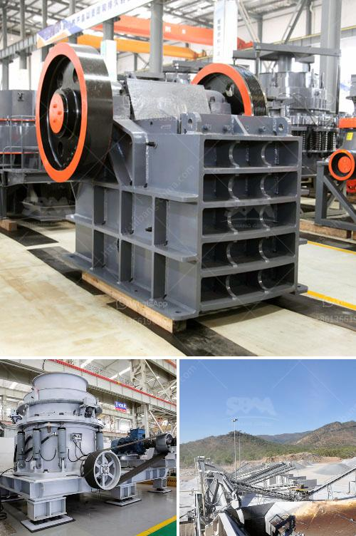

<h3>مطحنة هامر لتعدين الذهب في جنوب أفريقيا</h3>
تعد مطحنة هامر واحدة من أهم وأكبر معدات التعدين المستخدمة في صناعة تعدين الذهب في جنوب أفريقيا. تعمل هذه المطاحن على سحق الخامات الصخرية الصلبة لاستخلاص الذهب وفصله عن باقي المواد العضوية وغير الذهبية.

مطحنة هامر تعتبر آلة قوية وفعالة في عملية السحق وفصل الخامات. تتكون هذه المطاحن من طارة تدور بسرعة عالية وتحتوي على مطارق صلبة تضرب الخام بقوة. يتم سحق الخام بواسطة هذه المطارق وتقسم الخامات إلى جزئين، الجزء الذي يحتوي على الذهب والجزء الذي لا يحتوي على الذهب.

من الجدير بالذكر أن هذه المطاحن لا تعمل فقط في صناعة التعدين للذهب، بل يمكن استخدامها أيضًا لسحق وفصل العديد من المواد الأخرى مثل الكوارتز والحجر الجيري والشيليكات. تستخدم العديد من شركات التعدين في جنوب أفريقيا مطاحن هامر لاستخلاص الذهب بكفاءة وتحقيق أعلى عوائد ممكنة من العملية التعدينية.

ميزة استخدام مطاحن هامر هي قدرتها على سحق الخام بسرعة عالية وفي أحجام متنوعة. كما أنها قادرة على التعامل مع خامات ذات جودة متقلبة وتكسيرها بفعالية. وتعمل هذه المطاحن أيضًا على فصل الذهب عن الأتربة والصخور الأخرى الموجودة في الخام، مما يسهم في تحسين جودة المنتج النهائي.

وعلى الرغم من أن مطاحن هامر تعتبر من المعدات الرئيسية في صناعة تعدين الذهب في جنوب أفريقيا، إلا أن هذه المطاحن قد تواجه بعض التحديات والمشكلات. قد يتمتع بعض الخامات بمرونة عند تعرضها للسحق وتصبح أقل قابلية للاستخلاص بعد ذلك. بالإضافة إلى ذلك، يمكن أن يتسبب استخدام المطارق الصلبة في تصدع وتلف الخام أثناء عملية السحق.

في الختام، تعتبر مطاحن هامر أحد العناصر الأساسية في عملية تعدين الذهب في جنوب أفريقيا. تساعد هذه المطاحن في سحق وفصل الخامات الصخرية واستخلاص الذهب بكفاءة وفعالية. ومع تحسين التقنيات والتطورات المستمرة في هذا المجال، يمكن أن تلعب مطاحن هامر دورًا أكبر في زيادة إنتاج الذهب وتطوير صناعة التعدين في جنوب أفريقيا.
<h3>Contact us</h3><ul><li><strong>Whatsapp:&nbsp;<a href="https://wa.me/8613661969651">+8613661969651</a></strong></li><li><a href="https://swt.shibang-china.com/?git&amp;zhl&amp;مطحنة هامر لتعدين الذهب في جنوب أفريقيا"><strong>Online Service(chat now)</strong></a></li></ul><h3>Related</h3><ul><li><a href='مطحنة ريموند في باكستان.md'>مطحنة ريموند في باكستان</a></li><li><a href='كسارة الصدم PF لآلة تكسير الحجر للبيع.md'>كسارة الصدم PF لآلة تكسير الحجر للبيع</a></li><li><a href='مطاحن الكرة للحجر الجيري في ماليزيا.md'>مطاحن الكرة للحجر الجيري في ماليزيا</a></li><li><a href='شركة تصنيع سير الناقل من الصين.md'>شركة تصنيع سير الناقل من الصين</a></li><li><a href='مصنع طحن الحجر.md'>مصنع طحن الحجر</a></li></ul>