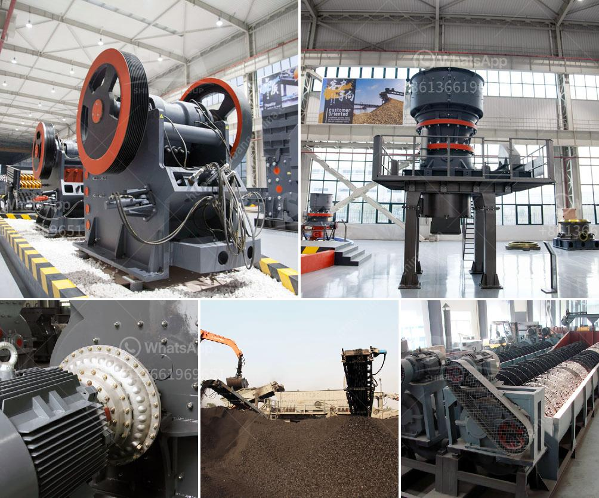

<h3>مطحنة هامر لطحن البولي إيثيلين منخفض الكثافة</h3>
تُعد مطحنة الهامر من أهم الأدوات التي تُستخدم في صناعة البلاستيك، وتحديدًا لطحن البولي إيثيلين ذو الكثافة المنخفضة. تتميز هذه المطاحن بقدرتها العالية على تحويل البولي إيثيلين إلى حبيبات صغيرة ومنتظمة الحجم، مما يجعلها مناسبة للاستخدام في عدة صناعات مختلفة.

يتألف جهاز المطحنة الهامر من عدة أجزاء، بما في ذلك الغرفة الطحن، والهامر، والشاشة الحجمية. يتم تغذية البولي إيثيلين إلى الغرفة الطحن، حيث يتم تحويلها إلى قطع صغيرة باستخدام الهامر. يعمل الهامر على تحطيم البولي إيثيلين باستخدام قوة الصدمة والاحتكاك، حيث يتم تثبيته بشكل ثابت على الدوران السريع. بتأثير الهامر، يتم تحويل حبيبات البولي إيثيلين إلى قطع صغيرة منتظمة الحجم.

تعتبر الشاشة الحجمية أيضًا جزءًا مهمًا في عملية الطحن، حيث تعمل على فصل الحبيبات الكبيرة عن الصغيرة. بفضل الشاشة الحجمية، يتم الحصول على حبيبات بولي إيثيلين صغيرة وموحدة الحجم، مما يزيد من كفاءة العملية ويعزز جودة الإخراج.

تتميز مطاحن الهامر بالعديد من المزايا، بما في ذلك القدرة على طحن البولي إيثيلين بطريقة سريعة وفعالة. تُعد السرعة والفعالية أمرًا بالغ الأهمية في صناعة البلاستيك، حيث يتم تحويل البولي إيثيلين إلى منتج نهائي في وقت قصير، مما يزيد من إنتاجية العملية. بالإضافة إلى ذلك، تعد مطاحن الهامر سهلة الاستخدام وصيانتها، مما يساعد على توفير الوقت والجهد.

يتم استخدام البولي إيثيلين المطحون كمادة خام في صناعة الأفلام البلاستيكية، وأنابيب التغليف، وسلال الشراء، ومنتجات البولي إيثيلين المزدوجة، والعديد من المنتجات الأخرى. يعد البولي إيثيلين المطحون منتجًا متينًا وقويًا، ويُعزز تأثير الاستدامة البيئية، حيث يتم إعادة استخدام المنتجات البلاستيكية المطحونة مرة أخرى في صناعات مختلفة.

باختصار، تعد مطاحن الهامر أداة أساسية في صناعة البلاستيك، حيث تتميز بقدرتها على تحويل البولي إيثيلين المنخفض الكثافة إلى حبيبات صغيرة ومنتظمة الحجم. توفر هذه الطريقة كفاءة عالية وأداء فعال، بينما تعمل على الحفاظ على جودة المنتج واستدامته البيئية.
<h3>Contact us</h3><ul><li><strong>Whatsapp:&nbsp;<a href="https://wa.me/8613661969651">+8613661969651</a></strong></li><li><a href="https://swt.shibang-china.com/?git&amp;zhl&amp;مطحنة هامر لطحن البولي إيثيلين منخفض الكثافة"><strong>Online Service(chat now)</strong></a></li></ul><h3>Related</h3><ul><li><a href='آلات سحق الحجر اليابانية.md'>آلات سحق الحجر اليابانية</a></li><li><a href='معدات تعدين مستعملة للبيع في غانا.md'>معدات تعدين مستعملة للبيع في غانا</a></li><li><a href='كسارة صناعية للبيع.md'>كسارة صناعية للبيع</a></li><li><a href='شركات تصنيع آلات الكسارة في باكستان.md'>شركات تصنيع آلات الكسارة في باكستان</a></li><li><a href='مصنع غسيل الذهب تروميل للبيع في دبي.md'>مصنع غسيل الذهب تروميل للبيع في دبي</a></li></ul>