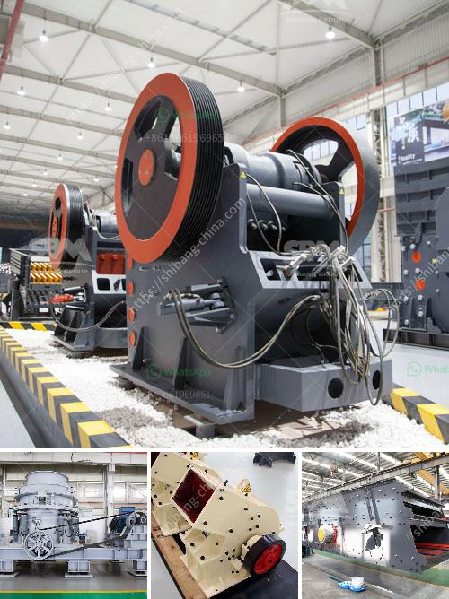

<h3>مطحنة هامر للأسمنت</h3>
تعد مطحنة الهامر للأسمنت أحد الآليات الأساسية في عملية تصنيع الأسمنت. تستخدم هذه المطاحن في عملية طحن الكلنكر، وهو المكون الرئيسي للأسمنت، إلى حجم ناعم جداً يمكن استخدامه في الإنتاج النهائي.

تتألف مطاحن الهامر من حوث وشفرات دوارة تقوم بسحق الكلنكر. وتعتبر الشفرات الدوارة عنصراً حيوياً في نجاح عملية طحن الكلنكر. فهي تعمل على تحطيم الجزيئات الكبيرة للكلنكر إلى جزيئات أصغر تسمى "المواد الخام"، وتقوم بضربها بسرعة عالية حتى تصبح ناعمة.

تستخدم مطاحن الهامر في المصانع الكبيرة للأسمنت التي تحتاج إلى إنتاج كمية كبيرة من الأسمنت يومياً. فباستخدام هذه المطاحن، يمكن تحقيق طحن كمية كبيرة من الكلنكر في وقت قصير، مما يزيد من كفاءة العملية ويقلل من تكاليف الإنتاج.

تتميز مطاحن الهامر بعدة مزايا أخرى أيضاً. فهي معدات قوية ومتينة تتحمل الاستخدام الشاق والمستمر، وتوفر مرونة في تنظيم عملية الطحن وتكسير الكلنكر بناءً على احتياجات الإنتاج المختلفة. كما تتميز أيضاً بحجمها الصغير وقدرتها على تثبيت على منصات صلبة أو ثابتة لتقليل اهتزازها وزيادة استقرارها.

ببساطة، تعد مطاحن الهامر للأسمنت جزءًا هامًا من عملية تصنيع الأسمنت. فهي المعدة المسؤولة عن تحطيم وطحن الكلنكر، مما يؤدي إلى الحصول على الأسمنت النهائي. بفضل تطور التكنولوجيا والهندسة، يمكن تحسين كفاءة وأداء مطاحن الهامر لتلبية احتياجات صناعة الأسمنت الحديثة.
<h3>Contact us</h3><ul><li><strong>Whatsapp:&nbsp;<a href="https://wa.me/8613661969651">+8613661969651</a></strong></li><li><a href="https://swt.shibang-china.com/?git&amp;zhl&amp;مطحنة هامر للأسمنت"><strong>Online Service(chat now)</strong></a></li></ul><h3>Related</h3><ul><li><a href='قائمة الآليات لمصانع تجهيز الرخام.md'>قائمة الآليات لمصانع تجهيز الرخام</a></li><li><a href='بيع كسارة الحجر 400 طن في الساعة.md'>بيع كسارة الحجر 400 طن في الساعة</a></li><li><a href='آفاق صناعة كسارة الجرانيت.md'>آفاق صناعة كسارة الجرانيت</a></li><li><a href='كسارة فكية بمقدار 100 طن في الساعة.md'>كسارة فكية بمقدار 100 طن في الساعة</a></li><li><a href='سعر كسارة الفك المحمولة.md'>سعر كسارة الفك المحمولة</a></li></ul>