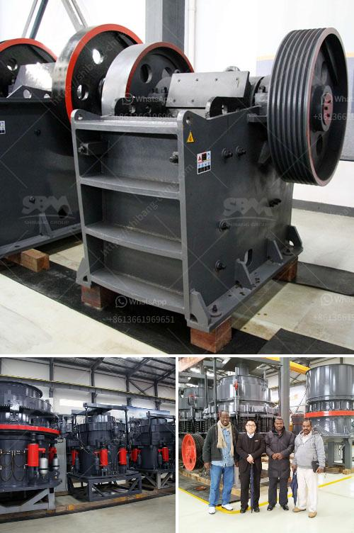

<h3>مطحنة هامر للتركيز</h3>
تُعد مطحنة هامر أو مطحنة الكسارة الهامرية واحدة من الأدوات الهامة المستخدمة في صناعة الطحن والتكسير. تتألف هذه المطاحن من غرفة طحن تحتوي على مطارق تدور بسرعة عالية، والتي تستخدم لتكسير المواد إلى حجم صغير.

تُستخدم مطاحن هامر في عدة صناعات مثل الأعلاف الحيوانية وتصنيع الأغذية والأعلاف الصناعية والمعادن والأسمنت والكيماويات. يعتبر استخدام مطحنة هامر للتركيز من أهم استخدامات هذا النوع من المطاحن.

تعمل مطاحن هامر التركيز على نحو فعال عن طريق دمج وحدتين معًا: القدرة على التكسير العالية والقدرة الكبيرة على الطحن. يتم تغيير حجم المطارق المستخدمة في المطحنة لتلائم احتياجات التركيز المحددة. هذا يتيح تحقيق تركيز عالٍ للمواد المطحونة.

يعد استخدام مطاحن هامر التركيز مفيدًا في صناعة التعدين، حيث يتم استخدامها لطحن الخامات المعدنية قبل إضافتها إلى وحدة التركيز النهائية. الهدف هو تقليل حجم الجزيئات وتحويلها إلى حبيبات دقيقة لسهولة استخلاص العناصر المعدنية المرغوبة.

توفر مطاحن هامر التركيز أيضًا فوائد أخرى عديدة. فهي تسمح بالتحكم في حجم الجسيمات المطحونة، مما يزيد من كفاءة عملية التركيز. كما تساهم في توفير وقت وجهد التنظيف، حيث تمنع تكون الرواسب العالقة في المطحنة.

بالإضافة إلى ذلك، فإن مطاحن هامر التركيز تُعد وسيلة فعالة للتحكم في الحجم التام للمادة المطحونة. يتم ضبط الشريط الشبكي الموجود في المطحنة بحيث يمر الحجم الصحيح من الجسيمات ويتم رفض الجسيمات التي تتجاوز الحجم المطلوب.

باختصار، فإن مطحنة هامر للتركيز هي أداة هامة في صناعة التعدين وغيرها من الصناعات المرتبطة. تمكن من تحطيم المواد إلى حجم صغير وتحويلها إلى حبيبات دقيقة لاستخلاص المعادن المرغوبة. بالإضافة إلى ذلك، توفر مطاحن هامر فوائد إضافية مثل التحكم في حجم الجسيمات المطحونة وسهولة التنظيف.
<h3>Contact us</h3><ul><li><strong>Whatsapp:&nbsp;<a href="https://wa.me/8613661969651">+8613661969651</a></strong></li><li><a href="https://swt.shibang-china.com/?git&amp;zhl&amp;مطحنة هامر للتركيز"><strong>Online Service(chat now)</strong></a></li></ul><h3>Related</h3><ul><li><a href='رمل وحجر الكسارة في كينيا.md'>رمل وحجر الكسارة في كينيا</a></li><li><a href='كسارات الحجر في كاليفورنيا.md'>كسارات الحجر في كاليفورنيا</a></li><li><a href='كسارة الرخام وآلات الطحن.md'>كسارة الرخام وآلات الطحن</a></li><li><a href='كسارة الحجر المحمولة للبيع في الفلبين.md'>كسارة الحجر المحمولة للبيع في الفلبين</a></li><li><a href='كسارة الحجر الجيري بيرو الجير.md'>كسارة الحجر الجيري بيرو الجير</a></li></ul>