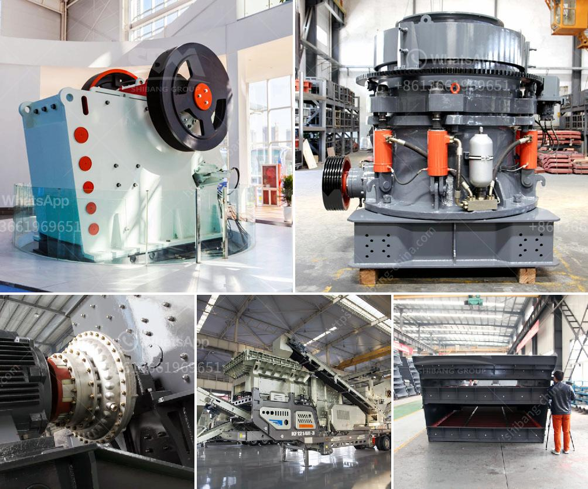

<h3>مطحنة هامر للحجر الجيري في جنوب أفريقيا</h3>
تعد مطحنة هامر للحجر الجيري في جنوب أفريقيا واحدة من أكبر وأهم المطاحن في المنطقة. تم تأسيس المطحنة في عام 1920 وهي متخصصة في طحن الحجر الجيري وتكريره لإنتاج الأسمنت. تقع المطحنة في مدينة جوهانسبرغ، وهي موقع استراتيجي يسهل الوصول إليه بفضل شبكة الطرق الجيدة والموقع المركزي في البلاد.

تعتبر مطحنة هامر للحجر الجيري ملتقى للتكنولوجيا الحديثة والابتكار في صناعة الأسمنت. تعتمد المطحنة على تقنية التكسير بالهامر لطحن الحجر الجيري بأحجام مختلفة وتحويله إلى مسحوق دقيق يدخل في عملية إنتاج الأسمنت. تتميز هذه التقنية بكفاءة عالية واستخدام أقل للطاقة، مما يسهم في تحسين العمليات الإنتاجية وتقليل الانبعاثات البيئية.

تضم المطحنة أيضًا مجموعة من المعدات الحديثة مثل الفرز والتصنيف ونقل المواد، مما يسهم في زيادة الإنتاجية وتحسين جودة المنتج النهائي. تضطلع المطحنة بدور حاسم في إمداد صناعة البناء بالأسمنت اللازم للإنشاءات الضخمة في جنوب أفريقيا والمناطق المحيطة.

تعتبر صناعة الأسمنت في جنوب أفريقيا أحد أعمدة الاقتصاد المحلي، حيث توفر فرص عمل للعديد من السكان المحليين وتشجع على التطور الاقتصادي. بفضل وجود مطحنة هامر للحجر الجيري وغيرها من الشركات الإنتاجية، يمكن تلبية الطلب المتزايد على الأسمنت وتلبية احتياجات السوق المحلية والإقليمية.

بموقعها المتميز وتقنياتها المبتكرة، تعتبر مطحنة هامر للحجر الجيري في جنوب أفريقيا نموذجًا رائدًا في صناعة الأسمنت. تلعب دورًا حاسمًا في تطور البنية التحتية واقتصاد البلاد، مما يعكس العزم والتطلعات الاقتصادية لجنوب أفريقيا.

في الختام، فإن مطحنة هامر للحجر الجيري في جنوب أفريقيا تعتبر إضافة قوية ومهمة للقطاع الصناعي في البلاد. تلتزم المطحنة بتحقيق أعلى مستويات الجودة والكفاءة وتلبية احتياجات السوق بطرق مستدامة وصديقة للبيئة. تمثل المطحنة رمزًا للتطور التكنولوجي والريادة في إنتاج الأسمنت.
<h3>Contact us</h3><ul><li><strong>Whatsapp:&nbsp;<a href="https://wa.me/8613661969651">+8613661969651</a></strong></li><li><a href="https://swt.shibang-china.com/?git&amp;zhl&amp;مطحنة هامر للحجر الجيري في جنوب أفريقيا"><strong>Online Service(chat now)</strong></a></li></ul><h3>Related</h3><ul><li><a href='مصنع غسيل وفرز للتأجير في جنوب أفريقيا.md'>مصنع غسيل وفرز للتأجير في جنوب أفريقيا</a></li><li><a href='كسارة صخور مصنوعة يدوياً.md'>كسارة صخور مصنوعة يدوياً</a></li><li><a href='استثمار مصنع كسارة الحجر.md'>استثمار مصنع كسارة الحجر</a></li><li><a href='مطاحن طحن أتا.md'>مطاحن طحن أتا</a></li><li><a href='سعر الكسارة من الصين.md'>سعر الكسارة من الصين</a></li></ul>