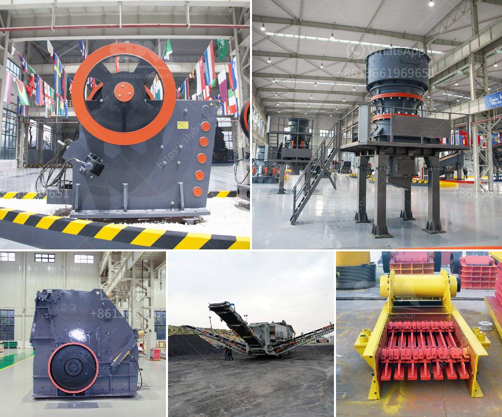

<h3>مطحنة هامر مختبرية</h3>
تعتبر مطحنة الهامر المختبرية أداة ضرورية في مجال الأبحاث العلمية والتطوير التكنولوجي. تستخدم هذه المطاحن في عملية طحن وسحق العينات الصلبة للتحليل والاختبارات المختبرية. تتميز هذه المطاحن بأنها صغيرة الحجم، متينة وقوية، مما يجعلها مثالية للاستخدام في المختبرات.

تتألف مطحنة الهامر المختبرية من جسم معدني متين وقوي، ومحرك كهربائي يسمح بتحريك الهامر الصغير المثبت داخل المطحنة. تربط العينة المراد طحنها في قمة المطحنة، ثم يتم تشغيل المطحنة لبدء عملية الطحن. الهامر الصغير يدور بسرعة عالية ويصطدم بالعينة الصلبة، مما يؤدي إلى تفتيتها إلى جزيئات أصغر وأدق.

يأتي مزيج المادة التي يتم طحنها خلال المطحنة بعدة أشكال وأنواع مختلفة، مثل المسحوق الناعم أو الجسيمات الخشنة. يعتمد حجم الجسيمات المشتتة وحالة المادة المطحونة على عدة عوامل، مثل طبيعة المواد المستخدمة وسرعة الطحن وشكل وحجم المطرقة.

تستخدم مطاحن الهامر المختبرية في العديد من التطبيقات العلمية والصناعية. ففي المجال العلمي، تستخدم هذه المطاحن في تحضير العينات لواحدة من أنواع التحليل المختلفة، مثل تحليل المواد، وتحليل العناصر، وتحليل الحجم، والبحوث الكيميائية والفيزيائية الأخرى.

توفر مطاحن الهامر المختبرية أيضًا العديد من المزايا. فهي سهلة الاستخدام، وتوفر طحنًا متساويًا وفعالًا للعينات، وتقلل من فقدان المواد المطحونة، وتوفر نتائج سريعة ودقيقة. بالإضافة إلى ذلك، يمكن تعديل إعدادات المطحنة للحصول على حجم الجسيمات المطلوب وفقًا لاحتياجات الباحث.

في النهاية، تعتبر مطاحن الهامر المختبرية أداة أساسية في المختبرات العلمية، حيث تساهم في تحسين نتائج التحاليل والاختبارات. بفضل قوتها ودقتها، تتيح هذه المطاحن إمكانية تحقيق تفاعلات دقيقة وإنتاج عينات مطحونة عالية الجودة. سهولة استخدامها وتكنولوجيتها المتطورة تجعل منها اختيارًا مثاليًا للباحثين لتنفيذ أعمالهم بفعالية ودقة.
<h3>Contact us</h3><ul><li><strong>Whatsapp:&nbsp;<a href="https://wa.me/8613661969651">+8613661969651</a></strong></li><li><a href="https://swt.shibang-china.com/?git&amp;zhl&amp;مطحنة هامر مختبرية"><strong>Online Service(chat now)</strong></a></li></ul><h3>Related</h3><ul><li><a href='كسارة لفة معدات مستخدمة tph الفحم الروسية.md'>كسارة لفة معدات مستخدمة tph الفحم الروسية</a></li><li><a href='محطات تكسير للبيع.md'>محطات تكسير للبيع</a></li><li><a href='كسارة الفحم 10 مم.md'>كسارة الفحم 10 مم</a></li><li><a href='خطة عمل لإنتاج الجبس.md'>خطة عمل لإنتاج الجبس</a></li><li><a href='كسارات الفك في تنزانيا.md'>كسارات الفك في تنزانيا</a></li></ul>