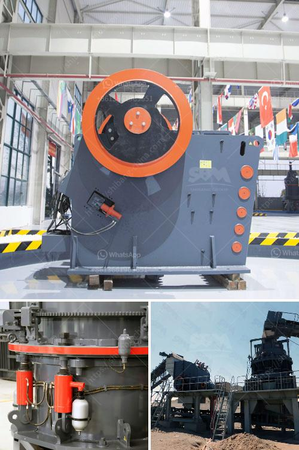

<h3>مطرقة إندونيسيا للبيع</h3>
تعتبر مطرقة إندونيسيا واحدة من المنتجات الحرفية الرائعة التي تعكس تراث وثقافة البلاد. تعد هذه المطرقة حقيبة أدوات حرفية تقليدية تستخدم في الحرف اليدوية، وهي واحدة من التحف الفنية الجميلة التي يعمل عليها الحرفيون الأندونيسيون الماهرون.

تمتاز مطارق إندونيسيا بتصاميمها الرائعة والمذهلة والتفاصيل المعقدة، حيث يتم صنعها بشكل يدوي بمهارة عالية من قبل الحرفيين الماهرين. تعكس المطارق تراث الثقافة الاندونيسية العريقة وتنتقل بالقصص والتاريخ القديم إلى الأجيال الحديثة.

تتميز مطارق إندونيسيا بمادتها الخام، حيث يُستخدم الزنك والنحاس والبرونز والحديد الذي يتم تشكيله وصقله بعناية. تعتبر المطارق آلة متعددة الإستخدامات، فهي تستخدم في المجالات المختلفة مثل النجارة والبناء والصيانة المنزلية وحتى في الصناعات التقليدية مثل الحلى والأثاث.

إندونيسيا تشتهر أيضًا بالحرف التقليدية من المعادن الثمينة مثل الفضة والذهب، وتستخدم في صنع المجوهرات والأوشحة. تتميز هذه المطارق بالنقوش المعقدة والأشكال الهندسية والديكورات الجميلة التي تبرز المهارات الفنية للحرفيين.

عند الاختيار من بين مجموعة متنوعة من المطارق، يجب أن يأخذ المشتري في الاعتبار النوعية والجودة والتصميم المطلوب. يجب أيضًا أن يتأكد من أن المطرقة مصنوعة بشكل يدوي وبجودة عالية، لأنها ستدوم لفترة طويلة.

تعد مطارق إندونيسيا رمزًا للعمل الشاق، وتعكس تراث وثقافة البلاد. يمكن للمسافرين العثور على هذه المطارق التذكارية عند زيارة الأسواق والمتاجر التقليدية في إندونيسيا. يمكن أيضًا شراؤها عبر الإنترنت من محلات الهدايا التي تقدم منتجات فنية تقليدية.

بالنهاية، تعتبر مطارق إندونيسيا تحفًا فنية رائعة ومفيدة في نفس الوقت. تتميز بتصاميمها الفريدة، وتوفر للمشتري إمكانية اقتناء قطعة فنية يمكنه استخدامها في الحياة اليومية.
<h3>Contact us</h3><ul><li><strong>Whatsapp:&nbsp;<a href="https://wa.me/8613661969651">+8613661969651</a></strong></li><li><a href="https://swt.shibang-china.com/?git&amp;zhl&amp;مطرقة إندونيسيا للبيع"><strong>Online Service(chat now)</strong></a></li></ul><h3>Related</h3><ul><li><a href='تأجير سيارات الكسارة في كالتيم.md'>تأجير سيارات الكسارة في كالتيم</a></li><li><a href='أسعار آلات تكسير الحجر في زيمبابوي.md'>أسعار آلات تكسير الحجر في زيمبابوي</a></li><li><a href='سعر مطحنة الكسارة سعر الحجر.md'>سعر مطحنة الكسارة سعر الحجر</a></li><li><a href='عملية تعدين الذهب.md'>عملية تعدين الذهب</a></li><li><a href='مطاحن تعدين الذهب المحمولة.md'>مطاحن تعدين الذهب المحمولة</a></li></ul>