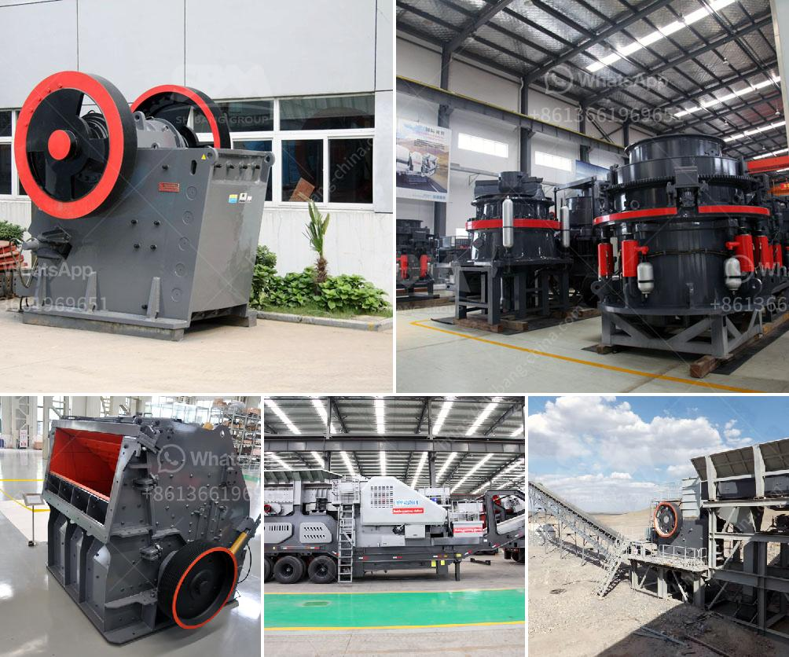

<h3>مطرقة الذهب المستخدمة للبيع في زيمبابوي</h3>
منذ قرون طويلة، كان الذهب يمثل رمزًا للثروة والقوة والجمال. وعلى مر العصور، استخدم الإنسان الذهب في صناعة المجوهرات والديكور، وكذلك في الحفلات الرسمية والمناسبات الاجتماعية. ومع تزايد الطلب على الذهب، بدأت بعض البلدان في استغلال ثرواتها وتطوير صناعة المجوهرات.

تعد زيمبابوي واحدة من تلك البلدان التي تشتهر بثرواتها من الذهب. ومنذ سنوات عديدة، اكتشف الناس أن بعض الصائغين في زيمبابوي يستخدمون طريقة فريدة لصناعة المجوهرات. وهي "مطرقة الذهب" المستخدمة للبيع.

مطرقة الذهب هي قطعة مجوهرات مصنوعة يدويًا من الذهب عيار 24 قيراط، وتقدم في تصميم رائع وفريد من نوعه. تعتبر هذه المطرقة رمزًا للثروة والرفاهية، وغالباً ما تستخدم في الحفلات والمناسبات الاجتماعية المهمة.

تبلغ ثمن مطرقة الذهب في زيمبابوي ما بين 200 و 400 دولار. وذلك يعتمد على حجم المطرقة ووزنها وتفاصيل التصميم. قد تتغير الأسعار من محل لآخر، حيث يمكن أن تكون المطارق الأكبر أكثر قيمة من تلك الأصغر.

تتميز مطارق الذهب في زيمبابوي بجمالها وتصميمها الدقيق. حيث يتم تجهيزها بمهارة فائقة من قبل الحرفيين المحليين، وتأخذ وقتاً طويلاً لإتقانها. تستخدم الطريقة التقليدية لتشكيل الذهب بعد تسخينه، ثم يتم ختمه بأنماط جميلة وعقيدات تزينه بأشكال هندسية تعكس ثقافة زيمبابوي المحلية.

تعتبر مطارق الذهب شراءً رائعًا للحفاظ على قيمة المال والاستثمار للمستقبل. فالذهب يعد ملاذًا آمنًا في حالات الأزمات المالية، وهو مرغوب فيه من قبل الكثيرين في جميع أنحاء العالم. وإضافة إلى ذلك، فإن مطارق الذهب تعتبر قطعة فريدة من نوعها ويمكن استخدامها كعرض جميل في أي بيت أو مكتب.

لذلك، إذا كنت تبحث عن قطعة فريدة من نوعها للمجوهرات أو ترغب في استثمار آمن وثمين، فإن مطارق الذهب في زيمبابوي هي خيار رائع لك. إنها تتحدث عن رفاهية وجمال وتقاليد قوية. استمتع بملكية الذهب وتألق به بمناسبتك القادمة!
<h3>Contact us</h3><ul><li><strong>Whatsapp:&nbsp;<a href="https://wa.me/8613661969651">+8613661969651</a></strong></li><li><a href="https://swt.shibang-china.com/?git&amp;zhl&amp;مطرقة الذهب المستخدمة للبيع في زيمبابوي"><strong>Online Service(chat now)</strong></a></li></ul><h3>Related</h3><ul><li><a href='مصنع الإسمنت الصغير المصنوع في الصين.md'>مصنع الإسمنت الصغير المصنوع في الصين</a></li><li><a href='كسارة متنقلة قابلة للنقل بسعة 200 طن.md'>كسارة متنقلة قابلة للنقل بسعة 200 طن</a></li><li><a href='موردين لسحق الصخور في بريتوريا.md'>موردين لسحق الصخور في بريتوريا</a></li><li><a href='مصنع كسارة الحجر التلقائي.md'>مصنع كسارة الحجر التلقائي</a></li><li><a href='حدود اهتزاز مطحنة الكرة.md'>حدود اهتزاز مطحنة الكرة</a></li></ul>