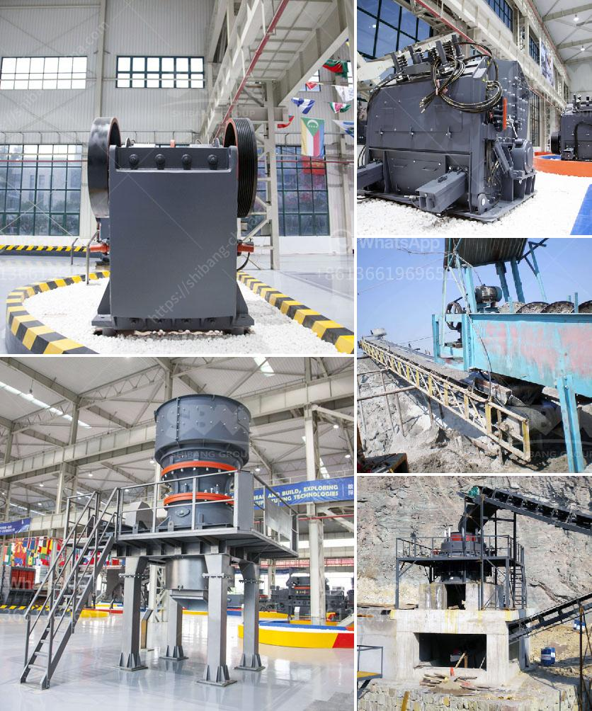

<h3>مطرقة صخرية</h3>
تعتبر المطرقة الصخرية أداة قديمة يستخدمها الإنسان منذ العصور القديمة. تتكون المطرقة الصخرية من قضبان معدنية طويلة مرتبطة برأس مطرقة ثقيل ومصنوع من الصخور القاسية مثل الغرانيت أو البازلت.

تاريخياً، استُخدمت المطارق الصخرية في العديد من الأغراض. في العصور القديمة، كانت المطارق الصخرية الأداة الأساسية في البناء، حيث تم استخدامها لتشكيل الصخور والحجارة لإنشاء المباني والمعابد. كما استُخدمت المطارق الصخرية في عمليات النقش والنحت على الصخور والمماثلة لتجسيد المشاهد التاريخية والعبادات الدينية.

تتنوع أحجام المطارق الصخرية وفقًا للاستخدام المقصود. فمنها المطارق ذات الأحجام الصغيرة والتي كان يسهل حملها واستخدامها بواسطة الإنسان البدائي المتنقل، ومنها المطارق الضخمة الثقيلة التي تحتاج إلى جهد جماعي لتشغيلها والتحرك بها.

تطور استخدام المطارق الصخرية على مر العصور. في العصور الوسطى، استخدمت هذه الأداة في صناعة الأسلحة الحربية مثل الترسانة والدروع. وفي العصور الحديثة، أصبحت المطارق الصخرية أداة أساسية في صناعة البناء والهندسة المدنية حيث يتم استخدامها في تكسير الخرسانة وتشكيل الحصى والصخور لأغراض البنية التحتية والمباني والطرق.

يُعزى انتشار استخدام المطارق الصخرية على مر العصور إلى قوتها وصلابتها، حيث تستطيع تحمل الضغوط العالية والاستخدام المتكرر دون أي تلف أو تلف. بالإضافة إلى ذلك، تعتبر المطارق الصخرية أداة اقتصادية نسبياً ومتاحة بسبب توفر الصخور الصلبة في الطبيعة.

في الختام، يمكن القول إن المطارق الصخرية لا تزال أداة هامة ومفيدة في العديد من المجالات، سواء في البناء أو الهندسة المدنية أو التاريخ والثقافة. تُعد هذه الأداة مثالاً على الاختراعات التي ابتكرها الإنسان القديم واستمرت في الاستخدام حتى اليوم. بفضل متانتها وفعاليتها، فإن المطارق الصخرية تعد أداة لا غنى عنها في الأعمال التي تتطلب تشكيل الصخور وتحطيمها بطريقة قوية ودقيقة.
<h3>Contact us</h3><ul><li><strong>Whatsapp:&nbsp;<a href="https://wa.me/8613661969651">+8613661969651</a></strong></li><li><a href="https://swt.shibang-china.com/?git&amp;zhl&amp;مطرقة صخرية"><strong>Online Service(chat now)</strong></a></li></ul><h3>Related</h3><ul><li><a href='كيفية اختيار كسارة مخروطية.md'>كيفية اختيار كسارة مخروطية</a></li><li><a href='مطحنة معدنية إلى 300 ميكرون.md'>مطحنة معدنية إلى 300 ميكرون</a></li><li><a href='سعر كسارة الحجر المحمولة في الفلبين.md'>سعر كسارة الحجر المحمولة في الفلبين</a></li><li><a href='معدات التعدين لإنتاج الحجر الجيري للبيع.md'>معدات التعدين لإنتاج الحجر الجيري للبيع</a></li><li><a href='كسارات مصنوعة في الفلبين الجنوبية.md'>كسارات مصنوعة في الفلبين الجنوبية</a></li></ul>