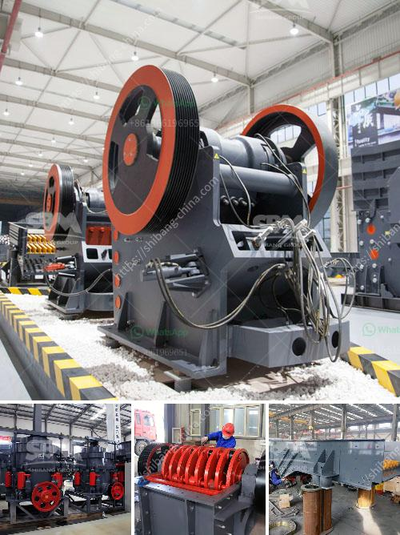

<h3>مطرقة فولاذية</h3>
تُعد المطرقة الفولاذية أحد الأدوات الأساسية في مجال البناء والأعمال اليدوية. فهي تستخدم لتطبيق قوة ضغط على الأجسام بغرض تشكيلها أو تثبيتها. تتميز المطارق الفولاذية بقوتها الهائلة ومتانتها العالية، مما يجعلها أداة لا غنى عنها للعديد من الحرفيين وعمال البناء.

تتكون المطارق الفولاذية من رأس مصنوع من الفولاذ الصلب، وعصا مقبضية مصنوعة من الخشب أو البلاستيك لزيادة قبضة العامل عليها. يتراوح وزن المطارق الفولاذية بين 200 إلى 400 جرام، مما يمنحها القوة الكافية لتحقيق المهام التي صُنعت من أجلها.

تستخدم المطارق الفولاذية في العديد من التطبيقات، مثل تثبيت الأظافر أو المسامير في الخشب أو الجدار، وتكسير الأجسام أو تشكيلها وتشذيب الطلاء أو إزالته. كما يمكن استخدام هذه المطارق في الحدادة والنجارة والصناعة العامة.

تتميز المطارق الفولاذية بالعديد من الفوائد. فهي توفر قوة ضرب قوية لتطبيق الضغط على الجسم المراد تثبيته، مما يجعل عملية التثبيت أكثر سهولة وفعالية. كما أن المطارق الفولاذية تتمتع بالمتانة والصلابة، مما يجعلها أداة طويلة الأمد وقادرة على تحمل الاستخدام الشاق لفترات طويلة دون التأثير على أدائها.

بفضل وزنها المتوسط، يمكن للمطروقة الفولاذية أن تزود العامل بالتحكم الكافي أثناء التشكيل أو التثبيت، مما يسهل عليه السيطرة على التطبيق وتحقيق النتائج المرجوة. كما أن هذه الأداة خفيفة الوزن مقارنة بالمطارق الأخرى المصنوعة من المواد الأخرى مثل المطارق الحديدية، مما يعزز من راحة العامل خلال الاستخدام المستمر.

لن يكتمل أي مجموعة أدوات يدوية بدون المطرقة الفولاذية. فهي أداة فعالة وموثوقة ولا غنى عنها في العديد من الأشغال والأعمال اليدوية. سواء كنت تقوم بأعمال ترميم في المنزل أو مشروع بناء كبير، فإن المطرقة الفولاذية ستكون شريكًا لا غنى عنه، فهي تجمع بين القوة والقدرة على التحكم والتحمل الشاق.
<h3>Contact us</h3><ul><li><strong>Whatsapp:&nbsp;<a href="https://wa.me/8613661969651">+8613661969651</a></strong></li><li><a href="https://swt.shibang-china.com/?git&amp;zhl&amp;مطرقة فولاذية"><strong>Online Service(chat now)</strong></a></li></ul><h3>Related</h3><ul><li><a href='كسارة حجر ثالثية.md'>كسارة حجر ثالثية</a></li><li><a href='مطحنة المطرقة للبيع في دبي.md'>مطحنة المطرقة للبيع في دبي</a></li><li><a href='أسعار كسارات نيجيريا الجديدة.md'>أسعار كسارات نيجيريا الجديدة</a></li><li><a href='كتلة الآلات وكسارة في AutoCAD.md'>كتلة الآلات وكسارة في AutoCAD</a></li><li><a href='تكلفة عمليات مصنع الرمل والحصى.md'>تكلفة عمليات مصنع الرمل والحصى</a></li></ul>