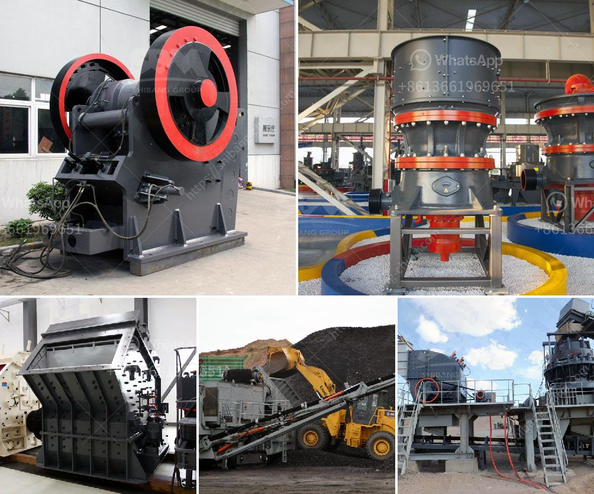

<h3>معالجة الحجر الجيري على نطاق صغير</h3>
تعد معالجة الحجر الجيري على نطاق صغير عملية هامة في صناعة البناء والإنشاءات. يتم استخدام الحجر الجيري بشكل شائع في تشييد الطرق والجسور والمباني والمنشآت الأخرى، وذلك بسبب قوته ومتانته. تهدف عملية معالجة الحجر الجيري إلى تحويله إلى مواد نهائية قابلة للاستخدام.

تتضمن عملية معالجة الحجر الجيري على نطاق صغير عدة خطوات. أولاً، يتم جمع الحجر الجيري من المحاجر المتاحة في المنطقة. يتم تكسير الحجر الجيري الخام باستخدام كسارات خاصة لتقليل حجمه إلى قطع أصغر. ثم، يتم غسل الحجر الجيري المجروش لإزالة الأتربة والشوائب.

بعد ذلك، يتم تجفيف الحجر الجيري المغسول باستخدام أفران خاصة. يتم تسخينه حتى درجة حرارة محددة لتبخير الماء المتبقي فيه. تعمل هذه العملية على تحسين نسبة الماء في الحجر الجيري وتحسين جودته.

ثم يتم طحن الحجر الجيري المجفف إلى مسحوق دقيق باستخدام طواحين خاصة. يتم تصنيف المسحوق المحصل عليه حسب الحجم والجودة المطلوبة. هذه المادة الخام يمكن استخدامها في مجموعة واسعة من التطبيقات.

عندما يتم استخدام الحجر الجيري المطحون في تشييد الطرق والجسور، يتم خلطه مع مواد أخرى مثل الأسمنت والرمل والماء لإنتاج الخرسانة. تكون الخرسانة قوية ومتينة بفضل وجود حجر الحجر في تركيبتها.

بالنسبة للاستخدامات الأخرى، مثل البلاط والجدران والأرضيات، يمكن استخدام الحجر الجيري المطحون كمواد بناء. يتم تشكيله في قوالب وتجفيفه للحصول على المنتج النهائي.

تتطلب عملية معالجة الحجر الجيري على نطاق صغير أيضًا تجهيزات ومعدات خاصة. يحتاج المنجم إلى معدات لجمع الحجر الجيري والقوى العاملة للقيام بالأعمال اللازمة. بالإضافة إلى ذلك، يتطلب العملية استخدام طواحين وأفران ومعدات أخرى لإجراء الخطوات المختلفة في المعالجة.

في الختام، يعد الحجر الجيري مادة أساسية في صناعة البناء والإنشاءات. يمكن معالجته على نطاق صغير لإنتاج مواد بناء عالية الجودة. يعتبر الحجر الجيري المطحون مادة متعددة الاستخدامات، مما يجعله خيارًا شائعًا في صناعة البناء.
<h3>Contact us</h3><ul><li><strong>Whatsapp:&nbsp;<a href="https://wa.me/8613661969651">+8613661969651</a></strong></li><li><a href="https://swt.shibang-china.com/?git&amp;zhl&amp;معالجة الحجر الجيري على نطاق صغير"><strong>Online Service(chat now)</strong></a></li></ul><h3>Related</h3><ul><li><a href='تكلفة مصنع كسارة الحجر الجيري.md'>تكلفة مصنع كسارة الحجر الجيري</a></li><li><a href='كسارة الجبس الحجر الجيري.md'>كسارة الجبس الحجر الجيري</a></li><li><a href='الفرق بين كسارة الفك وكسارة الصدم.md'>الفرق بين كسارة الفك وكسارة الصدم</a></li><li><a href='كسارة فكية صغيرة في المملكة المتحدة.md'>كسارة فكية صغيرة في المملكة المتحدة</a></li><li><a href='كسارات تأجير.md'>كسارات تأجير</a></li></ul>