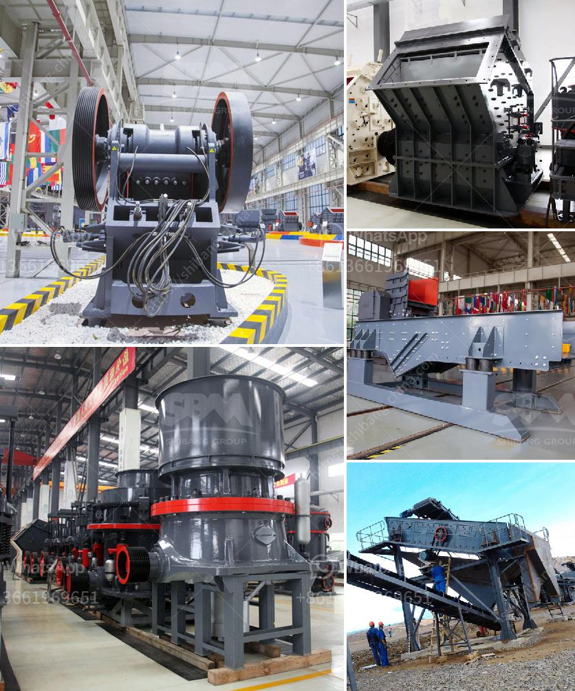

<h3>معالجة الحجر الجيري في نيجيريا</h3>
يُعتبر الحجر الجيري من الموارد الطبيعية الغنية في نيجيريا. إن استخدامه في العديد من الصناعات مثل صناعة الاسمنت والصلصال والحديد يجعله قضية اقتصادية هامة للبلاد. بالإضافة إلى ذلك ، يعتبر الحجر الجيري أيضًا مادة أساسية لصناعة المواد الكيميائية والزجاج والعديد من المنتجات الأخرى.

تعتمد معالجة الحجر الجيري في نيجيريا على تكنولوجيا حديثة وعمليات متطورة. يتم تعدين الحجر الجيري من المحاجر الكبيرة باستخدام المعدات الثقيلة مثل الشاحنات والحفارات. يتم نقل الحجارة الضخمة إلى مكان المعالجة بواسطة الحافلات أو الشاحنات، ثم تتم عملية سحق الحجر الجيري باستخدام الكسارات المختلفة.

بعد عملية السحق ، يتم طحن الحجر الجيري في مسحوق ناعم باستخدام طواحين الأسطوانة أو الطواحين الكروية. يتم تفجير الغاز الطبيعي أو الفحم الحجري بهدف توليد الحرارة اللازمة لعملية الطحن. يتم ثم نقل المسحوق الناتج إلى محطة خلط الرماد الجيري التي تستخدم فيها كمية معينة من المسحوق لإنتاج الرماد الجيري المطفأ، وهو منتج ذو قيمة عالية ويستخدم في صناعة الأسمنت.

بعد ذلك، يتم تعبئة الحجر الجيري المسحوق في أكياس جاهزة للتسويق، ويتم تصنيفه وفقًا للحجم والجودة المطلوبة. تُستخدم الآلات التكنولوجية المتقدمة لإجراء هذه العملية بدقة وفقًا للمعايير المطلوبة.

تواجه عملية معالجة الحجر الجيري في نيجيريا تحديات معينة. من أبرز هذه التحديات هي تنضيد الإنتاجية وتسهيل انتقال المعدات الثقيلة من المحاجر. بالإضافة إلى ذلك ، هناك أيضًا تحديات في الحصول على كميات كافية من الطاقة لتشغيل معدات المعالجة بشكل مستدام.

على الرغم من التحديات التي تواجهها صناعة معالجة الحجر الجيري في نيجيريا ، إلا أن البلاد تعمل على تطوير هذه الصناعة وزيادة الإنتاج. من المتوقع أن يؤدي تحسين البنية التحتية والتكنولوجيا المستخدمة إلى زيادة عائدات الحجر الجيري وتحقيق فوائد اقتصادية هامة للبلاد.

بالاختصار ، تُعد صناعة معالجة الحجر الجيري في نيجيريا قطاعًا اقتصاديًا هامًا. تعتمد عملية المعالجة على تكنولوجيا حديثة وعمليات متطورة لاستخدام الحجر الجيري في صناعات مختلفة. تواجه هذه الصناعة بعض التحديات التي يتعين التغلب عليها ، ومع ذلك ، يتوقع زيادة الإنتاج وتحقيق فوائد اقتصادية كبيرة للبلاد في المستقبل.
<h3>Contact us</h3><ul><li><strong>Whatsapp:&nbsp;<a href="https://wa.me/8613661969651">+8613661969651</a></strong></li><li><a href="https://swt.shibang-china.com/?git&amp;zhl&amp;معالجة الحجر الجيري في نيجيريا"><strong>Online Service(chat now)</strong></a></li></ul><h3>Related</h3><ul><li><a href='مطحنة طحن الحجر الصناعي.md'>مطحنة طحن الحجر الصناعي</a></li><li><a href='محطات تكسير محمولة.md'>محطات تكسير محمولة</a></li><li><a href='قطع غيار آلة المطحنة ووظيفتها.md'>قطع غيار آلة المطحنة ووظيفتها</a></li><li><a href='شاشة اهتزاز عالية التردد.md'>شاشة اهتزاز عالية التردد</a></li><li><a href='آلة طحن وخلط الكوارتز.md'>آلة طحن وخلط الكوارتز</a></li></ul>