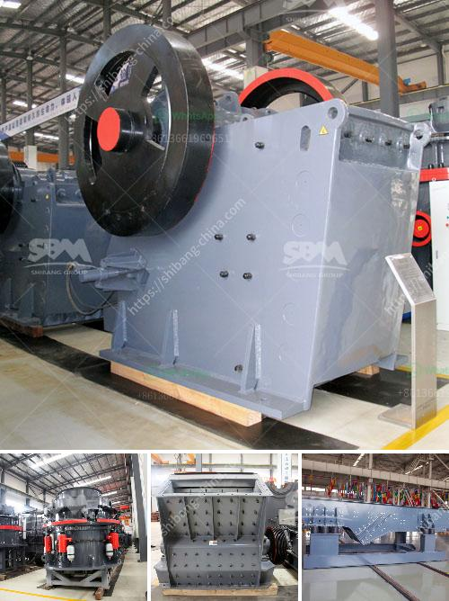

<h3>معالجة الذهب بنطاق صغير باستخدام طريقة CIP</h3>
تعد معالجة الذهب بنطاق صغير باستخدام طريقة CIP (التعدين باستخلاص الكربون المنشط) أحد الطرق الشائعة والفعالة لاستخلاص الذهب من الصخور والمواد المعدنية المختلفة التي تحتوي على كميات ضئيلة من الذهب. تعد هذه الطريقة هامة بالنسبة للمنقبين الصغار والمواقع التي تفتقر إلى البنية التحتية اللازمة لاستخراج الذهب بطرق أكبر القدرات.

تتكون طريقة معالجة الذهب باستخدام CIP من عدة خطوات. الخطوة الأولى هي سحق وطحن الصخور والمواد المعدنية للحصول على مسحوق ناعم. بعد ذلك، يتم خلط المسحوق مع الماء والمواد الكيميائية مثل النيغروسين والاوكسجين المنحل لتشكيل محلول ثاني أكسيد الكربون. يتم نقل هذا السائل إلى حوض التفاعل، حيث يتفاعل مع الذهب الموجود في المسحوق ويتشكل مركب معقد. 

بعد ذلك، يتم تصفية الحل الناتج من حوض التفاعل لإزالة الشوائب والرواسب الزائدة. يتم تجميع المحلول في صهريج خاص يحتوي على جهاز تحليل لقياس محتوى الذهب في هذا المحلول. إذا كان محتوى الذهب كافيًا، يتم إرسال المحلول إلى خط الاسترداد، حيث يمر الذهب عبر الكربون المنشط لامتصاصه من المحلول. ثم يتم غسل الكربون المشبع بالذهب وتحويله إلى حمأة تحتوي على الذهب. 

تتعدد فوائد استخدام طريقة CIP لمعالجة الذهب بنطاق صغير. فهي توفر طريقة فعالة وبأقل تكلفة لاستخلاص الذهب من الصخور والمواد المعدنية ذات الكميات الضئيلة. كما أنها تقلل من تلوث البيئة المحيطة، حيث يتم استخدام النيغروسين غير القابل للاشتعال بدلاً من السيانيد الذي يُستخدم في طرق أخرى لاستخلاص الذهب.

باختصار، طريقة معالجة الذهب بنطاق صغير باستخدام طريقة CIP تعد خيارًا مواتيًا للاستخلاص الفعال والاقتصادي للذهب من الصخور والمواد المعدنية ذات الكميات الصغيرة. كما أنها تلعب دورًا هامًا في دعم المنقبين الصغار والمواقع ذات البنية التحتية المحدودة في عمليات تعدين الذهب.
<h3>Contact us</h3><ul><li><strong>Whatsapp:&nbsp;<a href="https://wa.me/8613661969651">+8613661969651</a></strong></li><li><a href="https://swt.shibang-china.com/?git&amp;zhl&amp;معالجة الذهب بنطاق صغير باستخدام طريقة CIP"><strong>Online Service(chat now)</strong></a></li></ul><h3>Related</h3><ul><li><a href='شركة تصنيع كسارة الفك الدورانية في الهند.md'>شركة تصنيع كسارة الفك الدورانية في الهند</a></li><li><a href='معدات كسارة دبي.md'>معدات كسارة دبي</a></li><li><a href='عملية إنتاج رمل الصخور بتنسيق PDF.md'>عملية إنتاج رمل الصخور بتنسيق PDF</a></li><li><a href='سعر كسارة مخروطية هيدروليكية بتغذية 20 مم.md'>سعر كسارة مخروطية هيدروليكية بتغذية 20 مم</a></li><li><a href='مطحنة صخرة الرخام.md'>مطحنة صخرة الرخام</a></li></ul>