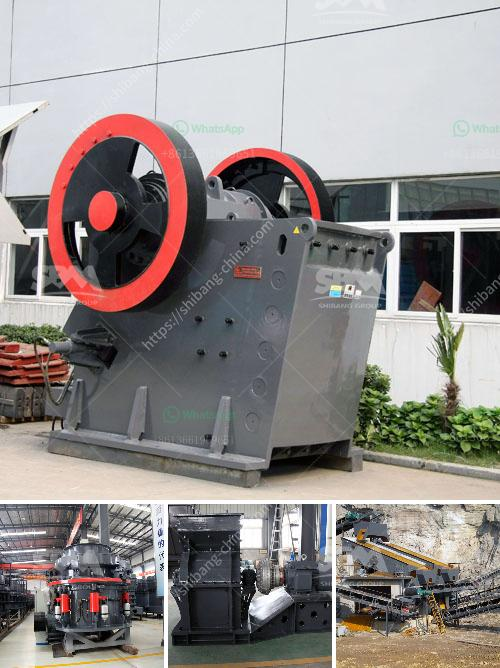

<h3>معالجة الذهب في الفلبين</h3>
تعد الفلبين واحدة من الدول الغنية بالموارد الطبيعية، ومن أهم هذه الموارد هو الذهب. تعتبر صناعة التعدين في الفلبين قطاعًا اقتصاديًا هامًا يسهم في توفير فرص العمل وزيادة النمو الاقتصادي.

تمتلك الفلبين إحدى أكبر الاحتياطيات من الذهب في العالم، حيث يعتبر التعدين واحدًا من أهم القطاعات الاقتصادية في البلاد. تشكل تعدين الذهب جزءًا كبيرًا من هذه الصناعة، مما يجعل معالجة الذهب عملية حاسمة.

تتم معالجة الذهب في الفلبين باستخدام العديد من الطرق والتقنيات المختلفة. واحدة من هذه الطرق هي التعدين بالمدينة الصغرى، وهي تقنية شائعة تستخدم في استخراج الذهب من الرواسب الطبيعية والتربة. تتضمن هذه العملية فصل الذهب عن المواد الأخرى باستخدام المياه والمواد الكيميائية.

بالإضافة إلى ذلك، تستخدم الفلبين أيضًا طريقة المعالجة بالتنقية النهائية. تتضمن هذه العملية استخدام المواد الكيميائية لفصل الذهب عن المواد الغير قابلة للذوبان. ثم يتم تسخين المحلول المكون للحصول على الذهب النقي.

ومع ذلك، يواجه تعدين الذهب في الفلبين مجموعة من التحديات. تقع معظم مناجم الذهب في المناطق النائية والريفية، ما يعني أن الوصول إليها قد يكون صعبًا وتكلفة النقل مرتفعة. بالإضافة إلى ذلك، يواجه العمال في هذه المناجم تحديات أخرى مثل الظروف العمل الصعبة ومخاطر الحوادث.

علاوة على ذلك، تحتاج صناعة التعدين في الفلبين إلى تعزيز الممارسات المستدامة والمسؤولة لحماية البيئة. يجب العمل على تنفيذ تقنيات التعدين الحديثة والمبتكرة لتقليل التأثير البيئي ومنع التلوث.

في النهاية، يعتبر تعدين الذهب في الفلبين قطاعًا حيويًا يساهم في اقتصاد البلاد. تحتاج هذه الصناعة إلى استثمارات وجهود مستدامة لتطويرها وتحسين أدائها. بتطبيق أفضل الممارسات واستخدام التكنولوجيا الحديثة، يمكن للفلبين تعزيز قدرتها التنافسية في سوق الذهب العالمية وتعزيز التنمية المستدامة في البلاد.
<h3>Contact us</h3><ul><li><strong>Whatsapp:&nbsp;<a href="https://wa.me/8613661969651">+8613661969651</a></strong></li><li><a href="https://swt.shibang-china.com/?git&amp;zhl&amp;معالجة الذهب في الفلبين"><strong>Online Service(chat now)</strong></a></li></ul><h3>Related</h3><ul><li><a href='مطحنة الكرة لطحن الفلسبار.md'>مطحنة الكرة لطحن الفلسبار</a></li><li><a href='كيفية صنع مسحوق وضع الجدار.md'>كيفية صنع مسحوق وضع الجدار</a></li><li><a href='تكلفة آلة الكسارة.md'>تكلفة آلة الكسارة</a></li><li><a href='المواصفات الفنية لمطحنة الكرة.md'>المواصفات الفنية لمطحنة الكرة</a></li><li><a href='سعر تريتورادورا دي تييرراس في باكستان.md'>سعر تريتورادورا دي تييرراس في باكستان</a></li></ul>