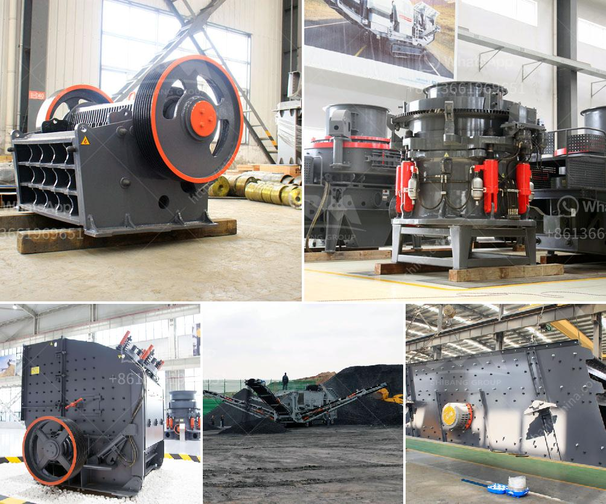

<h3>معالجة تكسير البازلت</h3>
يُعد البازلت من الصخور البركانية ذات الاستخدامات المتعددة في صناعات البناء والطرق. ولكن قبل استخدامها في هذه الصناعات، يتعين علينا تكسير البازلت للحصول على حصى أو رمل بازلتي قابل للاستعمال. تصمم عملية تكسير البازلت لتنتج أحجامًا صغيرة من الأحجار والركام بواسطة المعدات الثقيلة المخصصة لهذا الغرض، مثل آلات الكسارة الفكية والكسارة الصدمية والكسارة المخروطية.

تتضمن عملية معالجة تكسير البازلت العديد من المراحل. بدايةً، يتم نقل الصخور البازلتية من موقع التعدين إلى المصنع عن طريق الشاحنات أو السيور الناقلة. تتم إزالة الأتربة والرواسب الأخرى من البازلت باستخدام المياه أو الغسالات الخاصة. يتم تفتيت البازلت بواسطة الكسارات الفكية في البداية للحصول على حجم بداية مناسب. ثم يتم تشذيب ومعالجة البازلت بالكسارات الصدمية والمخروطية للحصول على حجم محدد من الحصى أو الرمل.

عملية التكسير تعتمد على مواصفات المنتج النهائي المطلوبة. في بعض الحالات، يجب أن يتم تكسير البازلت إلى قطع صغيرة بحجم معين يتم استخدامه في إنتاج الخرسانة أو التعبئة أو تسقيف الطرق. وفي حالات أخرى، يتم تكسير البازلت إلى حصى أكبر الحجم يمكن استخدامه في بناء الجدران أو الترصيف.

تُستخدم المعدات الثقيلة في عملية تكسير البازلت لضمان تفتيت الصخور بطريقة فعالة وسريعة. وهناك العديد من المعدات المستخدمة في هذه العملية، بما في ذلك الكسارات الفكية والصدمية والمخروطية. تعتبر الكسارة الفكية من بين المعدات الأكثر استخدامًا، حيث تعمل على فتح البازلت وتفتيته بشكل أولي. تعمل الكسارات الصدمية على تكسير البازلت إلى قطع صغيرة عن طريق الصدمة المباشرة عليها، في حين تعتبر الكسارات المخروطية مثالية للحصول على حبيبات تكسر الحجم المطلوب.

بعد عملية التكسير، يتم فصل الحصى والرمل عن المواد الفائضة باستخدام الغرابيل والشاشات الاهتزازية. تُستخدم هذه الأدوات لفصل الحجم الصغير المطلوب وإعادة تدوير أي مواد فائضة قابلة للمعالجة.

باختصار، يتطلب تكسير البازلت استخدام معدات خاصة ومراحل متعددة للحصول على حصى أو رمل بازلتي قابل للاستخدام في صناعات البناء والطرق. استخدام المعدات الثقيلة الحديثة في عملية التكسير يضمن إنتاجية عالية وجودة مستدامة للمنتج النهائي.
<h3>Contact us</h3><ul><li><strong>Whatsapp:&nbsp;<a href="https://wa.me/8613661969651">+8613661969651</a></strong></li><li><a href="https://swt.shibang-china.com/?git&amp;zhl&amp;معالجة تكسير البازلت"><strong>Online Service(chat now)</strong></a></li></ul><h3>Related</h3><ul><li><a href='عملية تصنيع حجر الكوارتز.md'>عملية تصنيع حجر الكوارتز</a></li><li><a href='محطم متنقل لسحق الفحم.md'>محطم متنقل لسحق الفحم</a></li><li><a href='عملية تصنيع السلاغ.md'>عملية تصنيع السلاغ</a></li><li><a href='تكلفة مصنع تكسير الحجر.md'>تكلفة مصنع تكسير الحجر</a></li><li><a href='مصنع كسارة 150 طن في الساعة.md'>مصنع كسارة 150 طن في الساعة</a></li></ul>