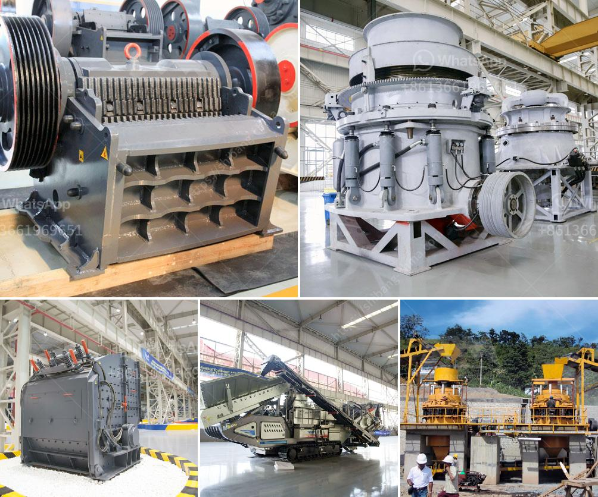

<h3>معالجة تكسير الكاولين في الهند</h3>
تكسير الكاولين هو عملية هامة في صناعة التعدين والمعالجة في الهند. يتم استخراج خام الكاولين من الطبقات الجيولوجية السطحية ، ثم يتم تكسيره وتجهيزه للاستخدام في مختلف الصناعات مثل السيراميك وصناعة الورق والدهانات والأدوية والبلاستيك.

يتم تكسير الكاولين لتحطيم الجزيئات الكبيرة إلى جسيمات أصغر يمكن معالجتها بواسطة المعاملات اللاحقة. تختلف طرق معالجة الكاولين حسب نوع الصناعة المستهدفة. ومع ذلك ، تشتمل الخطوات الأساسية المشتركة المستخدمة في معالجة الكاولين على التكسير والفصل المغناطيسي والتخلص من المواد العضوية وتنقية المياه.

يتم تكسير خام الكاولين ، الذي يتكون بشكل عام من معدن الكاولينيت ، باستخدام آلات تكسير متخصصة. يتم سحق الكاولين في مراحل متعددة باستخدام كسارات فكية وكسارات صدمية وكسارات مخروطية. يتم تفتيت الكاولين الخام إلى قطع صغيرة ، والتي تمر بعد ذلك عبر آليات فصل لفصل المعادن غير المرغوب فيها. 

ثم يتم تخزين الكاولين لمدة فترة قصيرة لإنجاز العمليات الممكنة لإزالة المواد العضوية. يتم غسل الكاولين بالماء لإزالة الأتربة والشوائب السطحية الأخرى. ثم يتم تنقية المحلول المستخدم لغسل الكاولين بإزالة المواد العضوية.

تعتبر معالجة الكاولين للتخلص من المواد العضوية أمرًا هامًا للحصول على جودة الكاولين المطلوبة. تستخدم العديد من التقنيات لإزالة المواد العضوية مثل العجن واستخدام المواد الكيميائية. في العملية الأخيرة ، يتم تجفيف الكاولين حتى يصبح جاهزًا للطحن والتصنيع في المنشآت الصناعية.

يوجد الكاولين في الهند في العديد من الولايات مثل راجستان وأوديشا وجهارخاند وجيبي وأندرا براديش. يتم اكتشاف مواقع جديدة باستمرار ، مما يزيد من إمكانات انتاج الكاولين في الهند. توجد العديد من الشركات في الهند التي تعمل في مجال استخراج وتكسير وتجهيز الكاولين، وتعزز هذه الشركات الاقتصاد وتوفر فرص عمل.

في الختام ، تكسير الكاولين في الهند يلعب دورًا هامًا في صناعة التعدين. تعتبر هذه العملية حاسمة لاستخراج الكاولين وتجهيزه للاستخدام في الصناعات المختلفة. يجب أن تركز الشركات العاملة في هذا القطاع على تكنولوجيا المعالجة المتقدمة والابتكار لتحسين كفاءة العمليات وجودة المنتج النهائي لتعزيز صناعة التعدين في الهند.
<h3>Contact us</h3><ul><li><strong>Whatsapp:&nbsp;<a href="https://wa.me/8613661969651">+8613661969651</a></strong></li><li><a href="https://swt.shibang-china.com/?git&amp;zhl&amp;معالجة تكسير الكاولين في الهند"><strong>Online Service(chat now)</strong></a></li></ul><h3>Related</h3><ul><li><a href='كسارة حجر في تروخيلو، بوليفيا.md'>كسارة حجر في تروخيلو، بوليفيا</a></li><li><a href='مطحنة عمودية للبيع في الولايات المتحدة.md'>مطحنة عمودية للبيع في الولايات المتحدة</a></li><li><a href='كسارة مطرقية متعددة.md'>كسارة مطرقية متعددة</a></li><li><a href='كسارات محمولة في السعودية.md'>كسارات محمولة في السعودية</a></li><li><a href='آلات تكسير الحجر في المملكة المتحدة.md'>آلات تكسير الحجر في المملكة المتحدة</a></li></ul>