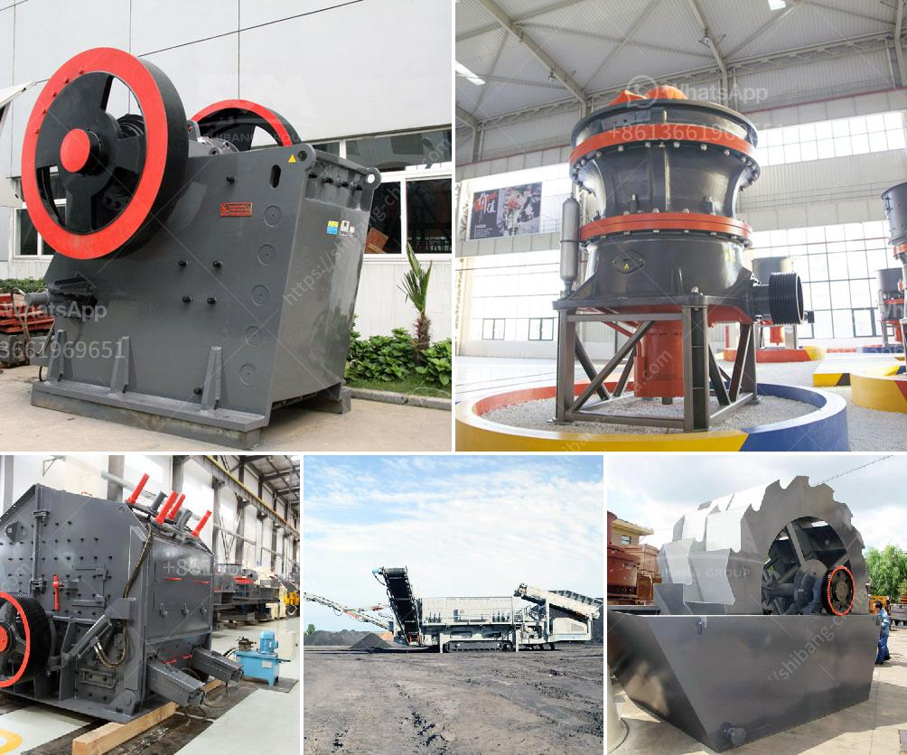

<h3>معالجة خام الدولوميت</h3>
خام الدولوميت هو نوع من الصخور المعدنية الغنية بالمغنيسيوم والكالسيوم.  ويتكون من مركب كيميائي يسمى كربونات المغنيسيوم والكالسيوم (CaMg (CO3)2).

تعتبر معالجة خام الدولوميت عملية هامة لاستخلاص المغنيسيوم والكالسيوم من الصخور الخام. يتم استخدام هذه العملية في العديد من الصناعات مثل صناعة الأسمنت والزجاج والصلب وصناعة المبيدات الحشرية والأسمدة.

إحدى الطرق الشائعة لمعالجة خام الدولوميت هي عملية الاحتراق.  يتم تسخين الخام في فرن على درجات حرارة عالية لتحويله إلى أكسيد المغنيسيوم وأكسيد الكالسيوم. يمكن استخدام هذين المركبين في العديد من التطبيقات المختلفة. يُستخدم أكسيد المغنيسيوم في صناعة الأسمنت كمنشط للتفاعلات الكيميائية وفي صناعة المغنيسيوم، بينما يستخدم أكسيد الكالسيوم كمواد خام لإنتاج الكالسيوم المكربن.

تعتمد عملية معالجة خام الدولوميت على تحويل المعادن الخام إلى مركبات كيميائية أكثر قيمة وفعالية. ويتطلب تحويل خام الدولوميت إلى منتجات نهائية صناعية عمليات مثل التكسير والطحن والترشيح والتركيب الكيميائي والتحليل والتعدين والتحسين. يجب أيضًا توفير معدات أساسية لتطبيق هذه العمليات ، بما في ذلك الكسارات والطواحين والفرز والفحص والخلاطات.

عملية معالجة خام الدولوميت يجب أن تتم وفقًا للمواصفات والقوانين البيئية بغرض الحفاظ على البيئة وتجنب التأثير السلبي على النظام البيئي المحيط. يجب مراعاة إعادة تدوير المواد النفايات والتخلص من المخلفات بشكل آمن وفعال.

عملية معالجة خام الدولوميت هي عملية صناعية هامة لاستخلاص المغنيسيوم والكالسيوم من الصخور الخام. تستفيد العديد من الصناعات المختلفة من هذه العملية. يمكن أن تساهم في تلبية الطلب العالمي على المغنيسيوم والكالسيوم، وتعزيز التنمية الاقتصادية والصناعية.
<h3>Contact us</h3><ul><li><strong>Whatsapp:&nbsp;<a href="https://wa.me/8613661969651">+8613661969651</a></strong></li><li><a href="https://swt.shibang-china.com/?git&amp;zhl&amp;معالجة خام الدولوميت"><strong>Online Service(chat now)</strong></a></li></ul><h3>Related</h3><ul><li><a href='سعر مصنع الرمل والحصى في الهند.md'>سعر مصنع الرمل والحصى في الهند</a></li><li><a href='مصنع تكسير الحجر الكلي في الصين.md'>مصنع تكسير الحجر الكلي في الصين</a></li><li><a href='عملية صنع كسارة رخام الكوارتز.md'>عملية صنع كسارة رخام الكوارتز</a></li><li><a href='كيفية سحق خام الذهب في ماين كرافت.md'>كيفية سحق خام الذهب في ماين كرافت</a></li><li><a href='طبقة من مطحنة ريمون.md'>طبقة من مطحنة ريمون</a></li></ul>