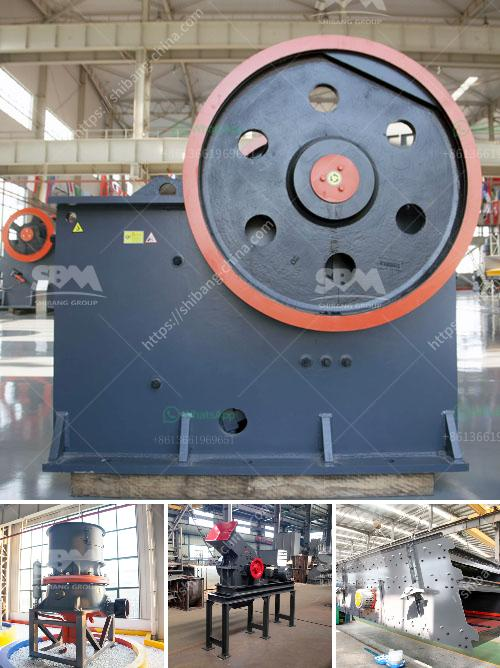

<h3>معالجة كسارة الكوارتز</h3>
تعتبر معالجة كسارة الكوارتز أمرًا هامًا للاستخدام الفعال لهذه الخامة القيمة. يصنف الكوارتز على أنه معدن يستخدم في العديد من الصناعات مثل الزجاج والسيراميك وصناعة الإلكترونيات. تتطلب معالجة كسارة الكوارتز خطوات محددة لتحقيق أعلى جودة وفائدة من هذه الخامة.

أولاً، يجب سحق الكسارة لتكون قطعًا صغيرة بواسطة كسارة فكية أو كسارة تصادمية. يوصى بتجهيز الكسارة بطريقة مناسبة لتلافي أي تلوث أو شوائب قد تؤثر على جودة الكوارتز النهائي.

ثانيًا، بعد سحق الكسارة، يتم تنظيفها بعناية باستخدام الماء والمحاليل الكيميائية المناسبة للتخلص من الشوائب المتبقية. يجب تجفيف الكوارتز جيدًا بعد التنظيف للحصول على نتيجة مثالية.

ثالثًا، يمكن تنفيذ عمليات التصنيف والفصل للحفاظ على جودة الكوارتز بإزالة الشوائب الدقيقة وفصل الجسيمات المرغوب فيها.

رابعًا، يجب إجراء عمليات التجفيف والتبريد على الكوارتز بعد عمليات التصنيع لتثبيت جودته وتقليل احتمالية تغير خواصه.

أخيرًا، يمكن معالجة الكسارة بعمليات أخرى مثل التصهير أو تجهيزها بطرق أخرى وفقاً للاستخدام النهائي للكوارتز.

باختصار، معالجة كسارة الكوارتز تشمل عمليات متعددة لتحقيق أعلى جودة وفائدة من الخامة. يجب الانتباه إلى التفاصيل والاحتياجات المحددة لكل صناعة وتطبيق لضمان الحصول على كوارتز ذو مواصفات مثالية ومطابقة للمعايير المطلوبة.
<h3>Contact us</h3><ul><li><strong>Whatsapp:&nbsp;<a href="https://wa.me/8613661969651">+8613661969651</a></strong></li><li><a href="https://swt.shibang-china.com/?git&amp;zhl&amp;معالجة كسارة الكوارتز"><strong>Online Service(chat now)</strong></a></li></ul><h3>Related</h3><ul><li><a href='كسارة الحجر المحجر.md'>كسارة الحجر المحجر</a></li><li><a href='مقترح مشروع أعمال لكسارة الحجر.md'>مقترح مشروع أعمال لكسارة الحجر</a></li><li><a href='مبيعات آلة التكسير المحمولة في جنوب أفريقيا.md'>مبيعات آلة التكسير المحمولة في جنوب أفريقيا</a></li><li><a href='آلة كسارة الحجر للبيع في نيوزيلندا.md'>آلة كسارة الحجر للبيع في نيوزيلندا</a></li><li><a href='تكلفة الحزام الناقل لكل متر.md'>تكلفة الحزام الناقل لكل متر</a></li></ul>