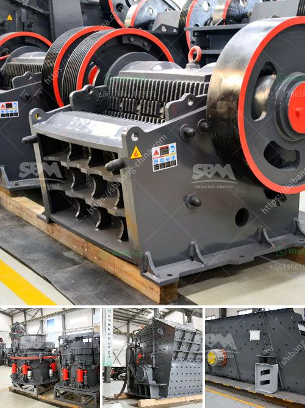

<h3>معدات إعادة تدوير الجبس للبيع</h3>
إعادة التدوير تعد وسيلة فعالة للحفاظ على البيئة وتقليل النفايات. واحدة من الفئات المهمة لإعادة التدوير هي إعادة تدوير الجبس. يتم استخدام الجبس في العديد من التطبيقات مثل صناعة الأسمنت والملاط والعزل والمواد البنائية الأخرى. وفي نهاية العمر الافتراضي لهذه المنتجات، يمكن إعادة تدوير الجبس لإنتاج منتج جديد.

إعادة تدوير الجبس تتطلب معدات خاصة تساعد في عملية الفرز والتجهيز وإزالة الشوائب. تشمل هذه المعدات آلات الفرز والتكسير والطحن. يتم استخدام آلات الفرز لفصل الشوائب والمواد الأخرى عن الجبس. ثم يتم تكسير الجبس في آلات تكسير خاصة لتقليل الحجم وتحسين جودة المنتج النهائي.

بعد ذلك، يتم طحن الجبس في آلات طحن لتحقيق حجم الحبيبات المطلوب. يتم إزالة الشوائب الأخرى أثناء عملية الطحن. تتوفر معدات إعادة تدوير الجبس بمختلف القدرات والمواصفات، والتي تعتمد على احتياجات المستخدم النهائي.

يتراوح سعر معدات إعادة تدوير الجبس من 200 إلى 400 دولار. يعتمد السعر على العلامة التجارية والمواصفات والحجم والقدرات. يجب على المستخدم النهائي النظر في جميع العوامل المذكورة لاختيار المعدات المناسبة لاحتياجاته.

من الجدير بالذكر أنه قبل شراء معدات إعادة تدوير الجبس، يجب أن يتم دراسة السوق والموردين المختلفين. يجب أن يتم الاستفسار عن الضمانات والصيانة والدعم الفني المقدم من قبل الشركة المصنعة. يجب على المستخدم النهائي أيضًا اختبار المعدات قبل الشراء لضمان سلامتها وأدائها الجيد.

في النهاية، إعادة تدوير الجبس تعد خيارًا مستدامًا واقتصاديًا للحفاظ على البيئة وتحقيق الاستدامة البيئية. ومعدات إعادة تدوير الجبس الحديثة والفعالة تلعب دورًا مهمًا في تحقيق هذا الهدف. يجب على المستخدمين النهائيين البحث واختيار المعدات المناسبة لاحتياجاتهم والعمل مع الموردين الموثوق بهم للحصول على أفضل النتائج.
<h3>Contact us</h3><ul><li><strong>Whatsapp:&nbsp;<a href="https://wa.me/8613661969651">+8613661969651</a></strong></li><li><a href="https://swt.shibang-china.com/?git&amp;zhl&amp;معدات إعادة تدوير الجبس للبيع"><strong>Online Service(chat now)</strong></a></li></ul><h3>Related</h3><ul><li><a href='ريموند مطحنة في كولينز.md'>ريموند مطحنة في كولينز</a></li><li><a href='مطاحن الكرة في إندونيسيا.md'>مطاحن الكرة في إندونيسيا</a></li><li><a href='محجر مستعمل بشكل معقول في نيجيريا.md'>محجر مستعمل بشكل معقول في نيجيريا</a></li><li><a href='سعر أحزمة الناقلات.md'>سعر أحزمة الناقلات</a></li><li><a href='آلات كسارة الحجر في هولندا.md'>آلات كسارة الحجر في هولندا</a></li></ul>