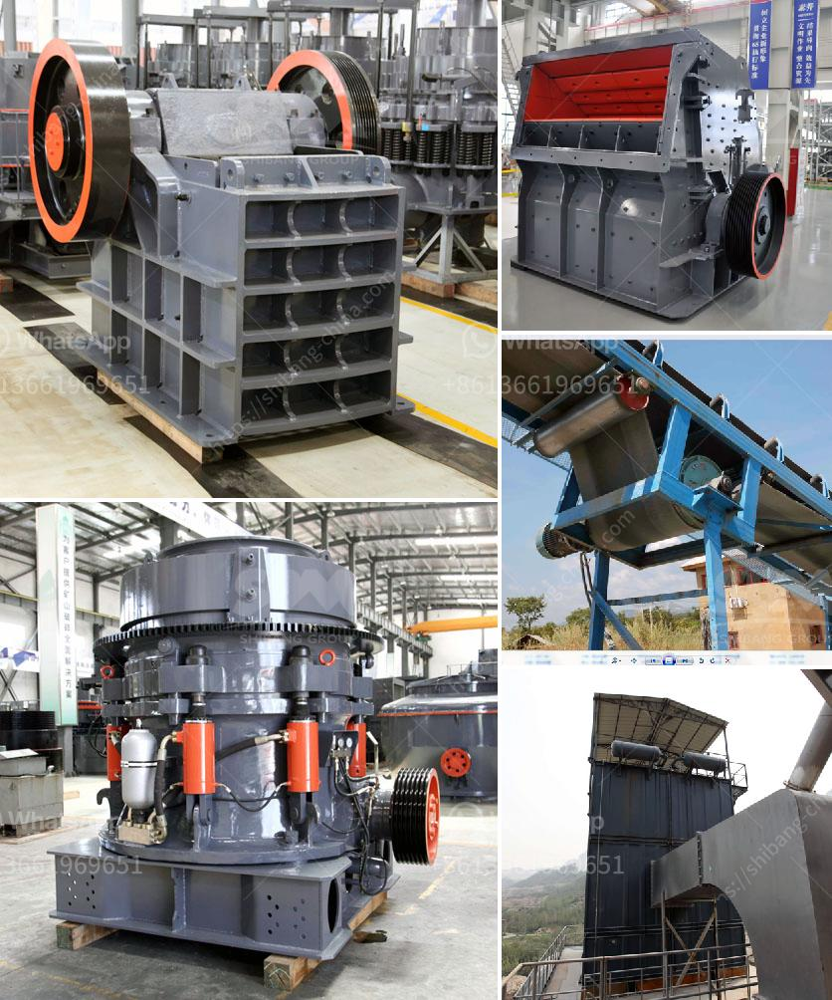

<h3>معدات إنتاج الأسمنت في ألمانيا</h3>
تعتبر ألمانيا واحدة من الدول الرائدة في صناعة الأسمنت في العالم. توفر البلاد معدات إنتاج متطورة ومبتكرة لإنتاج الأسمنت بجودة عالية وكفاءة عالية.

تتكون معدات إنتاج الأسمنت في ألمانيا من العديد من العناصر الرئيسية. أحد العناصر الرئيسية هو الفرن الدوار، الذي يستخدم لتسخين المواد الخام المكونة للأسمنت. يتم تسخين الحجارة الجيرية والطين والغرينة إلى درجة حرارة عالية داخل الفرن الدوار لإنتاج الكلنكر. يتم إضافة الكلنكر إلى مواد أخرى مثل الجبس والفحم لإنتاج الأسمنت النهائي.

بالإضافة إلى الفرن الدوار، تحتوي معدات إنتاج الأسمنت في ألمانيا على العديد من المعدات الأخرى مثل مطاحن الأسطوانة، وسحق النباتات، وأنظمة الفرز وحجم الجزيئات، ومعدات التغذية، والمجففات، والتخزين والتعبئة. تعد هذه المعدات مصممة بشكل دقيق وفقًا للتكنولوجيا الحديثة لضمان الأداء الأمثل والجودة المثلى.

يتم تصميم معدات إنتاج الأسمنت في ألمانيا لتحسين كفاءة العمليات وتقليل استهلاك الطاقة والموارد الطبيعية. تستخدم تقنيات حديثة مثل التحكم الآلي والتشغيل الذكي واستخلاص الطاقة للحد من التكاليف وتحقيق الاستدامة البيئية.

تعمل معدات إنتاج الأسمنت في ألمانيا بشكل مستمر على مدار الساعة طوال أيام الأسبوع لضمان تلبية الطلب المتزايد على الأسمنت في السوق المحلية والعالمية. تلتزم الصناعة الألمانية بمعايير عالية لمراقبة الجودة وضمان المعايير الدولية لمنتجاتها.

باختصار، تعتبر معدات إنتاج الأسمنت في ألمانيا متقدمة ومبتكرة، وتحظى بسمعة جيدة في صناعة الأسمنت العالمية. تعمل هذه المعدات بكفاءة عالية وجودة ممتازة، مع الالتزام بالاستدامة البيئية ومتطلبات الجودة العالمية. تحافظ ألمانيا على مكانتها كواحدة من أفضل الدول في صناعة الأسمنت على مستوى العالم.
<h3>Contact us</h3><ul><li><strong>Whatsapp:&nbsp;<a href="https://wa.me/8613661969651">+8613661969651</a></strong></li><li><a href="https://swt.shibang-china.com/?git&amp;zhl&amp;معدات إنتاج الأسمنت في ألمانيا"><strong>Online Service(chat now)</strong></a></li></ul><h3>Related</h3><ul><li><a href='جزء من مطحنة الأسطوانة.md'>جزء من مطحنة الأسطوانة</a></li><li><a href='كسارات مزدوجة التبديل.md'>كسارات مزدوجة التبديل</a></li><li><a href='موردي مطاحن الأسطوانة في المكسيك.md'>موردي مطاحن الأسطوانة في المكسيك</a></li><li><a href='كسارة الحجر الجرانيت الهند.md'>كسارة الحجر الجرانيت الهند</a></li><li><a href='صيغة حساب قدرة كسارة الفك.md'>صيغة حساب قدرة كسارة الفك</a></li></ul>