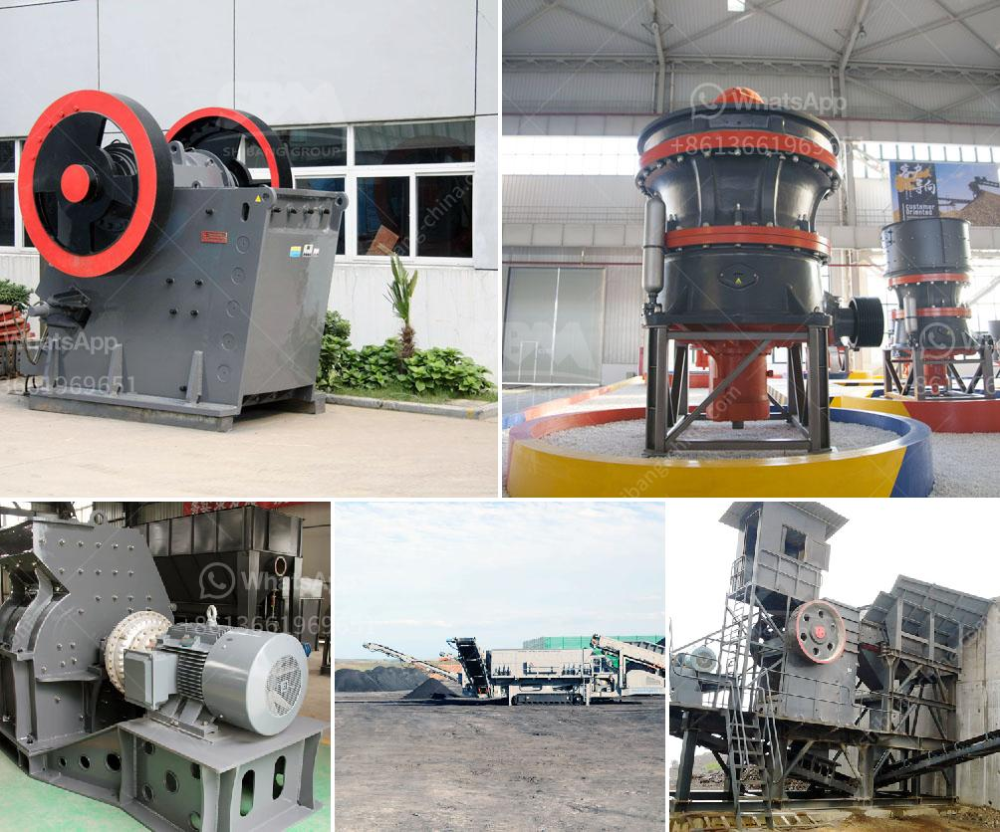

<h3>معدات إنتاج البازلت</h3>
معدات إنتاج البازلت هي المعدات اللازمة للبدء في عملية استخراج وتكسير البازلت، وهو نوع من الصخور البركانية المتصلبة التي يتم استخدامها في مجموعة متنوعة من التطبيقات الصناعية والبنائية.

تشمل معدات إنتاج البازلت الأساسية الحفارات، والكسارات، والنواقل، والغرابيل، والمغاسل، والخلاطات، ومصانع الخرسانة الجاهزة. تتنوع هذه المعدات بحسب حجم ونوع العملية المطلوبة. 

تعتبر الحفارات أحدى المعدات الرئيسية في عملية استخراج البازلت. تعمل هذه المعدة على إزالة الطبقات العلوية من التربة والصخور اللازمة قبل بدء عملية التكسير. تنقسم الحفارات إلى عدة أنواع مختلفة، بما في ذلك الحفارات المجنزرة والحفارات الا سطوانية، وتختلف في الحجم والقدرة التي تمتلكها.

تأتي الكسارات في مجموعة متنوعة من الأحجام والأنواع المختلفة، وتهدف إلى سحق الصخور الكبيرة إلى حجم صغيرة ومناسبة للاستخدام في العديد من التطبيقات. تتنوع الكسارات من حيث التصميم والقدرة وتكنولوجيا الكسر المستخدمة. تستخدم الكسارات عمومًا لتقسيم البازلت إلى قطع صغيرة وتحقيق الحجم المطلوب من المنتج النهائي.

تُستخدم النواقل لنقل البازلت المكسور من الكسارة إلى المراحل اللاحقة من العملية. تتميز هذه المعدات بقدرتها على نقل البازلت بكفاءة وسرعة، وتركيبها بشكل مناسب وملائم لخط الإنتاج.

الغرابيل هي المعدة التي يتم استخدامها لفصل المنتج النهائي من الشوائب. تستخدم الغرابيل بشكل متزامن مع الكسارة لفصل الحجارة الكبيرة والصخور الأخرى عن البازلت المكسور وفرزها بحجم مناسب.

تلاحظ أهمية مصانع الخرسانة الجاهزة كونها المصدر الأساسي للاستخدام النهائي للبازلت، حيث يتم استخدام البازلت المكسور كمادة خام أساسية في صناعة الخرسانة. تتطلب هذه المصانع معدات إنتاج بما في ذلك خلاطات الخرسانة ، ومعدات التوزيع ، والآلات الخاصة بالحقن والمعايرة.

باستخدام هذه المعدات، يمكن تشغيل وإدارة العملية بشكل فعال ومستدام، مما يعزز الإنتاجية والجودة للبازلت المكسور. تحتاج شركات البناء والتشييد والصناعات الأخرى إلى معدات إنتاج البازلت لضمان إمدادات مستدامة وكفاءة في خطوط الإنتاج.
<h3>Contact us</h3><ul><li><strong>Whatsapp:&nbsp;<a href="https://wa.me/8613661969651">+8613661969651</a></strong></li><li><a href="https://swt.shibang-china.com/?git&amp;zhl&amp;معدات إنتاج البازلت"><strong>Online Service(chat now)</strong></a></li></ul><h3>Related</h3><ul><li><a href='كيفية تحديد سعة سير الناقل.md'>كيفية تحديد سعة سير الناقل</a></li><li><a href='تكلفة مشروع وحدة طحن الكلنكر.md'>تكلفة مشروع وحدة طحن الكلنكر</a></li><li><a href='مطاحن الكرة للكالسيوم.md'>مطاحن الكرة للكالسيوم</a></li><li><a href='سعر مصنع الأسمنت.md'>سعر مصنع الأسمنت</a></li><li><a href='لكن كسارات الخرسانة نيجيريا.md'>لكن كسارات الخرسانة نيجيريا</a></li></ul>