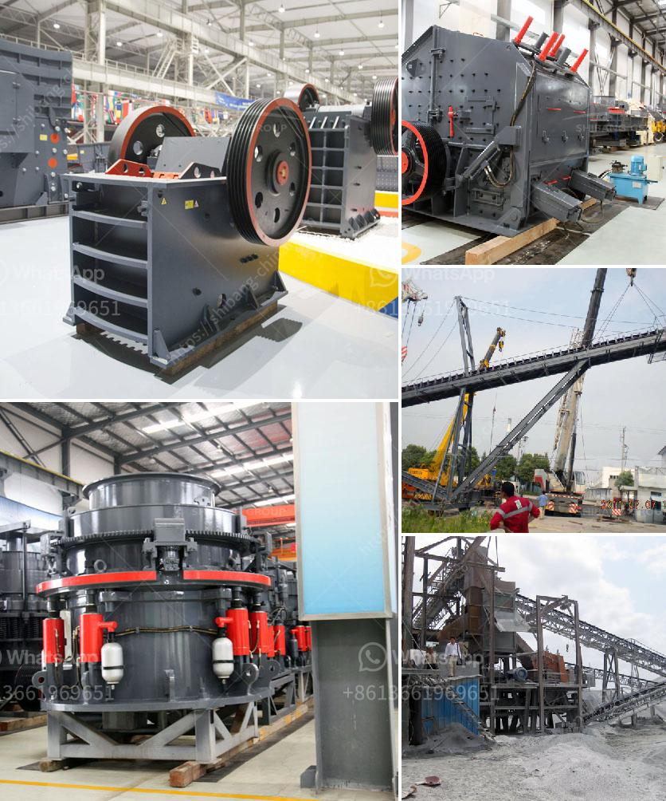

<h3>معدات إنتاج الركام</h3>
تعتبر معدات إنتاج الركام أدوات حاسمة في صناعة البناء والإنشاءات. تستخدم هذه المعدات لسحق الصخور والحصى الكبيرة إلى قطع صغيرة من الحجم المطلوب لإنتاج الركام اللازم للخرسانة والأسفلت وغيرها من المواد الإنشائية. في هذه المقالة، سنلقي نظرة عامة على بعض المعدات الرئيسية التي تستخدم في صناعة الركام.

أحد المعدات الرئيسية في عملية إنتاج الركام هو الكسارة. تمتاز الكسارات بأنها قادرة على سحق الصخور الصلبة والمواد الخام الأخرى بكفاءة عالية وبطرق مختلفة. تعمل الكسارات عن طريق تطبيق قوة ميكانيكية على المواد لكسرها وتجميعها في حجم محدد. تتوفر الكسارات في أحجام وطاقات مختلفة، بدءًا من الكسارات الصغيرة المحمولة التي يمكن استخدامها في المواقع الضيقة وصولًا إلى الكسارات الكبيرة المتحركة التي تستخدم في المشاريع الضخمة.

بعد سحق المواد الخام، يجب فصل الركام عن المواد الأخرى مثل الرمل والغبار، حيث يتم ذلك باستخدام الشاشات المهتزة أو الفاصلات المغناطيسية. تعتبر الشاشات المهتزة أداة مهمة للتصنيف والفصل الفعال للركام وفقًا لحجم الجسيمات المطلوب. تنتج الشاشات المهتزة بقوة اهتزازية تجعل الركام يمر عبر فتحات في الشاشة وتصنفه وفقًا لحجم الجسيمات. من ناحية أخرى، تستخدم الفاصلات المغناطيسية لفصل المواد المعدنية، مثل الحديد والحديد المغناطيسي، عن الركام العادي.

بعد فصل الركام، يتم نقله إلى الأماكن التخزينية أو معدات إضافية مثل الخلاطات أو الطاردات. يتم استخدام الخلاطات لتجهيز الركام ومزجه مع المواد الأخرى لإنتاج الخرسانة أو الأسفلت. بينما تُستخدم الطاردات لإزالة المواد المختلفة من الركام، مثل الغبار والمواد العضوية أو الشوائب.

في الختام، فإن معدات إنتاج الركام تلعب دورًا حاسمًا في صناعة البناء والإنشاءات. بفضل تقنيات التكسير والفصل والتصنيف، يتمكن المهندسون والمقاولون من إنتاج الركام ذو الجودة العالية والمتجانسة للاستخدام في مجموعة متنوعة من التطبيقات الإنشائية.
<h3>Contact us</h3><ul><li><strong>Whatsapp:&nbsp;<a href="https://wa.me/8613661969651">+8613661969651</a></strong></li><li><a href="https://swt.shibang-china.com/?git&amp;zhl&amp;معدات إنتاج الركام"><strong>Online Service(chat now)</strong></a></li></ul><h3>Related</h3><ul><li><a href='سعر مصنع كسارة الفك.md'>سعر مصنع كسارة الفك</a></li><li><a href='بناء مطحنة الكرة.md'>بناء مطحنة الكرة</a></li><li><a href='شاشات الفحم الاهتزازية.md'>شاشات الفحم الاهتزازية</a></li><li><a href='تكلفة تعدين وتكرير النحاس.md'>تكلفة تعدين وتكرير النحاس</a></li><li><a href='أسعار مصانع التكسير الكاملة لعلامة باكستر.md'>أسعار مصانع التكسير الكاملة لعلامة باكستر</a></li></ul>