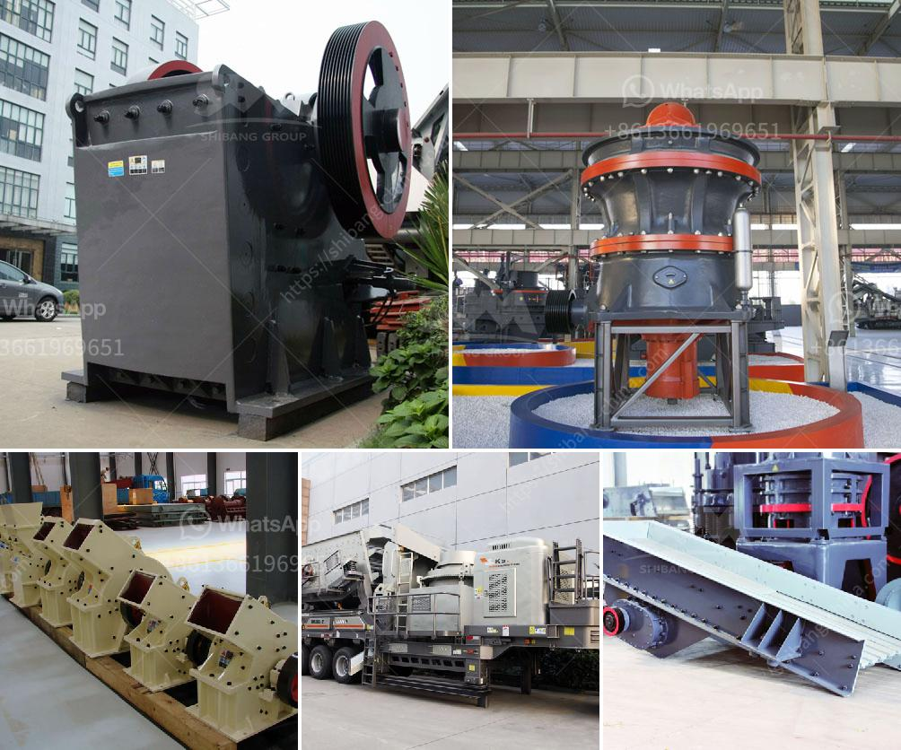

<h3>معدات استخراج الحجر</h3>
تعد معدات استخراج الحجر أدوات حيوية ضرورية لصناعات التعدين والبناء. يتم استخدام هذه المعدات لاستخراج الحجر من المحاجر والمناجم بطريقة فعالة وآمنة. سوف نتناول في هذه المقالة بعض أنواع المعدات الشائعة المستخدمة في عمليات استخراج الحجر.

أحد أنواع المعدات الشائعة هو الحفارة الهيدروليكية. يتم استخدام الحفارات الهيدروليكية لإزالة التربة والصخور في المحاجر والمناجم. تعمل هذه المعدات بواسطة نظام تشغيل هيدروليكي يستخدم السوائل لتوجيه الذراع والحفر. تتميز الحفارات الهيدروليكية بقوتها الهائلة وقدرتها على العمل في بيئات متنوعة.

ثاني أنواع المعدات المستخدمة هي الشاحنات الثقيلة. تعد الشاحنات الثقيلة وسيلة مواصلات رئيسية لنقل الحجر من المحجر إلى مواقع البناء. تتميز هذه الشاحنات بحمولتها الكبيرة وقوتها الهائلة، مما يسمح بنقل كميات كبيرة من الحجر في وقت قصير.

واحدة من الأدوات الأساسية في استخراج الحجر هي الكسارات. تُستخدم الكسارات لكسر الحجر إلى قطع صغيرة من الحجم المطلوب. هناك أنواع مختلفة من الكسارات بما في ذلك كسارات الفك والمطارق الهيدروليكية وكسارات الأسطوانة. تتميز الكسارات بقدرتها على تحمل الضغوط العالية وقدرتها على تحول الحجر إلى حجم مناسب للأغراض المطلوبة.

بالإضافة إلى ذلك، تعمل الأجهزة الاستشعارية أيضًا على العثور على احتياطيات الحجر. يتم استخدام أجهزة استشعار الأمواج فوق الصوتية والأشعة تحت الحمراء والليزر للكشف عن الحجر تحت الأرض. تعزز هذه الأجهزة الفعالية والدقة في استخراج الحجر وتساهم في زيادة الإنتاج وتقليل التكاليف.

في الختام، يمكن القول إن معدات استخراج الحجر هي عناصر أساسية في عمليات التعدين والبناء. تتميز هذه المعدات بقوتها وفعاليتها في استخراج الحجر ونقله وتحويله إلى أشكال مناسبة للاستخدام. إن استخدام هذه المعدات يعزز الإنتاجية ويمكن أن يحسن كفاءة عمليات الاستخراج والبناء بشكل عام.
<h3>Contact us</h3><ul><li><strong>Whatsapp:&nbsp;<a href="https://wa.me/8613661969651">+8613661969651</a></strong></li><li><a href="https://swt.shibang-china.com/?git&amp;zhl&amp;معدات استخراج الحجر"><strong>Online Service(chat now)</strong></a></li></ul><h3>Related</h3><ul><li><a href='سعر رخيص لآلة تصنيع حبيبات الفحم.md'>سعر رخيص لآلة تصنيع حبيبات الفحم</a></li><li><a href='تكلفة إنشاء مصنع الأسمنت الصغير في الهند.md'>تكلفة إنشاء مصنع الأسمنت الصغير في الهند</a></li><li><a href='تكلفة كسارة الرمل.md'>تكلفة كسارة الرمل</a></li><li><a href='جول بيلي كسارة حجر مستعملة.md'>جول بيلي كسارة حجر مستعملة</a></li><li><a href='مصنع طحن الحجر الألماني.md'>مصنع طحن الحجر الألماني</a></li></ul>