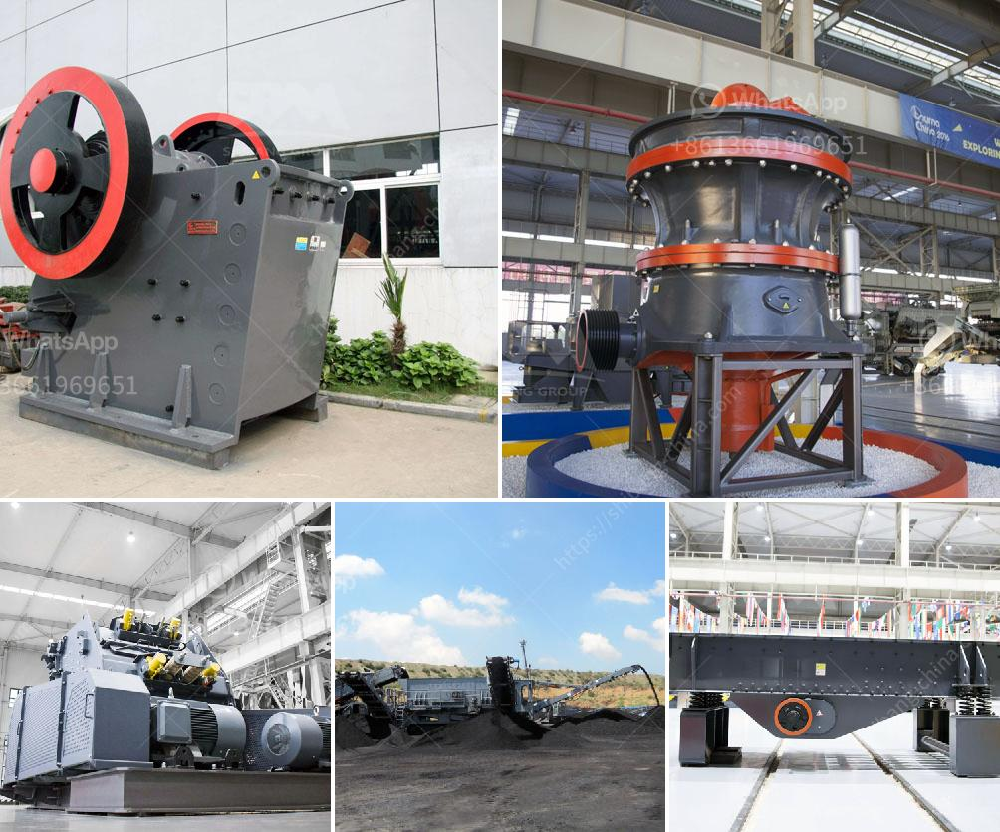

<h3>معدات استخراج الذهب من الصخور</h3>
تعتبر معدات استخراج الذهب من الصخور أدوات حاسمة في صناعة التعدين، حيث تستخدم لاستخراج الذهب من الصخور والتربة التي تحتوي على الكميات المستخرجة. يتوفر العديد من أنواع المعدات التي تستخدم في عملية استخلاص الذهب، وتتراوح من المعدات الهيدروليكية الكبيرة إلى المعدات البسيطة التي يستخدمها عمال تعدين الذهب الصغار. هذه المعدات قادرة على استخراج الذهب بكفاءة عالية وبتكلفة منخفضة، مما يجعلها ضرورية جداً في هذه الصناعة.

واحدة من أهم المعدات المستخدمة في استخلاص الذهب من الصخور هي الكسارة الصخرية. وظيفة الكسارة الصخرية هي تحطيم الصخور الكبيرة إلى أجزاء صغيرة قابلة للمعالجة. تتوفر الكسارات بأحجام وقدرات مختلفة، وتستخدم طرق متنوعة لتحقيق هذا الهدف. يمكن استخدام الكسّارات ذات الفك الثابت، حيث يتم تحجيم الصخور بين فكين ثابتين، أو الكسّارات ذات الصدم، التي تستخدم القوة الصدمية لتفتيت الصخور. يعتمد استخدام كل منها على الموقع والمواصفات التقنية ومتطلبات العملية.

بعد تحطيم الصخور وتجهيزها للمعالجة، يتم استخدام معدات الفصل والتصفية لاستخلاص الذهب. تشمل هذه المعدات العديد من العمليات المتطورة، مثل المغناطيسية والجاذبية والترشيح والغسيل. بالإضافة إلى ذلك، تستخدم تقنيات معالجة الذهب المختلفة، مثل الفصل الجاذبي والتعويم، لاستهلاك الذهب من الصخور والوسائل الأخرى. يتم استخدام هذه العمليات للفصل بين الذهب والمعادن الأخرى، وللاستفادة القصوى من الذهب المعدني الناتج.

بالإضافة إلى المعدات المذكورة، تشمل معدات استخراج الذهب آلات الحفر والتفجير والمعدات الهيدروليكية المتطورة التي تستخدم لتكسير الصخور وتحريك التربة وتعدين الذهب. هذه المعدات تستخدم تقنيات متطورة وأتمتة للحفاظ على سلامة العمال وتحسين كفاءة وإنتاجية عمليات استخلاص الذهب.

في النهاية، تعد معدات استخراج الذهب من الصخور أدوات حاسمة في صناعة التعدين، حيث تلعب دورًا حيويًا في استخلاص الذهب من الصخور وتربة التعدين. تستخدم هذه المعدات تقنيات مختلفة، بدءًا من الكسارات ووصولًا إلى معدات التصفية والفصل والتنقية. من خلال استخدامها، يتم الحفاظ على سلامة العمال وتحسين كفاءة استخراج الذهب، مما يعزز إنتاجية وربحية عمليات التعدين.
<h3>Contact us</h3><ul><li><strong>Whatsapp:&nbsp;<a href="https://wa.me/8613661969651">+8613661969651</a></strong></li><li><a href="https://swt.shibang-china.com/?git&amp;zhl&amp;معدات استخراج الذهب من الصخور"><strong>Online Service(chat now)</strong></a></li></ul><h3>Related</h3><ul><li><a href='مطحنة الكرة لكلنكر الأسمنت.md'>مطحنة الكرة لكلنكر الأسمنت</a></li><li><a href='المعدات المطلوبة لعمل محجر الجرانيت.md'>المعدات المطلوبة لعمل محجر الجرانيت</a></li><li><a href='كيفية بدء منجم المحاجر.md'>كيفية بدء منجم المحاجر</a></li><li><a href='كسارات الأسمنت المستخدمة للبيع.md'>كسارات الأسمنت المستخدمة للبيع</a></li><li><a href='تصنيع الكالسيت المسحوق في راجستان.md'>تصنيع الكالسيت المسحوق في راجستان</a></li></ul>