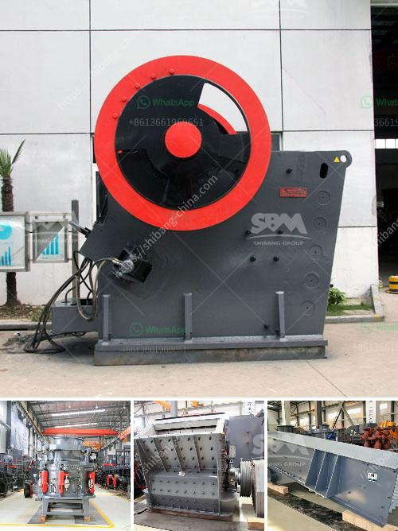

<h3>معدات التعدين في جنوب أفريقيا</h3>
تُعدّ جنوب أفريقيا واحدة من أكبر الدول المنتجة للمعادن في العالم، حيث تتمتع بموارد طبيعية غنية ومتنوعة تشمل الذهب والماس والفحم والبوكسيت والبلاتين والنحاس والفوسفات والذهب الابيض وغيرها. وتعدّ صناعة التعدين من أحد القطاعات الرئيسية في الاقتصاد الجنوب أفريقي، حيث تعتبر مصدر هام للإيرادات وتوفير فرص العمل.

لتنفيذ أعمال التعدين في جنوب أفريقيا، يعتمد المنتجون على معدّات حديثة ومتطورة تمكّنهم من استخراج الموارد بكفاءة وسرعة مضمونة. تشتمل معدّات التعدين في جنوب أفريقيا على العديد من الأجهزة والآلات المتخصصة، مثل الحفارات والكسارات الضخمة، وآلات الغربلة والفحص، وآلات نقل الحمولة الثقيلة، وآلات النقل والتنقل داخل مناجم الفحم، وغيرها.

يتميز قطاع التعدين في جنوب أفريقيا بتبني أحدث التقنيات والمبتكرات في هذا المجال. وتُطبّق أيضًا العديد من إجراءات السلامة والصحة المهنية لمنع وقوع حوادث وضمان سلامة العمال. تضمن هذه التدابير استخدام معدّات متطورة وتقديم تدريب عالي المستوى للعمال لتحسين مهاراتهم وزيادة الوعي بمخاطر العمل. فعلى سبيل المثال، يتم تجهيز العمال بمعدات واقية، مثل الخوذ والواقيات الشخصية والملابس الملائمة للعمل الميداني.

وتعدّ بعض المعدّات الخاصة في جنوب أفريقيا ضرورية أكثر من غيرها. فعلى سبيل المثال، يعتبر استخدام المعدّات الحديثة لاستخراج البلاتين ضرورة لضمان كفاءة عملية الإنتاج. كما أن استخدام تكنولوجيا تعدين الفحم على نطاق واسع يستلزم تداول المعدّات مثل الآلات الطبقية والقطع الهيدروليكية.

في الختام، تعد جنوب أفريقيا واحدة من الدول الرائدة في صناعة التعدين، حيث تتمتع بموارد غنية وتقنيات متقدمة. وتعدّ معدّات التعدين الحديثة والمتطورة أحد العوامل الرئيسية لنجاح هذا القطاع في البلاد، حيث تمكن المنتجين من استخراج المعادن بكفاءة وزيادة الإنتاجية، مع ضمان سلامة العمال وتقليل المخاطر المحتملة.
<h3>Contact us</h3><ul><li><strong>Whatsapp:&nbsp;<a href="https://wa.me/8613661969651">+8613661969651</a></strong></li><li><a href="https://swt.shibang-china.com/?git&amp;zhl&amp;معدات التعدين في جنوب أفريقيا"><strong>Online Service(chat now)</strong></a></li></ul><h3>Related</h3><ul><li><a href='مصنع كامل لاستخراج النحاس للبيع.md'>مصنع كامل لاستخراج النحاس للبيع</a></li><li><a href='شركة موردة لكسارة الحجر.md'>شركة موردة لكسارة الحجر</a></li><li><a href='شركة تصنيع لوحات الجبس في سنغافورة.md'>شركة تصنيع لوحات الجبس في سنغافورة</a></li><li><a href='تكلفة كسارة الفك 24x36.md'>تكلفة كسارة الفك 24x36</a></li><li><a href='كسارة المطرقة بسعة ١٠ طن في الساعة وحجمها.md'>كسارة المطرقة بسعة ١٠ طن في الساعة وحجمها</a></li></ul>